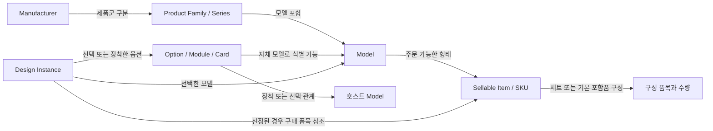
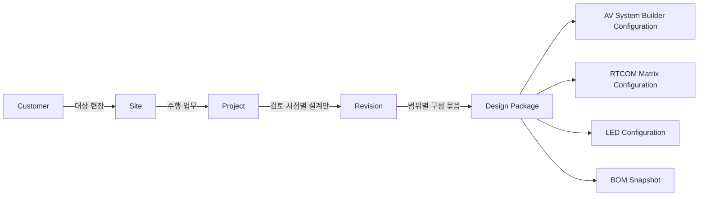
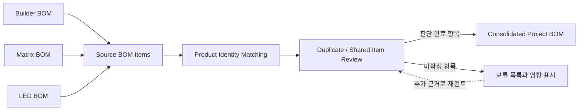

# CORE DOMAIN CONCEPTS

## 운영 범위 정정 — 제품 제외 (2026-09-21)

사용자 운영 결정에 따라 **HS-88M-U, HS-88MX, HD-D104U, HD-D108U는 `EXCLUDED FROM PORTAL`**이다. 이 결정은 아래 과거 분석·보존 권고보다 우선한다.

- Equipment Library 등록, Search/Filter 결과, Product Detail 생성, Product Compare, Taxonomy Mapping, Migration, 제품 데이터 검증·수집, Portal 제품 수량 집계에서 모두 제외한다.
- 과거 조사 기록에 해당 모델이 남아 있더라도 증빙·이력일 뿐, 활성 제품·검증 대기·향후 자동 등록 후보가 아니다. 명칭·사양 충돌의 해소도 Portal의 후속 과제로 요구하지 않는다.
- 원본 ZIP/PDF/Catalog/Datasheet 및 기타 제조사 자료는 수정·삭제하지 않는다. 여러 제품이 수록된 문서도 전체 원본을 보존하되 제외 모델 구역은 제품 데이터 준비에 사용하지 않는다.
- 기존 Library **31개는 조사 당시 원본 수량**이다. 이 중 HS-88MX, HD-D104U, HD-D108U의 3개 항목을 제외하여 현재 Portal 기준은 **28개 장비·시리즈 항목**이다. HS-88M-U는 원래 31개 목록에 없으므로 다시 차감하지 않는다. Series·묶음이 포함되어 있으므로 28개 SKU를 뜻하지 않는다.
- 이후 분석과 Product Data 준비는 이 제외 범위를 적용한다. 이번 변경은 문서 반영이며 기존 시스템 코드·데이터를 변경한 것은 아니다.

**프로젝트:** AV Equipment Library / RTCOM Configurator → AV Portal  
**작성일:** 2026-09-21  
**상태:** 사용자 범위 정정 반영 · Portal 내부 참고와 장기 확장 개념 구분  
**기준:** [EXISTING_SYSTEM_ASSESSMENT.md](./EXISTING_SYSTEM_ASSESSMENT.md)

## 0. 현재 적용 범위 — 사용자 정정 우선

현재 개발 대상은 AV Equipment Library / RTCOM Configurator를 AV Portal 본체로 발전시키는 것이다. AV System Builder와 LED Configurator는 기존 코드·구조·데이터·기능을 유지하고 Portal 메뉴 또는 Dashboard에서 기존 URL로 이동하도록 연결한다.

이 문서는 범위 정정 이전에 작성한 개념 분석을 보존한다. **세 시스템을 공통 데이터 플랫폼으로 묶는 Architecture 명세가 아니며, 현재 Portal MVP의 필수 모델 목록도 아니다.** 아래 적용 구분이 기존 본문의 통합 흐름보다 우선한다.

| 본문 | 현재 적용할 수 있는 참고 | 현재 범위에서 제외할 내용 |
|---|---|---|
| §2 Product Identity | Portal 내부 Manufacturer·Series·Model·판매 품목·TX/RX·PSE·카드 관계의 의미 구분 | Builder/LED 제품 DB와 공통 ID·제품 원본을 구축하거나 강제 매핑하는 작업 |
| §3 Project / Revision | RTCOM 자체 구성의 당시 사양·조건·검증 결과 보존 원칙 | 세 도구를 묶는 Customer/Site/Project/Revision/Design Package 체계를 필수 MVP로 채택하는 것 |
| §4 BOM Aggregation | RTCOM 내부 품목·세트·단위·포함품·잠정 상태를 구별하는 원칙 | Builder·Matrix·LED BOM 수집·대응·중복 검토·통합 Project BOM 구축 |
| §5 Compatibility | Portal 사양 표현에서 Connector·Signal·Protocol·Transport·Format·Capability를 혼동하지 않도록 하는 참고 | 공통 Compatibility Engine 구축 및 기존 도구 검증 로직 변경 |
| §6–7 연결 사례·점검 기준 | 향후 확장 시 사용할 설명 자료 | 현재 MVP의 구현·통합 테스트·완료 조건으로 적용하는 것 |

**현재 목표에서 제외:** Repository 통합, Database 통합, Product Database 강제 통합, Builder/LED 데이터 Migration, 세 시스템 Project 통합, 세 시스템 BOM 통합, Firestore/Supabase 통합, 공통 Authentication, 공통 Compatibility Engine. 필요할 때 별도 확장 과제로 검토한다.

현재 우선 검토 대상은 Portal 본체의 UI/UX, Equipment Library, Product Data, Search/Filter/Compare, Documents, RTCOM Configurator, Admin 및 외부 도구 실행 링크다. 구체적인 순서는 [평가 문서 §0](./EXISTING_SYSTEM_ASSESSMENT.md)을 따른다. Database·최종 Product Schema·전체 Architecture는 여전히 미확정이다.

## 1. 원래 개념 분석의 범위와 설계 원칙 — §0에 따라 제한 적용

이 문서는 1차 분석 방향 승인 후 요청된 Product Identity, Project / Revision, BOM Aggregation 개념 분석으로 작성되었다. 이후 사용자가 개발 범위를 정정했으므로 시스템 간 통합을 전제한 부분은 장기 참고로만 남긴다. 앞선 승인을 현재 통합 구현의 승인으로 해석하지 않는다. 전체 Portal Architecture, Database, Technology Stack, Repository 구조, Product Data Schema, Authentication 방식은 결정하지 않는다.

이 문서의 표와 관계도는 업무 개념을 설명한다. Database Table, 필드 정의, 필수값, API, 식별자 형식, 최종 상태 코드의 명세가 아니다. 표에 나오는 상태 이름은 검토 과정의 의미를 전달하는 예시다.

기존 시스템의 관찰 사실은 기준 문서의 조사 시점에 한정한다. 새로운 제조사 사양 검증은 수행하지 않았다. 제품명은 기존 사례를 설명하는 데 사용하며, 공식 SKU·세트 구성·PSE 차이·카드 호환 여부를 새로 확정하지 않는다. 설명용 수량과 장비 표식은 가상 예시다.

세 모델에 공통으로 적용할 원칙은 다음과 같다.

1. **동일 모델, 동일 판매 품목, 동일 설계 대상은 서로 다른 판단이다.** 같은 모델 두 대를 한 대로 만들지 않는다.
2. **현재 제품 정보와 당시 설계가 사용한 정보는 구분한다.** 제품 정보 갱신으로 과거 설계를 덮어쓰지 않는다.
3. **기존 도구의 계산 결과와 통합 검토 결과를 분리한다.** 원천 BOM을 수정하거나 자동으로 중복 삭제하지 않는다.
4. **미확정 정보는 미확정 상태로 보존한다.** SKU나 출처를 모르면 임의로 만들지 않는다.
5. **제품 기술 적합성, 구성 재현성, 구매 수량, 견적 확정은 각각 검토한다.** 한 항목의 승인이 나머지까지 승인하지 않는다.

## 2. Product Identity Model — Portal 내부 관계 검토에 선별 적용

아래에서 Builder·LED 사례와 원본 도구 간 공통 식별 관계는 장기 참고다. 현재는 Portal 자체 제품의 Series/Model/SKU/옵션 의미를 명확히 하는 데 활용하며 다른 시스템의 데이터를 변경·이관·연결하지 않는다.

### 2.1 단일 계층보다 역할을 가진 관계로 이해한다

`Manufacturer → Product Family / Series → Model → Sellable Item / SKU → Option / Module / Card → Design Instance`는 검토해야 할 개념의 흐름이다. 모든 제품이 이 순서의 단일 부모-자식 계층을 반드시 통과하는 것은 아니다.

특히 카드는 자체 Model과 판매 품목을 가질 수 있으며, 어떤 섀시에 장착되는지는 별도의 관계다. Design Instance는 SKU 선정 전에도 존재할 수 있다. TX/RX 세트는 여러 모델을 포함할 수 있다.

화살표는 관계의 의미만 나타낸다. 관계의 저장 방식이나 최종 다중성 제약을 정한 것은 아니다.

### 2.2 개념별 책임

| 개념 | 답해야 하는 질문 | 구분할 경계 |
|---|---|---|
| Manufacturer | 어느 제조사의 제품인가? | 공급사·판매 대리점과 구분. 이름 표기 차이만으로 다른 제조사를 만들지 않음 |
| Product Family / Series | 어떤 제품군에 속하는가? | 검색·탐색을 위한 묶음. 실제 주문 품목이나 배치 장비 수량으로 사용하지 않음 |
| Model | 기술적으로 어떤 모델인가? | 같은 Series 안의 다른 모델, 명칭이 유사한 변형을 구분. Series가 없거나 불명확해도 모델을 설명할 수 있어야 함 |
| Sellable Item / SKU | 실제로 무엇을 어떤 단위로 주문하는가? | Model과 항상 1:1이 아님. 기본 구성·지역·포장·세트 등에 따라 달라질 수 있으며 근거 필요 |
| Option / Module / Card | 호스트에 무엇을 선택·장착·추가하는가? | 제품 종류이면서 호스트와의 관계 역할. 기본 포함, 별도 구매, 선택 가능, 필수 조건을 구별 |
| Design Instance | 이 프로젝트 설계에서 어느 장비 또는 장비 집합을 뜻하는가? | Model의 복사본이나 구매 SKU와 구분. 위치·역할·선택 옵션·연결 등 프로젝트 맥락을 가짐 |

Sellable Item은 주문 단위라는 업무 개념이고 SKU는 이를 식별하는 코드다. 코드가 확인되지 않아도 “단품인지 세트인지 확인 중인 주문 후보”를 표현할 수 있어야 한다. 제조사 부품번호와 공급사 내부 SKU는 발급 주체가 다르므로 코드 문자열만으로 동일성을 확정하지 않는다.

Option에는 물리 카드 외에 설정 선택이나 라이선스 같은 비물리 항목도 있을 수 있다. 모든 Option에 물리 장비 인스턴스를 만들거나 별도 구매 수량을 부여하지 않는다. 이번에는 해당 유형의 상세 분류를 확정하지 않는다.

### 2.3 식별과 사양의 관계

제품을 식별하는 참조와 그 제품에 대한 사양 기록을 구분할 것을 제안한다. 사양 오타 수정이나 문서 갱신이 곧 새 모델을 뜻하지는 않는다. 반대로 실제 하드웨어 변형이나 주문 구성이 다르면 같은 이름이어도 구분이 필요할 수 있다.

기존 각 도구의 제품 표식은 **어느 도구의 어느 원본 항목인지**와 함께 보존한다. 동일 문자열 ID가 다른 도구에서 사용돼도 같은 제품으로 보지 않는다. 공통 식별은 원본을 대체해 지우는 것이 아니라, 대응 관계와 판단 근거를 연결하는 개념이다.

별칭은 검색을 돕지만 동일성의 증거를 대신하지 않는다. `PSE`, `TX`, `RX`, 카드 구성, 부품번호 같은 차이를 이름 정리 과정에서 버리지 않는다. 원본 명칭과 검토한 명칭을 함께 추적할 필요가 있다.

### 2.4 사례별 해석

| 사례 | 개념상 해석 | 확인 또는 보존할 사항 |
|---|---|---|
| XDM Series | RTCOM의 Product Family / Series에 해당하는 탐색 단위 | Series 자체를 주문 가능한 섀시 한 대로 계산하지 않음 |
| XDM-12 / XDM-20 / XDM-36 | 서로 다른 Model | 각 모델의 판매 구성·기본 포함품·카드 장착 상태는 별도 확인. 모델명에서 SKU를 발명하지 않음 |
| TX / RX 세트 | TX Model과 RX Model 사이의 역할 관계, 그리고 필요하면 별도의 세트 판매 품목 | 함께 소개된 카탈로그 항목인지 실제 세트 SKU인지 구별. 세트라면 포함 모델·수량과 단품 판매 여부의 근거 필요 |
| 기본형 / PSE 변형 | 구별이 필요한 기술·판매 변형 후보 | 별도 Model인지 동일 Model의 주문 옵션인지 제조사 근거로 결정. 확인 전에는 동일 제품으로 병합하지 않음 |
| Matrix Option Card | 자체 Model·판매 품목을 가질 수 있는 모듈, 섀시의 선택/장착 관계 | 호환 가능과 실제 장착은 별개. 카드 종류, 수량, 슬롯 위치, 기본 포함 여부를 구별 |
| LED Cabinet | 캐비닛 Model과 해당 주문 품목; 설계에서는 배열에 쓰이는 수량 집합 또는 개별 위치 | 패널 전체와 캐비닛 한 개를 혼동하지 않음. 운영 수량·예비 수량·세트 포장을 구별 |
| Processor | 기술 모델, 주문 구성, 프로젝트의 처리 장비 역할 | 고정 구성과 카드 선택 구성을 구별. 같은 모델이라도 장착 카드·운용 조건은 다를 수 있음 |
| Builder 배치 장비 | 특정 설계 대상의 Design Instance를 나타내는 화면 표현 | 노드 ID와 모델 ID를 동일시하지 않음. 동일 장비가 LED 구성에서도 표현될 수 있음 |

예를 들어 XDM 섀시 인스턴스 한 대에 카드 두 장을 선택했다고 해서 섀시 Model이 바뀌지는 않는다. 카드가 기본 포함인지 별도 구매인지에 따라 구매 내역은 달라질 수 있다. 그 차이를 제품 모델과 장착 구성, 판매 구성의 관계로 설명한다.

### 2.5 Design Instance와 도구별 표현

설계 대상 하나를 여러 도구가 다른 관점에서 표현할 수 있다. 같은 프로세서가 LED 도구에서는 용량 검토 대상으로, Builder에서는 결선 노드로 나타날 수 있다. 이때 두 원본 표현을 **같은 설계 대상에 대한 참조**로 연결할 수 있지만 사용자 검토가 필요하다.

반대로 한 Builder 노드가 `수량 2`를 나타낼 수도 있다. 화면의 노드 하나를 무조건 실물 한 대로 간주하지 않는다. 개별 배치·연결을 구분해야 하면 두 설계 대상으로, 아직 구분이 필요 없는 수량이면 장비 집합으로 설명할 수 있다. 이 표현 방식의 최종 선택은 보류한다.

Design Instance는 실제 설치 자산의 일련번호와도 다르다. 설계 단계에 아직 구매되지 않은 장비가 존재할 수 있고, 기존 장비를 재사용할 수도 있다. 필요한 설계 수량과 신규 구매 수량은 별도로 검토해야 한다.

Revision 간 같은 장비의 변경을 비교할 수 있도록 설계 대상의 연속성을 추적하는 것이 유용하다. 같은 대상의 옵션 변경인지, 다른 장비로 교체한 것인지, 복제하여 한 대를 추가한 것인지를 구별한다. 이 추적을 위한 ID 형식이나 저장 구조는 정하지 않는다.

## 3. 장기 참고: Project / Revision Model — 세 시스템 통합은 범위 밖

아래 관계도는 이전 요청에 따른 확장 개념이다. 현재 Portal MVP에 공통 Project나 Design Package를 반드시 도입한다는 뜻이 아니다. RTCOM 구성의 저장·복원 개선에 필요한 내부 범위는 별도로 검토한다.

### 3.1 관계와 의미

이 흐름은 기본 탐색 관계다. Customer가 Site를 반드시 법적으로 소유한다는 뜻은 아니다. 발주처·최종 사용자·현장 운영자가 다를 수 있으며, 그런 역할과 복수 현장 프로젝트의 필요 여부는 후속 검토 대상으로 둔다.

| 개념 | 의미 | 구분할 경계 |
|---|---|---|
| Customer | 프로젝트가 대상으로 하는 고객 관계 | 법인명·담당자 표시가 설계 식별을 대신하지 않음 |
| Site | 실제 설치 또는 서비스 대상 현장 | 한 고객의 여러 현장, 한 현장의 여러 프로젝트를 구별 |
| Project | 목적·범위를 가진 설계/납품 업무 | 같은 현장의 신규 구축과 후속 증설을 무조건 같은 프로젝트로 취급하지 않음 |
| Revision | 특정 시점에 함께 검토할 설계 조건과 결과의 기준선 | 자동 저장 횟수, 도구 파일 버전, 제품 사양 버전과 구분 |
| Design Package | Revision 안에서 목적·공간·설비 범위별로 검토할 구성 묶음 | 단일 앱 파일과 다름. 세 앱을 모두 포함할 필요는 없고 같은 종류의 구성이 여러 개일 수 있음 |
| BOM Snapshot | 특정 입력과 검토 판단에 대응하는 BOM의 고정된 결과 | 원천 도구 BOM인지 패키지/프로젝트 취합 BOM인지 범위를 표시 |

예를 들어 하나의 Project의 Revision R1에 “대회의실 AV”와 “로비 LED”라는 두 Design Package가 있을 수 있다. 대회의실 패키지는 Builder·Matrix·LED 구성을 함께 참조하고, 로비 패키지는 LED 구성만 참조할 수 있다. R1/R2는 설명용 이름이며 번호 규칙은 정하지 않는다.

### 3.2 Design Package가 참조하는 대상

작업 중인 도구 화면이나 “최신 파일” 링크만 연결하면 과거 설계를 복원하기 어렵다. 검토 기준선에서는 **어떤 시점의 어떤 구성 내용인지 고정해서 식별할 수 있는 대상**을 참조해야 한다.

패키지를 이해하는 데 필요한 정보는 다음과 같다. 이는 필드 목록이나 파일 규격이 아닌 보존 요구사항이다.

- 포함된 도구별 구성의 고정본과 그 역할·적용 공간.
- 실제 선택한 제품, 카드·옵션, 인스턴스 관계와 당시 사용한 사양.
- 단위·배열·거리·예비율·이중화 등 계산 입력과 가정.
- 원천 BOM, 취합 BOM, 제품 대응·중복 검토 판단의 근거.
- 도구·계산 규칙·제품 자료·가격 기준의 식별 가능한 버전.
- 당시 검증 결과, 미확인 항목, 예외 승인 또는 제외 사유.

같은 구성을 여러 패키지에서 참고하는 경우에는 참고용인지 수량 기여 대상인지 구분한다. 여러 패키지가 공유하는 프로세서나 중앙 매트릭스는 프로젝트 수준에서도 같은 설계 대상을 가리킬 수 있어야 한다. 패키지별 BOM을 더하는 것만으로 프로젝트 구매 수량이 결정되지 않는다.

설계 대안 A와 B가 함께 검토 중이라면 양쪽 장비를 동시에 합산하지 않는다. 어느 대안이 취합 대상인지 명시하고, 미선택 대안도 과거 검토 자료로 보존한다.

### 3.3 Revision의 개념적 흐름

| 단계 | 제안하는 동작 원칙 |
|---|---|
| 작업 중 | 현재 작업본을 수정할 수 있으나 과거 검토 기준선과 구분 |
| 검토 제출 | 제출한 구성·자료·계산 결과를 고정. 검토 중 수정이 있으면 새 제출본으로 식별 |
| 검토 결과 기록 | 승인·보완 요청·반려의 대상과 범위를 특정. BOM 승인과 기술 사양 승인을 혼동하지 않음 |
| 다음 Revision 작성 | 이전 기준선에서 새 작업을 시작하고 변경 이유·영향을 비교. 기존 고정본은 덮어쓰지 않음 |

승인되지 않은 Revision도 제출 당시 내용은 추적 가능해야 한다. 승인 이후 변경만 이력으로 남기면 검토 과정에서 어떤 내용이 바뀌었는지 사라질 수 있기 때문이다. 승인 권한의 기술적 구현이나 상세 상태 전이는 이번 범위가 아니다.

### 3.4 과거 설계와 견적의 재현

“재현”은 세 가지 수준으로 구분할 것을 제안한다.

| 수준 | 의미 | 필요한 보존 |
|---|---|---|
| 당시 결과 열람 | 그때 검토·제출한 도면, 수량, 견적 금액을 그대로 확인 | 고정된 구성·결과·BOM·견적과 관련 판단 기록 |
| 당시 조건으로 재계산 | 같은 입력과 규칙으로 계산해 당시 결과와 대조 | 사용 사양·옵션·가격·단위·규칙 버전 및 실행 가능 조건. 버전명만 보존해서는 충분하지 않음 |
| 최신 조건으로 재검토 | 최신 제품·가격·규칙으로 변화 영향 확인 | 별도의 새 Revision과 차이 보고. 과거 결과와 구분 |

과거에 사용한 사양 일부가 나중에 잘못된 것으로 확인돼도 기존 결과를 조용히 수정하지 않는다. 해당 과거 기준선에 정정 사실과 영향 검토 필요성을 연결하고, 수정된 설계·견적은 새 Revision에서 만든다. 과거 재현은 과거 판단이 지금도 올바르다는 뜻이 아니다.

정확한 재계산에는 제품 Model뿐 아니라 당시 SKU 구성, 장착 카드, 기본 포함품, 사용자 변경값, 수량 산정 조건, 단위 변환, 반올림 규칙이 필요하다. 견적에는 당시 사용한 단가·통화·가격 기준일·할인·원가/판매가·설치비·간접비·세금 및 환율이 적용됐다면 그 기준도 필요하다. 가격 산식을 새로 정하거나 실제 가격을 수집하는 것은 이번 범위가 아니다.

가격표 전체의 보존 여부와 별개로, 해당 견적 산출에 실제 사용한 값과 결과를 재현할 수 있어야 한다. 가격을 볼 수 없는 검토자에게는 금액을 제외한 자료를 제공할 수 있으나, 그 사본만으로 전체 견적 재현이 가능하다고 표시하지 않는다. 권한은 업무상 요구만 정의하고 Authentication은 구현하지 않는다.

### 3.5 기존 세 시스템의 공백을 다루는 방법

기준 문서에서 Builder의 파일 내보내기와 링크 공유 범위가 다르고, Library는 카탈로그 버전 검사를 수행하며, LED 구성의 모든 설계 상태 보존 여부는 미검증이었다. 따라서 각 도구의 저장 파일이 있다는 이유만으로 재현 가능하다고 선언하지 않는다.

제안하는 원칙은 **원본 고정본 + 당시 사용한 근거/조건 + 계산 결과 + 검토 판단**을 함께 보존하고, 빠진 정보는 명시하는 것이다. 오래된 계산 환경이 없으면 “당시 결과 열람 가능, 동일 조건 재계산 미검증”으로 구분한다. 현재 데이터로 빈칸을 채운 뒤 과거 그대로라고 표시하지 않는다.

예를 들어 R1에서 선택한 Processor의 사양이나 가격이 변경되면 R1은 그대로 유지한다. R2에서 최신 자료 적용을 선택하고, 그에 따른 옵션·수량·금액·판정 변화를 비교한다. Product Identity가 동일해도 사용한 사양과 가격의 시점은 달라질 수 있다.

## 4. 장기 참고: BOM Aggregation Model — 현재 구현 대상 아님

아래의 세 도구 BOM 수집·대응·취합 흐름은 현재 진행하지 않는다. Portal에서는 기존 RTCOM Configurator의 자체 BOM·검증·출력 개선만 검토할 수 있으며, Builder/LED의 BOM이나 계산 Logic은 변경하지 않는다.

### 4.1 전제와 흐름

기존 Builder, Matrix, LED 도구의 BOM 계산 로직은 유지한다. 통합 단계는 원천 결과를 받아 출처를 보존하고 제품 식별·수량 관계를 검토한 뒤 프로젝트 범위의 결과를 만든다.

자동화가 가능하더라도 후보 검색·유사성 안내·단위 불일치 탐지까지를 우선한다. **후보 발견이 수량 제거 승인으로 이어지지 않도록 한다.** 이번에는 이 흐름 자체도 구현하지 않는다.

### 4.2 단계별 책임

| 단계 | 수행할 개념적 작업 | 하지 않을 판단 |
|---|---|---|
| Source BOM Items | 원래 도구·고정 구성·계산 시점·원본 행·수량·단위·설명·잠정 상태를 보존 | 누락 품목을 추정해 원천 결과에 끼워 넣기 |
| Product Identity Matching | Manufacturer/Model/SKU/변형·옵션과의 대응을 검토하고 근거 기록 | 모델명이 같다는 이유로 같은 실물로 판단 |
| Duplicate / Shared Item Review | 같은 설계 대상인지, 별도 실물인지, 세트와 구성품인지, 일부 수량만 겹치는지 판단 | 자동 삭제, 임의의 최대값/최소값 선택 |
| Consolidated Project BOM | 검토된 기여 수량을 취합하고 원천 행·판단으로 역추적 가능하게 표현 | 미확정 항목을 숨긴 구매 확정 합계 표시 |

Builder의 현재 BOM은 케이블 중심이며, LED에서 선택한 프로세서가 실제 BOM 행으로 출력되는지까지 기준 문서에서 확정하지 않았다. 구성에 장비가 보이는 것과 원천 BOM이 그 장비를 포함하는 것은 다르다. 아래 중복 예시는 해당 장비 행이 실제로 제공될 때의 검토 방식이다. 원천에 없다면 우선 “구성에 존재하나 BOM에 미포함”인 공백으로 표시하고, 필요 시 별도로 승인한 수동 보완 내역으로만 취급한다.

### 4.3 세 가지 판단을 분리한다

1. **제품 대응 판단:** 같은 Model인가, 같은 SKU까지 확인됐는가, 아니면 후보인가?
2. **설계 대상 판단:** 같은 장비를 두 번 표현했는가, 별도 실물인가, 일부만 공유하는가?
3. **수량 기여 판단:** 어느 원천 행이 몇 개를 기여하며, 어떤 수량이 참고·기본 포함·대안·보류로 처리되는가?

예를 들어 동일 SKU가 확인되어도 서로 다른 방의 두 대이면 총 2대다. 같은 설계 대상이라는 근거가 있어도 한 도구는 기본형, 다른 도구는 PSE형 또는 다른 카드 구성을 지정했다면 먼저 설계 충돌을 해결해야 한다. 한쪽 정보를 임의로 우선하지 않는다.

### 4.4 검토 가능한 판단 기록

검토 화면이나 기록이 답해야 할 질문은 다음과 같다. 저장 필드의 확정 목록은 아니다.

- 어떤 Revision·Design Package·도구 고정본·원천 행을 비교했는가?
- 원천 수량과 단위는 무엇이며, 이미 예비품이나 포함품을 반영했는가?
- 같은 제품 또는 같은 설계 대상으로 보는 근거는 무엇인가?
- 비교한 수량 전체가 겹치는가, 일부만 겹치는가?
- 채택한 수량, 별도 유지할 수량, 구매에서 제외하되 설계에 남길 수량은 무엇인가?
- 누구의 어떤 판단으로 언제 검토했으며, 미확정 또는 충돌은 무엇인가?
- 그 판단을 적용한 통합 결과는 어느 원천 행에서 나왔는가?

예시 판단에는 “동일 설계 대상의 중복 표현”, “별도 실물”, “일부 수량 공유”, “세트/구성품 관계”, “기존 장비 재사용”, “미선택 대안”, “추가 확인 필요”가 있다. 원천 행은 남겨 두고 통합 기여만 설명한다. 자동 중복 제거와 원본 삭제는 하지 않는다.

### 4.5 핵심 사례

| 사례 | 검토 방식 | 승인된 판단 이후의 결과 예시 |
|---|---|---|
| 동일 프로세서가 LED와 Builder에 존재 | 동일 패키지의 동일 처리 장비인지 확인. 모델·옵션·위치·연결 역할을 대조 | 같은 한 대이면 통합 1대, 두 원천 참조는 유지. 근거 부족이면 합계를 확정하지 않음 |
| Matrix 장비가 Builder에도 배치 | Builder의 섀시 표현과 Matrix 구성의 섀시·카드 내역을 같은 장비 범위로 연결할지 검토 | 섀시는 한 번 기여, 카드는 실제 추가 품목만 기여. Builder가 완성 세트를 뜻한다면 포함품 확인 후 처리 |
| 같은 모델 두 대가 실제로 필요 | 같은 Model이라도 위치·역할·개별 설계 대상이 다름을 확인 | 각각 1대, 통합 표시 수량 2대. 행을 묶어 보여도 개별 대상은 추적 |
| Spare Cabinet | 설치용과 예비품의 목적을 구분. 원천 수량에 이미 예비가 포함됐는지 확인 | 설치 16 EA + 예비 1 EA = 필요 17 EA라는 설명을 보존. 예비율을 다시 적용하지 않음 |
| GBIC EA / SET | 해당 세트의 정확한 구성과 원천 단위를 확인. 세트 단가인지 개당 단가인지 함께 검토 | 확인된 구성에 한해서 변환. `1 SET = 2 EA`를 모든 GBIC의 보편 규칙으로 적용하지 않음 |
| Cable 수량 / 길이 | 기성 케이블의 구매 개수와 개당 길이, 제작 케이블의 원자재 길이·단말 처리를 구분 | 10 m 기성 케이블 3 EA를 원자재 30 m와 동일 구매 항목으로 합치지 않음 |
| 장비 / 시공비 | 물품 수량과 작업·용역·할증·간접비의 산정 근거를 구분 | 장비·자재 소계와 시공·기타 비용 소계를 구별. 금액은 합산 가능 조건이 확인된 경우만 총계화 |

### 4.6 세트·수량·부분 중복의 상세 예

**TX/RX 세트:** 원천 A가 세트 1 SET, 원천 B가 TX 1 EA와 RX 1 EA를 표시한다고 가정한다. 같은 설치 쌍인지 먼저 검토한다. 공식 판매 구성이 확인되면 구매 관점에서 세트 1개 또는 개별 품목 2개 중 선택한 방식을 표현할 수 있다. 동시에 두 방식을 더하지 않는다. 설치 관점에서는 TX와 RX의 위치·역할을 각각 유지한다. 세트가 단순 카탈로그 묶음이었다면 세트 SKU를 생성하지 않는다.

**일부 수량 공유:** Builder 원천에 같은 모델 3대가 있고 LED 원천의 1대가 그중 하나를 나타낸다는 근거가 있다고 가정한다. 검토 결과는 공유 1대와 별도 2대를 구분해 통합 3대가 된다. 3과 1 중 큰 수를 택하는 계산 규칙이 아니라, 어떤 1대가 중복인지 확인한 결과다. 대응 대상이 불명확하면 부분 중복 판단을 보류한다.

**Spare Cabinet:** LED 결과가 이미 “설치 16 + 예비 1 = 17”을 포함한다면 취합 단계에서 예비 1을 다시 추가하지 않는다. 다른 패키지의 예비품과 공동 사용하려면 서로 대체 가능한 품목인지, 현장 운영상 공유 가능한지, 누가 보관·사용하는지 별도 판단해야 한다. 모델명이 같다는 이유만으로 예비 수량을 줄이지 않는다.

**GBIC:** 어떤 원천에서 2 SET를 출력하고 그 세트가 서로 구별되는 모듈 A·B 각 1개로 확인됐다고 가정한다. 설치 내역은 A 2 EA와 B 2 EA로 설명할 수 있다. 이를 구별 없는 단일 SKU 4 EA로 합치면 구매 품목이 달라질 수 있다. 환산 전 수량·단위, 세트 구성 근거, 환산 결과를 함께 남긴다.

**Cable:** 원천에 순수 경로 길이만 있는지, 여유 길이·손실률을 이미 반영한 구매 길이인지 구분한다. 서로 다른 제작 케이블의 총 길이는 자재 계획에 유용하지만 각 연결 구간과 단말 수량을 대체하지 않는다. 취합 단계에서 임의 여유율을 더하지 않는다.

**기존 장비:** 설계에 Processor 1대가 필요하지만 현장 장비를 재사용한다면 설계 필요량 1대와 신규 구매량 0대를 구분할 수 있다. 비용이 0이라고 해서 장비를 설계·검증 대상에서 삭제하지 않는다.

### 4.7 통합 결과의 표현과 보류 항목

Consolidated Project BOM은 최소한 다음을 구별해 읽을 수 있어야 한다.

- 검토가 완료된 장비·자재의 필요 수량과 구매 후보 수량.
- 설치용, 예비용, 기존 장비 재사용, 기본 포함품의 차이.
- 주문 세트와 그 구성품의 관계 및 중복 산정하지 않은 이유.
- 시공·용역·간접비 등의 비용 항목과 산정 조건.
- 미확정 제품 대응, 미확정 중복, 미확정 단위, 원천 누락·충돌 목록.
- 각 통합 행의 원천 결과와 검토 판단으로 돌아가는 추적 경로.

확정 가능한 소계는 표시할 수 있지만 보류 항목이 전체 수량이나 금액에 영향을 주면 전체 결과를 “부분 검토 결과”로 표시한다. 미확정 수량을 0으로 처리하거나, 두 원천을 일단 더한 값을 구매 확정 수량으로 표시하지 않는다. 가격 미확정도 0원과 구분한다.

통합 표시상 같은 SKU를 한 행으로 집계할 수는 있으나, 서로 다른 실물·패키지·용도별 기여 내역은 유지한다. 이 표시 집계는 중복 제거가 아니다. EA·SET·m·작업 단위처럼 의미가 다른 수량은 직접 더하지 않는다.

### 4.8 원천 변경 시 재검토

도구 구성이 바뀌면 새 원천 BOM을 별도 결과로 취급한다. 이전 행을 덮어쓰거나 과거 중복 판단을 무조건 재사용하지 않는다. 모델·SKU·옵션·수량·위치·패키지 범위가 달라졌다면 영향을 받는 대응·중복·가격 판단을 다시 검토한다.

이전 판단은 참고자료로 제시할 수 있지만 새 원천에도 적용된다는 확인이 필요하다. 새로운 통합 결과는 새 BOM Snapshot으로 고정하고 해당 Revision/Design Package와 연결한다. 과거 Snapshot의 수량과 판단은 그대로 보존한다.

## 5. 사양 표현의 참고 개념 — 공통 Compatibility Engine은 범위 밖

이번에는 엔진, 알고리즘, 상세 사양 구조를 설계하지 않는다. 다만 Product Identity와 Design Instance가 다음 개념을 혼동하지 않도록 할 필요가 있다.

| 개념 | 이번 단계의 의미 | 향후 검토할 질문 |
|---|---|---|
| Physical Connector | 물리적으로 연결하는 접속부의 형상·접점 유형 | 서로 연결할 수 있는가? 변환 장치가 필요한가? |
| Signal | 영상·음성·제어 등 전달하려는 정보와 신호의 종류 | 무엇을 보내고 받으며 방향은 무엇인가? |
| Protocol | 통신·제어·보호 등의 동작 규칙 | 필요한 규칙·버전·보호 조건을 양쪽과 중간 장치가 지원하는가? |
| Transport | 신호를 운반하는 전송 방식과 매체 | 어떤 매체·변환 경로·거리 조건으로 전달하는가? |
| Format | 실제 운용하려는 영상·음성 등의 표현 조건 | 해상도·주사율·색 형식·비트 깊이 등 요구가 무엇인가? |
| Capability | 장비·포트·선택 구성에서 조건부로 가능한 능력 | 선택한 카드·모드·다른 자원 사용 조건에서 무엇을 지원하는가? |

이 용어들은 HDMI 같은 하나의 명칭을 모두 한 속성에 넣지 않기 위한 개념 구분이다. 예를 들어 HDMI 계열 물리 커넥터가 같아도, 요구 Format과 실제 지원 대역폭·HDCP 조건이 맞는지는 별도 판단해야 한다. 여기서 특정 제품의 지원 수치나 버전 조합은 확정하지 않는다.

향후에는 **소스 장비 → 케이블·연장기·스위처 등의 경로 → 수신 장비** 전체와 운용 조건을 함께 봐야 한다. 커넥터 일치, 제품 동일성, 구매 세트 구성은 기술적 호환을 보장하지 않는다. 같은 Processor Model도 선택 카드·운용 모드·동시 자원 사용에 따라 적용 가능한 Capability가 달라질 수 있으므로 Design Instance의 선택 조건과 연결해 검토할 필요가 있다.

검증 결과의 근거·가정·미확인 조건도 당시 Revision에 보존하는 방향을 제안한다. “미확인”과 “비호환”을 구별하고, 도구의 단순 연결 허용을 기술 호환 승인으로 승격하지 않는다. 상세 Protocol/Transport 분류, 규칙 우선순위, 성능 계산은 후속 검토 대상으로 남긴다.

## 6. 장기 참고: 세 모델을 함께 적용한 예시

다음은 개념의 연결성을 확인하기 위한 가상 시나리오이며 실제 프로젝트나 제품 구성을 확정한 것이 아니다.

1. 고객 A의 현장 S에 회의실 구축 Project를 만든다. Revision R1의 “회의실 AV” Design Package가 Builder·Matrix·LED 구성의 고정본을 참조한다.
2. XDM Series 아래 XDM-20 Model을 선택한다. 주문 SKU와 기본 포함품은 아직 확인 중이고, Matrix 구성에는 선택 카드 내역이 있다. Builder 노드는 같은 섀시 설계 대상을 표현하는 후보로 연결한다.
3. LED 구성의 Processor 선택과 Builder의 Processor 배치를 같은 장비로 볼지 검토한다. 실제로 같은 한 대임이 확인되면 해당 원천 BOM 행이 제공되는 범위에서 한 대만 기여하게 판단한다. 별도 방의 같은 모델 장비는 별도 실물로 남긴다.
4. LED Cabinet 설치용과 예비품 수량을 구분한다. GBIC와 케이블은 단위·세트·포장 내용을 확인하고, 시공비는 별도 비용 항목으로 검토한다.
5. 주문 SKU가 미확정인 항목을 포함한 결과는 구매 확정 BOM으로 표시하지 않는다. 확인된 수량과 보류 목록을 함께 검토한다.
6. R1의 원천 구성, 사용 사양, 계산 결과, 대응·중복 판단, 당시 견적 기준을 보존한다. 이후 가격과 Processor 사양이 바뀌면 R2에서 변경을 반영하고 R1과 비교한다.

이 흐름에서는 제품 모델과 판매 품목이 구분되고, 같은 장비의 여러 표현이 추적되며, 기존 도구의 계산을 바꾸지 않고도 취합 판단을 설명할 수 있다.

## 7. 장기 참고: 원래 개념 모델의 점검 기준

아래는 문서의 일관성을 검토하는 기준이며 구현 테스트 결과가 아니다.

| 질문 | 이 제안에서의 답 |
|---|---|
| Series를 장비 한 대로 오인하지 않는가? | 탐색 묶음과 Model·판매 품목을 분리 |
| 카드가 자체 제품이면서 섀시 옵션일 수 있는가? | 자체 식별과 호스트 관계를 별도로 설명 |
| SKU를 모르는 초기 설계도 표현 가능한가? | Model 수준 선택과 구매 품목 미확정을 허용 |
| 같은 모델 두 대를 유지할 수 있는가? | 설계 대상·위치·역할 또는 수량 집합을 통해 구분 |
| 같은 장비의 두 도구 표현을 추적할 수 있는가? | 원본 표현 보존 후 검토된 동일 대상 관계로 연결 |
| 과거 가격과 잘못된 사양까지 당시대로 확인 가능한가? | 당시 사용값·결과를 보존하고 정정은 새 Revision과 연결 |
| 모든 저장 파일의 재계산을 보장한다고 오인하지 않는가? | 결과 열람·당시 재계산·최신 재검토의 가능 범위를 구분 |
| 미확정 중복을 자동으로 삭제하지 않는가? | 후보와 판단, 수량 기여를 분리하고 보류 목록 유지 |
| 예비품·세트·길이·시공비를 올바르게 구별하는가? | 용도·구성·단위·비용 종류를 유지하고 무조건 합산하지 않음 |
| 기존 계산 로직이 유지되는가? | 원천 결과는 보존하고 취합 판단을 별도로 기록 |

## 8. 현재 결론과 미결정 사항

사용자가 정정한 개발 범위는 확정된 작업 경계로 적용하며 재승인을 요청하지 않는다. 현재는 Portal 내부 제품 표현과 RTCOM 구성 개선에 필요한 개념만 선별적으로 참고한다. 세 시스템 Project·BOM·Product Data 통합 모델은 향후 별도 요청이 있을 때 다시 검토한다.

Portal 내부에서 기본형/PSE의 구분과 TX/RX의 실제 판매 단위를 명확히 하는 것은 유효한 검토 과제다. 반면 패키지 간 공용 장비, 세 도구의 과거 재계산, 통합 견적·공통 권한은 현재 필수 과제가 아니다. 세부 MVP와 최종 Product Schema는 아직 결정하지 않는다.

이번 범위 정정은 이 문서와 기준 평가 문서에만 반영했다. 전체 Portal Architecture 확정, Database 선택, Technology Stack 변경, Repository 통합, Product Data Schema 확정, Authentication 구현, 기존 시스템 코드 변경, 데이터 Migration은 수행하지 않았다.
