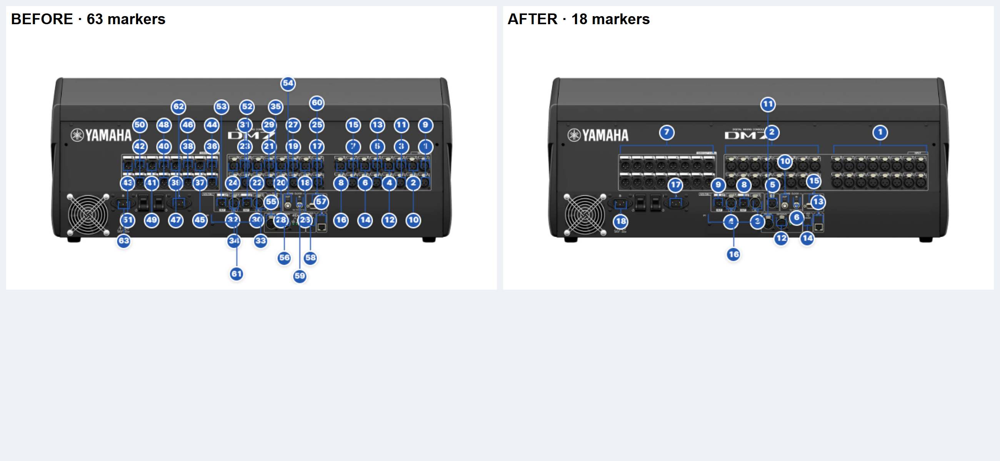
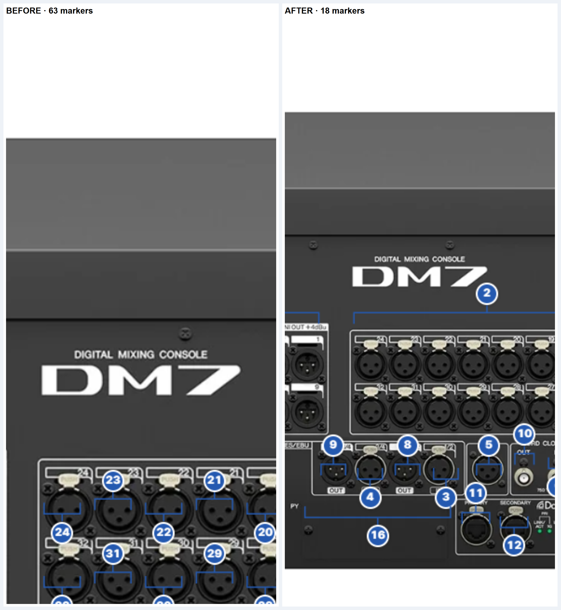

# W-20261002-004 DM7 반복 단자 묶음 근거

기준 `origin/main` `f124bf0f20d677cf8e1893b2fd43936bf6e31bb9`의 DM7 후면 지도 63개 항목을 검토했다. 공식 [DM7 매뉴얼](../../beta/site/docs/dm7-user-manual-0b1045e2664d.pdf) 물리 38~40쪽과 기존 검증 `io`는 아날로그 입력 32개, OMNI OUT 16개를 확인한다. 게시 [Rear 사진](../../beta/site/detail/images/dm7-rear.webp)은 정확 모델 DM7이며 1800×1800이다. 사진은 **수량 근거가 아니라 블록 경계와 좌표 근거**로만 썼다.

| 묶음 번호 | 설명 항목 | 기존 항목 | 사진의 가로 범위·위치 | 근거 |
|---:|---|---|---|---|
| 1 | 아날로그 입력 1–16 | 1~16 | 오른쪽 블록, x=1219~1566, y=865 | 기존 `io` INPUT 1–32·매뉴얼 38~39쪽·기존 번호 1~16 |
| 2 | 아날로그 입력 17–32 | 17~32 | 가운데 블록, x=814~1161, y=865 | 같은 `io`와 쪽·기존 번호 17~32 |
| 7 | OMNI OUT 1–16 | 36~51 | 왼쪽 블록, x=421~768, y=865 | 기존 `io` OMNI OUT 1–16·매뉴얼 38쪽 |

세 블록 사이에는 실제 빈 구간이 있다. 하나의 아날로그 입력 번호가 가운데·오른쪽 블록을 잇지 않도록 나누어 **63 → 18개**로 확정했다. 명세의 기본 목표 17개보다 1개 많은 이유다. 세 묶음의 번호와 괄호는 XLR 소켓 위쪽에 놓인다. 수량은 블록당 16개이며, 이미 검증된 `io`의 입력 32개·출력 16개와 기존 번호 범위를 대조했다. 입력 두 묶음의 설명에는 각 범위를 넣어 문장 반복을 없앴다.

나머지 고유 단자 15개는 명칭·설명·좌표를 보존했다. `워드 클록 입력`만 번호 순서 원칙에 맞게 출력보다 앞에 배치하고, 1~18 연속 번호를 매겼다. 제품 JSON에서 `portMap` 제거 후 SHA-256은 변경 전후 모두 `45744232469d0c9b6679ba34d2cc91e460c5b6e58681723c27127ed423b196bb`다. 근거 JSON의 `coreSha256`도 이 값으로 유지했다. PDF SHA-256 `e4db669ad55b036c1b22883756989d19edc352ae2b0aa0b46131460e19cb15a9`, Rear WebP SHA-256 `f50248dc1521fd9e17985d1d7bf71d6a7f313639717d4fb7d69ed92cdae973fe`는 기존 근거와 같다. 항목별 쪽·좌표는 [기계 검증 근거 JSON](W-20261002-002-port-map-evidence.json)의 `dm7.markers`에 갱신했다.

## 전후 화면 비교

| 1280px 전후 | 390px 전후 (사진을 가운데로 이동) |
|---|---|
|  |  |

설명 목록까지 포함한 원본 캡처는 [수정 전 1280px](W-20261002-004-dm7-screens/before-1280.png)·[수정 후 1280px](W-20261002-004-dm7-screens/after-1280.png), [수정 전 390px](W-20261002-004-dm7-screens/before-390-center.png)·[수정 후 390px](W-20261002-004-dm7-screens/after-390-center.png)에 보관한다. [1024px](W-20261002-004-dm7-screens/after-1024.png)·[721px](W-20261002-004-dm7-screens/after-721.png)도 확인했다. 전후 수치와 오류 검사는 [local.json](W-20261002-004-dm7-screens/local.json)에 기록한다.
