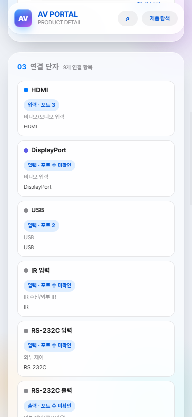
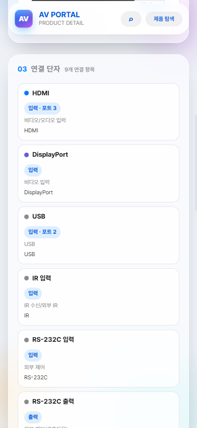

# W-20261002-006 — 연결 단자 수량 대조표

- 기준: `origin/main` `c18cd6efd493a1e995274abc88033d2a34deacec`, 2026-10-02 삼성전자 대한민국 비즈니스 제품별 동적 **스펙** 탭을 Chromium에서 열어 대조.
- 행별 공식 표기·URL·판정·제품 해시: [근거 JSON](W-20261002-006-io-port-counts-evidence.json). 공개 사진으로 수량을 세거나 `있음`을 `1`로 해석하지 않았다.
- 결과: 삼성 15종 `io` 136행 중 수량 공란 **87행**, 이번에 채운 행 **0**, 공란 유지 **87**. 기존에 수량이 있는 49행도 보존했다. **삼성 제품 JSON 변경 0개**.

| 국내 모델·공식 한국 스펙 | 수량 채움 | 공란 유지 |
|---|---:|---:|
| [HG43U800FNFXKR](https://www.samsung.com/sec/business/hotel-tvs/hoteltv-hu8000f/HG43U800FNFXKR/) | 0 | 4 |
| [HG50U800FNFXKR](https://www.samsung.com/sec/business/hotel-tvs/hoteltv-hu8000f/HG50U800FNFXKR/) | 0 | 4 |
| [HG65U800FNFXKR](https://www.samsung.com/sec/business/hotel-tvs/hoteltv-hu8000f/HG65U800FNFXKR/) | 0 | 4 |
| [LH115QHFEBGXKR](https://www.samsung.com/sec/business/smart-signage/standalone-lh115qhfebgxkr/LH115QHFEBGXKR/) | 0 | 7 |
| [LH32QMCEBGCXKR](https://www.samsung.com/sec/business/smart-signage/qmc-series/LH32QMCEBGCXKR/) | 0 | 7 |
| [LH43QHCEBGCXKR](https://www.samsung.com/sec/business/smart-signage/qhc-series/LH43QHCEBGCXKR/) | 0 | 6 |
| [LH43QMCEBGCXKR](https://www.samsung.com/sec/business/smart-signage/qmc-series/LH43QMCEBGCXKR/) | 0 | 6 |
| [LH75QHCEBGCXKR](https://www.samsung.com/sec/business/smart-signage/qhc-series/LH75QHCEBGCXKR/) | 0 | 6 |
| [LH85QMCEBGCXKR](https://www.samsung.com/sec/business/smart-signage/qmc-series/LH85QMCEBGCXKR/) | 0 | 6 |
| [LH98QECEDGCXKR](https://www.samsung.com/sec/business/smart-signage/qec-series-d/LH98QECEDGCXKR/) | 0 | 5 |
| [LH98QMCEBGCXKR](https://www.samsung.com/sec/business/smart-signage/qmc-series-98/LH98QMCEBGCXKR/) | 0 | 6 |
| [LH55VHCRBGBXKR](https://www.samsung.com/sec/business/smart-signage/videowall-vhc-r-series/LH55VHCRBGBXKR/) | 0 | 8 |
| [LH55VMCRBGBXKR](https://www.samsung.com/sec/business/smart-signage/videowall-vmc-r-series/LH55VMCRBGBXKR/) | 0 | 8 |
| [LH55WMFWBGCXKR](https://www.samsung.com/sec/business/smart-signage/flip-pro-wmfx/LH55WMFWBGCXKR/) | 0 | 5 |
| [LH75WMFWLGCXKR](https://www.samsung.com/sec/business/smart-signage/flip-pro-wmfx/LH75WMFWLGCXKR/) | 0 | 5 |
| **합계** | **0** | **87** |

## 공란 유지 판단

공식 탭에 해당 단자가 있으나 수량 대신 `있음` 또는 단자 형식만 쓰인 행 **55**(예: LH32QMC `RS232 입력: 있음`, `오디오출력: Stereo Mini Jack`; 호텔 TV `RJ12: 있음`, `Ethernet Bridge (LAN-Out): 있음`)은 공란을 유지했다. 대응 항목 자체가 없는 행 **10**(LH115 상세 단자 6, 55인치 Flip 상세 단자 4)도 공란이다. `무선(물리 단자 없음)` **7**행에는 물리 포트 수를 적지 않았다. Flip의 `USB: 1 (Rear), 1 (with optional tray)` 또는 `USB: 2 (Front 1, Rear 1)`은 **USB-C 허브** 개수의 근거가 아니고, `비디오출력: 있음`도 **HDMI 출력** 개수의 근거가 아니므로 이 **3**행도 공란을 유지했다.

공식 탭이 `없음`이라고 적은 기존 I/O 행 **12**개는 수량 문제가 아니라 **단자 존재 여부 불일치**이다. 이번 범위에서는 I/O 행·출처·검증 상태를 바꿀 수 없으므로 공란을 유지하고 별도 정정 입력으로 넘긴다. LH32QMC의 `DP 입력: 없음`, `오디오 입력: 없음`; LH98QEC의 `DP 입력: 없음`, `IR 입력: 없음`, `오디오 입력: 없음`; 다른 QHC/QMC 제품의 `오디오 입력: 없음`; 두 비디오월의 `전원 출력: 없음`이 해당한다. **`0`을 채워 단자가 없는 사실을 수량처럼 보이게 하지 않았다.**

## A 표시 수정과 화면

LH32QMC의 03 카드 9개 중 `포트 수 미확인` **7→0개**. A만 적용한 시점의 화면에서 카드가 충분히 간결해졌다. HDMI `입력 · 포트 3`, USB `입력 · 포트 2`는 유지되고, 전체 단자 표의 `미확인` 7행도 그대로다. 제품 데이터 변경 없이 해결된 표시 문제임을 [1280 전](W-20261002-006-screens/before-lh32qmcebgcxkr-1280.png)·[1280 후](W-20261002-006-screens/after-lh32qmcebgcxkr-1280.png), [390 전](W-20261002-006-screens/before-lh32qmcebgcxkr-390.png)·[390 후](W-20261002-006-screens/after-lh32qmcebgcxkr-390.png)에서 나란히 확인할 수 있다.

| LH32QMC 390px 수정 전 | LH32QMC 390px A 적용 후 |
|---|---|
|  |  |

삼성 15종 × 390px와 회귀 4종(`brc-am7`, `rio1608-d3`: 숫자 수량 모두 기입 / `qlxd1`: 수량 전부 공란 / `cdi-2-1200bl`: 삼성 외 혼합) = **19화면**을 [캡처 폴더](W-20261002-006-screens/)에 남겼다. [로컬 화면 검사 결과](W-20261002-006-screens/local.json): `포트 수 미확인` 카드 0, 가로 넘침 0, 깨진 이미지 0, JS 예외 0. 전체 단자 표는 수량 공란을 계속 `미확인`으로 표시했다.

## 검증·병합 기록

- A 전용 검사 RED: `node --test tests/io-port-counts.test.mjs` **0 pass / 1 fail**, 카드가 실제로 `입력 · 포트 수 미확인`을 반환. A 수정·생성물 동기화 후 GREEN 1/1.
- B 근거 검사 RED: 15종 행별 근거가 없어서 **1 pass / 1 fail**. 공식 탭 15개 대조와 87행 근거 기록 후 GREEN **2 pass / 0 fail**.
- `npm.cmd test` **193 tests / 192 pass / 0 fail / 기존 skip 1**. `node beta/verify-pages.mjs` **247·240·371**. `node beta/build-search-index.mjs`와 `--check` **622326 bytes OK**(생성물 변경 0). `node beta/build-readable-catalog.mjs` 종료 코드 0(변경 0). `node beta/sync-detail-assets.mjs` 동기화 9쌍, 실제 변경은 공개 `detail/app.js` 1개. `git diff --check` 통과.
- 자체 리뷰: 신규 Critical 0 / 신규 Important 0. 기존 한국 스펙과 I/O 존재 여부 불일치 12행은 이 PR에서 수정하지 않고 별도 제품 데이터 판단으로 인계. PR·Pages·공개 확인은 실제 수행 뒤 보완한다.

### 병합·공개 확인 (사후 기록)

- [구현 PR #170](https://github.com/Seoulav/AV-Portal/pull/170) **MERGED** 2026-10-02T07:24:20Z, 병합 SHA `a0e7b644db8977f7f534d751f39dbe3395fceaec`. [Pages run 36978382588](https://github.com/Seoulav/AV-Portal/actions/runs/36978382588) **success**.
- [공개 LH32QMC](https://seoulav.github.io/AV-Portal/detail/?product=lh32qmcebgcxkr#io) 1280px·390px에서 카드 7개의 반복 문구 제거, 숫자 수량 카드와 전체 단자 표의 `미확인` 유지. [공개 1280px](W-20261002-006-screens/public-lh32qmcebgcxkr-1280.png)·[공개 390px](W-20261002-006-screens/public-lh32qmcebgcxkr-390.png).
- 공개 모바일 19화면(삼성 15종+회귀 4종)의 [검사 결과](W-20261002-006-screens/public.json): `포트 수 미확인` 카드 0, 가로 넘침 0, 깨진 이미지 0, JS 예외 0. 공개 `detail/app.js`와 삼성 JSON 15개를 병합 Git blob과 바이트 단위로 대조해 **16/16 일치**.
