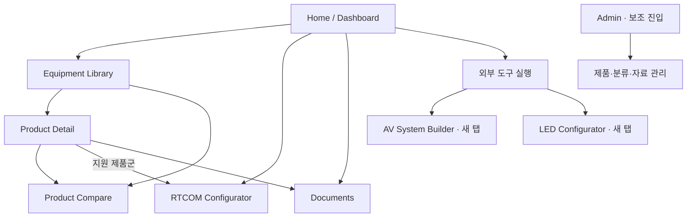

# PORTAL MVP SPEC

## Product Detail 기획 보강 — 2026-09-24

이번 사용자 요청은 Product Detail의 정보 구조·UI 기준 보강 승인이다. 구현 착수·READY 전환·Final Schema·Database/Storage 결정 승인이 아니다. 기준 main은 888b035aafaeb9eb0472abcc2ec4e42a565b578f이며, W-013에서 공개된 베타 25개와 승인된 다섯 필드 범위를 유지한다. 아래 상세 요구는 향후 화면의 목표이며 현재 데이터에 없는 설명·사진·사양을 채우거나 공개하는 승인이 아니다. 기존 정식 공개 자료 요건과 제한된 베타의 승인 범위를 구분한다.

## 자료 수집 정책 정정 (2026-09-22)

이번 사용자 운영 결정은 아래 기존 URL·출처·자료 수집 요구와 충돌할 경우 우선한다. 최종 Schema나 수집 구현을 확정하는 작업이 아니다.

### RTCOM — 제조사 직접 제공 자료

RTCOM은 사용자가 제조사에서 직접 공식 자료를 제공받는다. **Work는 RTCOM 제품에 대해 별도 웹 조사·자동 웹 검색·크롤링을 수행하지 않는다.** Product / Model List, Datasheet / Specification, User Manual, Front Image, Rear Image, Drawing / CAD 및 기타 제조사 제공 기술자료를 최우선 공식 근거로 사용한다.

공개 Source URL이 없어도 제조사 직접 제공임을 확인할 수 있는 자료는 `MANUFACTURER_DIRECT`와 같은 출처 개념으로 공식성을 표현한다. 제공 주체·수령일·전달 경로·원본 파일·적용 모델/Revision을 추적하고, URL을 임의 생성하지 않는다. URL 부재만으로 직접 제공 자료를 비공식 또는 자료 누락으로 판정하지 않는다. 직접 제공 사실이 사양 충돌을 자동 해소하거나 개별 제품의 모든 공개 요건을 충족한다는 뜻은 아니다.

제품별 공식 웹사이트 또는 제품/Series 페이지 URL은 가능하면 제조사로부터 함께 제공받는다. 제품 전용 페이지가 실제로 존재하지 않는 경우, 공식 제조사 사이트 URL·관련 Series 페이지 URL·`DEDICATED_PRODUCT_PAGE_NOT_AVAILABLE` 같은 부재 사유 개념을 구분한다. 아직 URL을 받지 못한 경우와 전용 페이지가 없다고 확인된 경우는 다르다. 제품 전용 페이지 부재는 제조사 확인 근거와 함께 관리하고, 임의 링크 생성이나 별도 웹 조사로 해결하지 않는다.

Product Detail은 Manual / Datasheet 옆에 확보된 공식 링크를 제공하되 링크 종류를 ‘제조사 공식 제품 페이지’, ‘공식 Series 페이지’, ‘제조사 공식 사이트’로 정확히 표시한다. 전용 페이지가 없으면 그 사실을 구별하며 홈페이지를 전용 제품 페이지로 위장하지 않는다. 전용 페이지 부재는 일반 미수집과 구분하여 공개 준비 검토에 반영한다. 이는 Datasheet·Manual·고해상도 전면/후면 자료의 필수 확보 요건을 면제하는 것이 아니다.

### RTCOM 이외 제조사 — 지정 제품만 조사

Yamaha, Shure, Samsung, AMX, Analog Way 등은 **사용자가 제공한 조사 대상 장비 리스트에 있는 제품만** 조사한다. 제조사 전체 제품이나 관련 모델을 임의로 대량 수집하지 않는다. 지정 제품마다 제조사 공식 Product Page, 공식 Datasheet / Specification, 공식 User Manual, 공식 고해상도 Front Image, 공식 고해상도 Rear Image의 5종을 조사한다.

조사 순서는 **Manufacturer Official Product Page → Official Downloads / Support → Official Datasheet / Manual → Official Media Kit / Press Assets**다. 판매점·블로그·커뮤니티·비공식 이미지 사이트는 공식 자료의 대체 근거로 사용하지 않는다.

항목별 조사 결과는 `FOUND`, `MISSING`, `CONFLICTED`, `REVIEW REQUIRED` 같은 개념으로 남긴다. FOUND는 해당 자료를 찾았다는 뜻이며 자동으로 사양 검증 또는 공개 준비 완료를 뜻하지 않는다. 필수 자료의 누락은 기존 `REQUIRED / MISSING` 요구와 연결한다. 찾지 못한 자료를 추측하거나 다른 모델 자료로 대체하지 않는다.

### 공통 유지 기준

Front / Rear Image는 가능하면 긴 변 2000px 이상의 제조사 원본을 우선한다. 누락 이미지를 생성하거나 저해상도 AI 확대본을 공식 원본으로 취급하지 않는다. 공식 출처·적용 모델·이미지 역할과 실제 원본 해상도를 추적한다. 출처/상태 개념의 명칭은 예시이며 최종 필드명·enum·Product Data Schema는 미확정이다.

기존 4개 모델 제외, Portal 대상 28개 항목, 원본 자료 보존, 기존 시스템 코드·데이터 미변경 범위를 유지한다. 이번에는 자료 수집 정책만 반영하며 새 제품 조사·자료 수집·외부 발송은 실행하지 않는다.

## 정식 공개 자료 요건 추가 (2026-09-22)

앞으로 AV Portal에 정식 공개하는 모든 Product는 **① 제조사 공식 해당 제품 페이지 URL ② 공식 Datasheet / Specification ③ 공식 User Manual ④ 고해상도 Front Image ⑤ 고해상도 Rear Image**를 확보해야 한다. RTCOM의 출처 URL 및 전용 페이지 예외는 상단 자료 수집 정책 정정을 따른다. 이 기준은 아래의 자료 부족 제품 공개 관련 이전 제안보다 우선한다. 기존 28개 대상 항목도 자동으로 공개 준비 완료가 되는 것은 아니다.

- Product Detail의 Manual / Datasheet 옆에 **제조사 공식 제품 페이지**로 바로 이동하는 링크를 제공한다. 제조사 홈페이지 첫 화면이나 판매점 페이지를 해당 제품의 공식 페이지로 대체하지 않는다.
- Front / Rear는 제조사 공식 Product Page, Media Kit, Press Asset 등 공식 출처를 우선한다. 이미지별 Source URL(있는 경우) 또는 제조사 직접 제공 증빙, 제공 주체·원본 파일·해상도·적용 모델·전면/후면 역할의 출처를 추적할 수 있어야 한다. 문서도 공식 출처·적용 모델·Revision을 추적한다.
- 가능하면 긴 변 **2000px 이상인 고해상도 원본**을 우선한다. 2000px은 우선 확보 목표이며 이번 요구만으로 절대적인 최소 픽셀 기준을 확정하지 않는다. 고해상도 적합성 확인 없이 저해상도 자료를 충족 처리하지 않는다.
- 제조사가 Rear Image 또는 고해상도 이미지를 제공하지 않으면 해당 자료를 **`REQUIRED / MISSING`**으로 남긴다. 임의 생성, 다른 모델 사진 대체, AI 확대본을 공식 고해상도 원본으로 취급하는 것은 금지한다. 저해상도 참고 파일이 존재하더라도 필수 고해상도 자료의 충족과 구분한다.
- 5종 중 누락되거나 공식 출처·적용 대상이 확인되지 않은 자료가 있으면 **정식 공개 준비 완료로 판정하지 않는다.** 내부 준비·증빙 보존은 가능하다. 단순 파일 존재, 사양 검증 상태, 제품 판매 상태와 공개 준비 상태를 구분한다.
- `official_product_url`, `datasheet`, `user_manual`, `front_image`, `rear_image`, `image_source`, `document_source`, `publication_readiness`는 향후 Schema에서 표현할 **요구 개념**이다. 최종 필드명·자료형·상태 enum·저장 구조는 확정하지 않는다. 여기서 자료의 ‘필수’는 운영상 공개 요건이며 Database 필수 필드 설계가 아니다.
- 기존 4개 모델의 `EXCLUDED FROM PORTAL` 결정은 계속 적용한다. 제외 모델에 이 자료를 새로 수집·검증하지 않는다. 원본 자료는 보존한다.

## 운영 범위 정정 — 제품 제외 (2026-09-21)

사용자 운영 결정에 따라 **HS-88M-U, HS-88MX, HD-D104U, HD-D108U는 `EXCLUDED FROM PORTAL`**이다. 이 결정은 아래 과거 분석·보존 권고보다 우선한다.

- Equipment Library 등록, Search/Filter 결과, Product Detail 생성, Product Compare, Taxonomy Mapping, Migration, 제품 데이터 검증·수집, Portal 제품 수량 집계에서 모두 제외한다.
- 과거 조사 기록에 해당 모델이 남아 있더라도 증빙·이력일 뿐, 활성 제품·검증 대기·향후 자동 등록 후보가 아니다. 명칭·사양 충돌의 해소도 Portal의 후속 과제로 요구하지 않는다.
- 원본 ZIP/PDF/Catalog/Datasheet 및 기타 제조사 자료는 수정·삭제하지 않는다. 여러 제품이 수록된 문서도 전체 원본을 보존하되 제외 모델 구역은 제품 데이터 준비에 사용하지 않는다.
- 기존 Library **31개는 조사 당시 원본 수량**이다. 이 중 HS-88MX, HD-D104U, HD-D108U의 3개 항목을 제외하여 현재 Portal 기준은 **28개 장비·시리즈 항목**이다. HS-88M-U는 원래 31개 목록에 없으므로 다시 차감하지 않는다. Series·묶음이 포함되어 있으므로 28개 SKU를 뜻하지 않는다.
- 이후 분석과 Product Data 준비는 이 제외 범위를 적용한다. 이번 변경은 문서 반영이며 기존 시스템 코드·데이터를 변경한 것은 아니다.

**개발 대상:** AV Equipment Library / RTCOM Configurator → AV Portal  
**상태:** 사용자 기능·화면 구조 제안 / 검토 대기  
**작성일:** 2026-09-21  
**기준 문서:** [EXISTING_SYSTEM_ASSESSMENT.md](./EXISTING_SYSTEM_ASSESSMENT.md), [CORE_DOMAIN_CONCEPTS.md](./CORE_DOMAIN_CONCEPTS.md)의 정정된 범위

## 0. 목표와 범위

Portal MVP의 목표는 사용자가 **장비를 찾고, 사양과 근거를 확인하고, 후보를 비교하고, RTCOM 구성을 검토**할 수 있게 만드는 것이다. 필요한 경우 기존 AV System Builder와 LED Configurator를 외부 링크로 실행한다.

개발 중심은 기존 RTCOM 사이트다. Builder와 LED의 코드·Database·Product Data·계산 Logic·기능을 변경하지 않는다. 세 시스템의 데이터·Project·BOM·Authentication·Compatibility를 통합하지 않는다.

이 문서는 사용자가 보는 화면과 기능 요구를 정의한다. Architecture, Database, Framework, Repository 구조, 최종 Product Schema, Authentication 구현은 결정하지 않는다. 화면 이름은 정보 구조를 설명하며 실제 URL·컴포넌트·API 규격이 아니다.

기존 기능에 대한 판단은 1차 평가의 조사 결과를 사용한다. 기존 세 시스템의 재조사·제조사 사양 재검증·코드 구현은 수행하지 않았다. 추가로 사용자가 제시한 TechDataPS 제품 상세 페이지를 화면과 공개 텍스트로 확인하여 §3.3의 UX 참고로 반영했다. 아래 수치 필터와 제품 사례는 UX 설명이며 특정 장비의 공식 사양을 확정하지 않는다.

### 단계 표기의 의미

- **MVP:** 초기 사용자 흐름에 필요한 기능. 현재 문서의 검토 대상이며 구현 완료를 뜻하지 않는다.
- **Phase 2:** Portal 내부의 사용성·관리 효율을 높이는 후속 후보. MVP 완료 조건에 포함하지 않는다.
- **Future:** 별도 요구 확인 후 검토할 장기 후보. 자동으로 개발 범위에 포함되지 않는다.

각 절에서 별도 단계 표기가 없는 세부 동작과 상태 처리는 해당 MVP 기능의 요구사항이다. §10의 기능 목록이 단계 구분의 기준이다.

## 1. Portal Information Architecture

### 1.1 주요 메뉴

| 메뉴 | 포함 화면과 역할 | 단계 |
|---|---|---|
| Home | 검색·카테고리·설계 도구·주요 자료로 시작하는 Dashboard | MVP |
| Equipment Library | 제품 목록, 카테고리별 탐색, 상세, 비교 | MVP |
| RTCOM Configurator | 기존 XDM / SPX / VDM 구성 흐름 | MVP |
| Documents | 제조사 자료와 공개 가능한 내부 자료 탐색 | MVP |
| 외부 도구 | AV System Builder 실행, LED Configurator 실행 | MVP |
| Admin | 운영 담당자의 제품·자료 관리 화면. 보조 메뉴로 분리 | MVP 요구사항 |

**Product Detail과 Product Compare는 상위 메뉴로 만들지 않는다.** 상세는 목록에서 선택해 열고, 비교는 목록·상세의 “비교에 추가”를 통해 진입한다. 비교함은 Library 화면에서 항상 찾을 수 있게 표시한다. 일반 사용자의 주 메뉴에 관리 항목을 나열하지 않는다.

Home과 Dashboard는 같은 화면으로 두고 중복 메뉴를 만들지 않는다. 외부 도구 두 개도 주 메뉴 두 칸을 각각 차지하게 하기보다 “외부 도구” 아래에 묶고 Home에는 직접 실행 카드를 제공한다. 별도의 외부 도구 소개 페이지는 MVP에 만들지 않는다.

### 1.2 공통 화면 원칙

- 사용자가 현재 위치를 알 수 있도록 제목·선택 카테고리·뒤로 가기를 제공한다. 상세·비교에서 목록으로 돌아오면 검색어·필터·스크롤 위치를 유지한다.
- 같은 Portal 안에서 목록·상세를 이동하는 동안 비교 선택을 유지한다. 로그인·다른 기기·브라우저 재실행까지의 유지 기능은 MVP에서 약속하지 않는다.
- 로딩 중, 결과 없음, 데이터 미등록, 읽기 실패를 구분한다. 실패에는 재시도와 목록으로 돌아가기 동작을 제공한다.
- 키보드로 검색·필터·비교 선택·메뉴를 사용할 수 있고, 포커스를 확인할 수 있어야 한다. 검증 상태는 색상과 함께 텍스트로 표시한다.
- 모바일에서는 필터를 접어 열고 적용하도록 한다. 상세는 세로 배치하며 비교표는 제품명과 항목명을 식별할 수 있는 가로 스크롤을 제공한다.
- 외부 링크와 새 탭 동작을 실행 전에 표시한다. 링크를 위해 로그인하거나 제품·프로젝트 데이터를 전달하는 흐름은 만들지 않는다.

## 2. Dashboard

Home은 통계 대시보드보다 **바로 작업을 시작하는 화면**으로 구성한다. 사용 기록이나 공통 프로젝트 데이터가 필요하지 않은 범위로 제한한다.

### 2.1 화면 구성과 작업

| 영역 | 사용자에게 보일 내용 | 주요 동작 |
|---|---|---|
| 상단 검색 | “제조사, 모델명, 기능으로 장비 검색” | 검색어를 유지한 채 Library 결과로 이동 |
| 카테고리 탐색 | 현재 제품 카테고리와 표시 항목 수 | 선택 카테고리가 적용된 Library 열기 |
| RTCOM 설계 | “XDM / SPX / VDM 매트릭스 구성” | 기존 Configurator 열기 |
| 외부 도구 | Builder와 LED의 역할 설명, 외부 링크 표시 | 각각 기존 URL을 새 탭으로 열기 |
| 주요 Documents | 운영자가 선정한 3~5개 자료의 제목·제조사·유형·출처 | 자료 열기 또는 Documents 전체 보기 |

현재 카테고리는 모듈형 매트릭스, 일체형 매트릭스, 분배기·선택기, 전송기·확장, 케이블의 5개를 출발점으로 한다. “전체”는 조회 선택지이며 여섯 번째 카테고리로 계산하지 않는다. 카테고리 수와 항목 수는 화면에 실제 표시하는 분류·목록과 일치해야 한다.

현재 대상 28개 항목에는 제품군과 묶음이 포함되므로 “28개 구매 가능 제품” 대신 “28개 장비·시리즈”처럼 실제 의미에 맞게 표현한다. 제외 모델을 집계하지 않고 실제 대상 수에 따라 갱신한다.

“최근 본 자료”, 개인 즐겨찾기, 개인화된 작업 이력은 **Phase 2**로 미룬다. MVP에는 운영자가 고른 주요 자료만 제공하며 최근 사용 기록을 수집하는 기능을 요구하지 않는다.

## 3. Equipment Library와 Product Detail

### 3.1 Library 목록 — MVP

화면은 **검색·필터 / 결과 요약·정렬 / 제품 카드 / 비교함**으로 구성한다. 초기 데이터는 제외 모델을 뺀 RTCOM 28개 항목을 대상으로 하되 제품군·개별 모델·TX/RX 묶음을 구별해 표시한다.

| 요소 | 요구사항 |
|---|---|
| Manufacturer | 제조사로 탐색 가능. 초기 제조사가 하나라도 표시하고 향후 제조사 추가 시 동일한 화면 구조로 수용 |
| Category | 사용자 언어의 분류명과 항목 수 제공. “전체” 포함 |
| Series | 소속이 확인된 경우 탐색 수단으로 표시. Series 정보가 없는 제품에 임의 값을 채우지 않음 |
| Model | 실제 모델명을 명확히 표시. Series 항목과 개별 Model을 같은 수준의 구매 품목으로 오인하지 않게 구분 |
| Product Card | 이미지, 제조사, 이름, 항목 유형, 카테고리/Series, 핵심 정보 최대 3개, 검증 상태, 상세·비교 동작 |
| 결과 요약 | 결과 수와 적용한 검색어·필터 표시. 조건별 해제와 전체 초기화 제공 |
| 정렬 | 검색 시 관련도, 이름순. 가격순·인기순은 MVP 제외 |
| 비교함 | 선택 제품명·개수, 제거, 비교 시작. 2~4개 선택 |

기존 자료의 장비군·묶음을 화면에서 구별하는 것은 최종 Product Schema 확정이 아니다. 공식 모델·판매 단위가 불명확하면 “제품군”, “TX/RX 묶음 · 판매 단위 확인 필요”처럼 현재 확인 수준을 표시한다.

제품군 항목에는 “모델 보기/구성 검토”, 개별 제품에는 “상세 보기”를 제공할 수 있다. 모듈형 제품의 최대 사양은 카드가 모두 장착된 현재 구성의 사양처럼 표시하지 않는다. 제품 이미지가 없으면 이미지 미등록 상태를 표시하고 유사 모델의 사진으로 대체하지 않는다.

### 3.2 Product Detail — MVP

| 화면 순서 | 구성 | 표시 기준 |
|---|---|---|
| A. Product Header | Manufacturer, Product / Model, Series, Category, 짧은 영문 설명, 한글 제품 설명, Verification Summary | 이 순서 유지, Category 복수 허용, 미등록 설명 추정 금지 |
| B. Product Image Gallery | 큰 대표 이미지 + Main / Front / Rear / Perspective / Other 썸네일 | Front·Rear 최소 확보 목표, Missing Image·역할·확대·출처. 다른 모델·AI 이미지 대체 금지 |
| C. Quick Documents | User Manual, Datasheet, Specification, Technical Document, Drawing / CAD, Brochure, Official Product Page | 설명과 가까운 위치, 2×2/2×3 우선·추가 자료는 다음 행, 없는 버튼 없음 |
| D. Main Detail Sections | Overview → Features → Specifications → I/O → Documents → Sources & Verification | Desktop Section Navigation, Mobile 가로 스크롤 Sticky Tab |

상세 동작·누락 상태·접근성·검수 기준의 기준 문서는 [UI/UX §5](UI_UX_SPEC.md#5-product-detail--av-engineering-library)다. Specifications는 General / Video / Audio / Control / Network / Power / Physical / Environment 중 적용 그룹별 Name·Value·Unit·Condition·Source·Verification을 보존한다. I/O는 Connector·Signal·Direction·Quantity·Protocol·Fixed/Optional·Card/Module·Condition 및 근거를 독립 영역에서 제공한다. 사진과 I/O의 위치 연결은 향후 검토로 남긴다. 이 항목들은 화면 요구이며 최종 Schema/DB 결정이 아니다.

Manufacturer Official과 Supplemental / Domestic을 구별한다. JBL/AMX/BSS는 공식+TechDataPS, Shure는 공식+삼아프로사운드 비교 정책을 유지한다. 검토 표시는 VERIFIED / CONFLICTED / REVIEW REQUIRED이며 자료 확보·사양 검증·공개 허가는 각각 독립 판단한다.

상세의 긴 내용은 섹션 바로가기로 이동하게 하고 중요한 상태를 접힌 영역에만 숨기지 않는다. 지원 모델 목록이 없는 Series는 카드별 정확한 사양을 추측해 보여주지 않는다.

**“정보 없음”, “해당 없음”, “미지원”, “0개”를 다르게 표시한다.** 미지원·0개는 근거가 있을 때만 사용한다. 포트 목록이 비어 있다고 “입출력 없음”으로 표시하지 않는다. 카탈로그의 AxB 요약은 오디오·제어 포트까지 포함한 전체 물리 포트 명세와 구별한다.

Verification은 제품 전체의 보증 배지가 아니다. “카탈로그 기준”, “확인 필요”, “자료 불일치”, “검증됨”처럼 기존 상태를 이해하기 쉬운 말로 표현하고, 검증됨에는 범위·근거를 연결한다. 자료의 출처가 공식이라는 사실만으로 모든 사양을 검증 완료로 바꾸지 않는다.

다제조사 등록을 수용할 UX는 MVP에 포함하지만, 여러 제조사의 제품을 대량 수집·입력하는 작업은 MVP 필수 조건이 아니다. 기존 Builder나 LED의 제품 데이터를 가져오지 않는다.

### 3.3 참고 사례를 반영한 AV Engineering Library 상세 UX — MVP

**참고 페이지:** [TechDataPS AMX VARIA-100 제품 상세](https://techdata-ps.com/m21_view.php?listType=1&c_code=005004&idx=2655), 2026-09-21 확인. 제조사 표시가 포함된 탐색 경로, 큰 제품 이미지, 제품명·설명, 매뉴얼·시방서·사양서·도면 링크, 특징/스펙 구분을 관찰했다. 링크된 파일 내용과 사양의 정확성은 검증하지 않았다.

이 사례는 제품을 알아보고 자료에 접근하는 흐름의 참고다. 페이지 디자인·문구·이미지를 복제하거나 제품 데이터를 가져오지 않는다. Portal은 제품 소개와 함께 엔지니어링 검토를 할 수 있도록 다음과 같이 설계한다.

| 참고할 방식 | Portal에서의 적용 |
|---|---|
| 제조사 중심의 탐색 맥락 | 상세 상단에 제조사·Category·Series를 표시하고 각 항목으로 필터된 Library로 이동. 별도 제조사 홍보 페이지는 MVP에 추가하지 않음 |
| 제품명·설명·대표 이미지 | 한 영역에서 제품 정체성과 용도를 확인. 설명은 짧게 요약하고 자세한 내용은 개요 섹션에서 제공 |
| 자료 유형별 빠른 접근 | 상단에 매뉴얼·사양서·도면 등 등록된 자료의 바로가기 제공. 전체 자료는 Documents 섹션에서 관리된 목록으로 확인 |
| 특징과 스펙의 구분 | 개요와 Structured Specifications를 분리. 마케팅 설명을 검증된 수치 사양처럼 표시하지 않음 |

**화면 배치 제안:**

| 위치 | 데스크톱 | 모바일 |
|---|---|---|
| 탐색 줄 | 목록 복귀, 제조사·Category·Series 경로 | 줄바꿈 가능한 경로와 목록 복귀 |
| 제품 요약 | A Header → B Gallery → C Quick Documents | 같은 순서 유지 |
| 주요 동작 | 비교에 추가, 자료 바로가기, 지원 제품의 RTCOM 구성기 열기 | 같은 동작을 짧은 버튼으로 배치 |
| 섹션 바로가기 | Overview / Features / Specifications / I/O / Documents / Sources & Verification | 같은 순서의 가로 스크롤 Sticky Tab |
| 본문 | Overview → Features → 사양 → I/O → 자료 → 출처·검증 | 같은 정보 순서를 세로로 제공 |

상단의 큰 홍보 배너를 필수로 두지 않는다. 사용자가 제품 소개뿐 아니라 비교와 검증 작업을 빠르게 시작할 수 있도록 이미지 높이를 조절하고 제품명·핵심 동작이 가까이 있도록 배치한다. 시각 방향은 UI/UX §5.7의 밝은 RTCOM/LED 계열을 따른다. 구체적 디자인 토큰·코드는 이번에 결정하지 않는다.

**엔지니어링 검토를 위한 추가 동작:**

- Structured Specifications는 항목·값·단위·조건·상태를 읽을 수 있는 표로 제공한다. 사양서 파일을 다운로드해야만 핵심 사양을 볼 수 있는 구조에 머무르지 않는다.
- I/O Ports는 독립 섹션으로 두고 방향·커넥터·신호·수량·고정/옵션 여부를 표시한다. 사진이나 특징 문구만 보고 포트를 추정하지 않는다.
- 각 사양·포트의 “근거 보기”는 해당 문서와 확인된 페이지 또는 근거 메모를 보여준다. 페이지를 모르면 문서만 연결하고 페이지 번호를 만들지 않는다.
- Verification & Sources에는 전체 검토 요약과 항목별 미확인·불일치를 보여준다. 제품 상단 배지만으로 모든 사양이 확인됐다고 표현하지 않는다.
- Product Compare는 제품 요약 영역에서 바로 추가할 수 있게 하며 §5의 2~4개 비교와 Category 제한을 그대로 적용한다. 상세와 비교에서 같은 사양·조건·근거 표현을 사용한다.
- 자료 유형에 파일이 하나면 바로 열기/다운로드하고, 여러 개면 언어·버전·적용 모델을 선택할 수 있는 목록을 보여준다. 등록되지 않은 유형에는 작동하지 않는 다운로드 버튼을 만들지 않는다.

자료 바로가기에는 파일 형식과 동작을 구분해 표시한다. PDF·HWP·PPTX 등 파일 확장자만으로 Datasheet·시방서의 의미나 공식 여부를 판단하지 않는다. 같은 자료의 상단 바로가기와 본문 Documents 항목은 서로 다른 버전으로 안내되지 않아야 한다.

## 4. Search / Dynamic Filter

### 4.1 검색할 수 있는 정보 — MVP

| 검색 대상 | 사용자 경험 | 제한 |
|---|---|---|
| Manufacturer / Series / Model | 전체·부분 명칭으로 검색, 확인된 별칭 활용 | PSE·TX·RX 같은 구분 문구를 없애서 동일 제품으로 취급하지 않음 |
| Category / Keyword | 카테고리명, 용도·기능 설명으로 검색 | 검색 결과를 기술적 추천·호환 판정으로 표시하지 않음 |
| Signal / Interface | HDMI, SDI 등 등록된 용어로 검색·필터 | 커넥터·신호·매체를 구분해 표시; 같아 보이는 명칭을 동일 의미로 강제하지 않음 |
| 주요 Specifications | 등록된 핵심 사양값을 검색어로 찾고, 지원하는 항목은 필터 제공 | 설명에만 등장한 문구와 정형 사양 일치를 구별 |
| Verification | 검증 상태별로 조회 | 미확인 제품을 기본 목록에서 자동 제외하지 않음 |

검색은 대소문자·일반적인 공백 차이를 처리하고 기존에 확인된 동의어를 활용한다. “4K면 모든 4K 요구 충족” 같은 추론 검색은 하지 않는다. 자연어 추천·의도 해석은 **Future**로 둔다.

### 4.2 필터 구성

**공통 필터:** Manufacturer, Category, Series, Verification. Series는 현재 제조사·분류 범위에서 의미가 있는 값만 제공한다. **전체 카테고리 조회 중에는 공통 필터를 중심으로 제공하고, 특정 카테고리로 좁히면 해당 제품군의 핵심 필터를 추가**한다.

| 제품군 | MVP의 카테고리별 필터 후보 | 데이터가 부족할 때 |
|---|---|---|
| 모듈형 매트릭스 | Series, 등록된 지원 신호 | 슬롯 수·카드 혼합 가능 여부를 임의 필터로 만들지 않음 |
| 일체형 매트릭스 | 입출력 토폴로지, 등록된 신호 | 전체 물리 포트 수와 혼동하지 않게 라벨 표시 |
| 분배기·선택기 | 제품 유형, 입출력 토폴로지 | 설명만 있는 수치는 정형 조건 충족으로 판단하지 않음 |
| 전송기·확장 | 전송 매체, TX/RX/전환형 등 확인된 역할 | 묶음 항목과 단품 역할을 구분; 모르는 값은 정보 미등록 |
| 케이블 | 케이블 유형, 전송 매체 | 확인되지 않은 길이·대역폭 조건은 제공하지 않음 |

카테고리별로 **신뢰할 수 있는 소수의 핵심 필터**만 출시한다. 값·단위·조건을 일관되게 비교할 수 없는 필터는 감춰 두고 상세 원문으로 안내한다. 필터 항목을 채우기 위해 데이터를 추정하지 않는다. 수치 범위·최소 해상도·대역폭 등 복잡한 조건 검색은 자료 정리 후 **Phase 2**에서 검토한다.

### 4.3 조건 적용과 전환

- 같은 필터에서 여러 값을 고르면 “하나 이상 포함”, 서로 다른 필터는 “모든 조건 충족”으로 적용한다. 화면 설명도 이 의미와 일치해야 한다.
- 검색어와 필터는 함께 적용한다. 결과 0개이면 현재 조건을 보여주고 조건별 해제·전체 초기화를 제공한다. 아무 결과나 보여주도록 조건을 몰래 완화하지 않는다.
- 검색어·필터 칩·결과 수가 항상 함께 갱신된다. 조작 중 초점이나 스크롤이 불필요하게 이동하지 않게 한다.
- Category 변경으로 해당하지 않게 된 전용 필터는 해제하고 어떤 조건이 해제됐는지 알려준다. 공통 필터는 유지하며 제조사 변경으로 Series가 무효가 되는 경우도 동일하게 처리한다.
- 특정 사양 필터를 선택하면 해당 사양이 확인된 항목만 조건 일치로 보여준다. 정보가 없는 제품은 조건 미일치와 다르다는 안내를 제공하고, 미확인 항목은 Verification 또는 조건 해제로 확인할 수 있게 한다.
- 필터 자체에 미등록 값이 있는 경우 “정보 미등록”으로 찾을 수 있게 한다. 다만 해당 개념이 적용되지 않는 제품까지 미등록으로 섞지 않는다.

예를 들어 전송기를 선택하면 매체·역할 필터가 나타나고, 케이블로 바꾸면 케이블 유형·매체 필터가 나타난다. 두 제품군에 서로 다른 의미의 “포트 수”를 공통 필터로 강제하지 않는다.

## 5. Product Compare

### 5.1 진입과 선택 — MVP

목록·상세에서 2~4개를 선택한다. 한 개이면 “비교할 제품을 하나 더 선택하세요”, 다섯 번째 선택에는 “최대 4개까지 비교할 수 있습니다”와 기존 선택 해제를 안내한다. 같은 항목을 두 번 추가하지 않는다.

MVP에서는 **같은 Category이며 같은 수준의 항목끼리 상세 사양표 비교**를 제공한다. Series 전체와 개별 Model, TX/RX 묶음과 단품은 동일한 개별 제품 비교로 취급하지 않는다. 같은 Category라도 비교 기준이 맞지 않으면 상세 사양을 억지로 한 행에 배치하지 않는다.

다른 Category 또는 다른 수준의 항목을 추가하려 하면 선택을 바꾸도록 안내하고 기존 선택을 임의로 지우지 않는다. 사용자는 각 상세를 확인할 수 있다. 여러 Category를 구획별로 비교하는 화면은 **Phase 2** 후보로 둔다.

### 5.2 비교 화면 — MVP

| 영역 | 요구사항 |
|---|---|
| 제품 헤더 | 제조사·모델/항목명·이미지·검증 요약·제품 제거·상세 열기 |
| 공통 사양 | 의미·단위·적용 조건이 같은 사양을 같은 행으로 정렬 |
| 다른 사양 | 일부 제품에만 있는 사양도 표시하고 누락/해당 없음/미지원 구분 |
| 차이 보기 | “차이만 보기” 제공. 미확인 값도 차이가 있는 정보 상태로 남김 |
| I/O 비교 | 입력/출력/양방향, 커넥터·신호·수량, 고정/옵션 구분 |
| Documents | 각 제품의 주요 근거 자료 열기 |
| Verification / Source | 각 사양의 상태·조건·출처 확인. 자료 불일치 강조 |

최댓값을 무조건 우수한 값으로 색칠하거나 자동 우승 제품을 선정하지 않는다. 같은 해상도 표기라도 적용 조건이 다르면 조건을 함께 보여준다. 비교 불가능한 사양은 “조건이 달라 직접 비교 어려움”으로 표시한다.

카테고리별 비교 행은 상세 화면의 사양 표현과 일치시킨다. Compare만을 위해 별도의 추정 데이터를 만들지 않는다. 비교 결과의 PDF/Excel 출력·저장·공유는 **Phase 2**, 자동 추천은 **Future**다.

## 6. RTCOM Configurator

기존 XDM / SPX / VDM 구성의 핵심 기능을 유지한다. 화면 개선으로 계산·검증 결과의 의미나 수량을 바꾸지 않는다. 정확성 이슈를 발견하면 근거와 영향 범위를 별도 검토하며 이번 문서가 Logic 변경 승인은 아니다.

### 6.1 유지·개선·검토·후순위 구분

| 구분 | 대상 | 단계와 방침 |
|---|---|---|
| 반드시 유지 | 제품군·프레임 선택, 카드 배치, TX/RX 연결·수량 및 포트 배정 | MVP: 현재 지원 범위를 유지 |
| 반드시 유지 | 구성 요약, 검증 결과, 자체 BOM, 기존 JSON 저장/불러오기·자동 저장·출력 흐름 | MVP: 사용 가능 범위를 유지; 지원 여부·성공 여부를 명확히 표시 |
| UX 개선 | 단계와 현재 선택 요약, 다음 단계 조건, 빈 슬롯·선택 카드 구분 | MVP: 사용자가 막힌 이유와 다음 행동을 확인 |
| UX 개선 | 오류·주의·미확인의 구분, 해당 슬롯/항목으로 이동 | MVP: 기존 판정과 근거를 보존해 표시 |
| UX 개선 | 저장 상태, 파일 읽기 실패, 카탈로그 버전 불일치, 화면 이탈 안내 | MVP: 기존 파일을 임의 변환·초기화하지 않음 |
| 정확성 검토 | XDM 일부 모델의 실제 슬롯 근거와 SPX/VDM의 논리 배치 구분 | MVP 전 검토·표시 정리. 미확정 수치는 그대로 미확정 |
| 정확성 검토 | 카드 허용·혼합, TX/RX·전원·기본 포함품, 잠정 BOM 범위 | MVP에서 근거·제한 표시. 규칙 변경은 별도 승인 대상으로 남김 |
| 정확성 검토 | 요구량 입력·저장·집계의 현행 범위, 설명과 실제 보존 내용 | MVP: 완성된 요구조건 검증으로 광고하지 않음 |
| 후순위 | 자동 카드 추천·요구량 기반 자동 구성 | Phase 2 후보: 근거·로직 검토 선행 |
| 후순위 | Portal 내부 구성 목록·Revision 비교, 출력 양식 고도화 | Phase 2. 세 도구 Project 통합과 구분 |

### 6.2 화면 흐름 — MVP

기존 구성 단계의 순서를 가능한 한 유지하면서 “프레임 선택 → 카드 구성 → TX/RX·포트 배정 → 검토·저장/출력”을 이해할 수 있게 표현한다. 이 표현은 신규 계산 절차를 정의하지 않는다.

구성 영역 옆 또는 아래에는 제품군·섀시·선택 카드 수·연결 대상·검증 요약을 제공한다. 변경 시 기존 구성에 영향을 줄 수 있으면 프레임 변경 등 현재 파괴적인 동작 전에 영향을 안내한다. 목록으로 이동하거나 다른 제품을 보다가 작업 중 구성이 자동으로 덮어써지지 않게 한다.

Product Detail의 “RTCOM 구성기 열기”는 해당 제품군과의 관계가 확인된 항목에만 표시한다. 다른 제품에는 버튼을 제공하지 않는다. 자동 사전 선택을 위해 Logic을 바꿔야 한다면 MVP에서는 기존 구성기 진입만 제공한다. Builder·LED로 구성 데이터를 전송하는 버튼은 없다.

### 6.3 정확성 표시의 출시 기준

- 실제 슬롯 근거가 없는 제품군은 “논리 구성 · 실제 장착 조건 확인 필요”로 표시한다. 모든 제품군이 실제 슬롯 기준이라는 일괄 안내를 사용하지 않는다.
- `UNVERIFIED_DRAFT`를 “미검증 검토용” 등 이해 가능한 문구로 표시한다. 구조 검사 통과를 구매·설치 확정으로 해석하지 않는다.
- 전원·케이블·포함품이 누락되거나 잠정 산정된 경우 BOM 인접 위치와 출력물에서 구분한다.
- 파일 불러오기가 실패하면 기존 작업을 유지하고 오류 이유·복귀 방법을 제공한다. 기존 버전 검사 우회나 자동 Migration은 하지 않는다.
- 알려진 문제로 현재 입력·결과의 의미를 설명할 수 없다면 해결 또는 별도 검토 판단 전까지 해당 기능을 “정확성 확보 완료”로 표시하지 않는다. 경고 문구만으로 실제 오류가 해결됐다고 보지 않는다.

## 7. Documents

### 7.1 자료 탐색 — MVP

Documents 목록에는 자료 검색과 Manufacturer, 자료 유형, 관련 제품/Series, 출처 구분 필터를 제공한다. 상세 화면의 Documents는 같은 자료 목록을 해당 제품에 한정해 보여준다. 하나의 Catalog가 여러 제품에 관련될 수 있으며 제품마다 서로 다른 자료인 것처럼 중복 등록할 필요가 없게 관리 UX를 설계한다.

| 자료 유형 | 목록에서 보여줄 정보와 동작 |
|---|---|
| Datasheet | 적용 모델, 문서 버전/발행일, 언어, 원문 열기 |
| User Manual | 적용 제품/Series, 버전, 원문 열기 |
| Installation Guide | 적용 제품·설치 조건 안내, 원문 열기 |
| Catalog | 제조사·발행 정보, 관련 제품, 확인된 경우 관련 페이지 |
| Drawing / 도면 | 적용 모델·도면 종류·리비전·파일 형식, 원문 열기 또는 다운로드. CAD 전용 뷰어는 MVP 제외 |
| 시방서 / 설계 참고 문서 | 작성 주체·적용 범위·작성 기준, 원문 열기 또는 다운로드. 공식 Datasheet와 구분 |
| Firmware / Software 자료 | 제조사 공식 안내·다운로드 페이지, 확인된 적용 모델/버전 |

공통 표시 정보는 제목·유형·출처·언어·버전 또는 날짜·관련 제품이다. 날짜를 모르면 “발행일 미확인”으로 표시하고 Portal 등록일을 발행일처럼 쓰지 않는다. 모델 적용 범위가 불명확하면 그 상태를 표시한다.

원문 링크는 새 탭으로 열고, 직접 파일을 제공할 수 있는 자료에는 다운로드를 제공한다. MVP에서 전용 문서 뷰어·OCR·본문 검색·Firmware 파일 재배포·자동 설치 기능은 만들지 않는다. 공식 페이지에 접근하지 못하면 해당 상태를 안내하고 자료 확인을 재시도할 수 있게 한다.

### 7.2 출처와 공개 범위 — MVP

자료를 “제조사 공식 자료”, “유통사/파트너 작성 자료”, “내부 작성/정리 자료”, “출처 확인 필요”로 구별한다. 작성·발행 주체와 자료를 제공하는 사이트를 구분한다. 유통사 사이트에서 제공하는 파일도 발행 주체가 확인되면 제조사 공식 원문일 수 있지만, 게시 사이트나 파일명만으로 공식 여부를 확정하지 않는다. 내부 정리본이 제조사 자료를 참고했더라도 공식 원문과 같은 배지로 표시하지 않는다. 공식 문서의 출처와 개별 사양 검증 상태도 별도로 표현한다.

공개 Portal에서 제공할 수 있는 내부 자료만 일반 Documents에 게시한다. “내부” 표시는 접근 제한을 대신하지 않는다. 공개 범위가 확인되지 않은 자료는 관리 초안에 남기며 일반 목록에 노출하지 않는 요구사항을 둔다. 인증·접근 제어의 구현 방식은 이번 문서에서 정하지 않는다.

문서 변경 이력·자동 링크 점검·본문 검색은 **Phase 2**, 제조사 자료 자동 수집과 자동 사양 추출은 **Future**다.

## 8. Admin

### 8.1 최소 관리 화면 — MVP 요구사항

Admin은 Portal 내부 자료 운영을 위한 최소 기능으로 제한한다. 사용자·팀·역할 관리, SSO, 공통 Authentication은 포함하지 않는다. 다음 표는 관리자의 작업 요구를 정의하며 공개 편집이나 무인증 관리 화면 배포를 승인하는 것이 아니다. 실제 운영 진입과 보호 방식은 향후 별도 결정이 필요하다.

| 관리 영역 | 최소 작업 | 범위 제한 |
|---|---|---|
| Manufacturer | 이름·표시명 등록/수정, 목록 표시 여부 관리 | 다른 도구 제조사 정보와 동기화하지 않음 |
| Category | 기존 분류 이름·설명·표시 순서 관리, 새 분류 등록 | 무제한 분류 계층·드래그형 분류 설계 도구는 제외 |
| Product | 제품 목록 검색, 초안 추가·수정, 제조사/Category/Series 연결, 항목 유형 표시, 미리보기·게시/게시 중지 | 최종 Schema 확정이나 대량 Migration을 전제하지 않음 |
| Specifications / I/O | 해당 제품군에 제공된 항목의 값·단위·조건·근거·확인 상태 편집 | 모든 제품군 사양과 필터를 만드는 범용 Schema 편집기는 제외 |
| Images | 대표·전면·후면 등 이미지 추가/교체, 설명·역할·표시 순서 관리 | 자동 이미지 수집·Builder/LED 자산 이관 제외 |
| Documents | 자료 정보·원문 연결/허용 파일 등록, 관련 제품·Series 연결, 출처·공개 가능 여부 지정 | 자동 크롤링·Firmware 실행 제외 |
| Verification | 상태·검토 근거·확인일·검토 메모 관리 | 근거 없이 “검증됨”으로 일괄 승격하지 않음 |

새 Category는 이름과 기본 제품 표현을 등록할 수 있지만, 그 Category의 상세 사양·전용 필터·비교 기준을 자동으로 생성하지 않는다. 미정인 부분은 공통 목록·기본 상세로 표시하고 추가 기준은 별도 검토한다. 다제조사 확장 가능 UX를 범용 데이터 설계 도구로 확대하지 않는다.

### 8.2 편집·게시 흐름 — MVP

관리 목록에서 항목을 선택해 편집하고, 사용자 화면 미리보기를 거쳐 게시한다. 저장하지 않은 변경이 있으면 화면 이탈 시 안내한다. 초안 저장과 사용자에게 보이는 게시를 구분하고, 저장 실패 시 성공으로 표시하지 않는다.

필수 식별 정보가 없거나 자료 연결이 잘못된 경우 문제 위치를 안내한다. 일부 기술 사양이 미확인이라는 이유만으로 제품 등록 전체를 막지는 않되, 미확인 상태가 사용자 화면에 명확히 남아야 한다. “검증됨”으로 변경할 때는 어떤 자료의 무엇을 확인했는지 남길 수 있어야 한다.

기존 참조에 영향을 줄 수 있는 항목은 삭제보다 게시 중지를 우선한다. 기존 제품 상세·구성 연결·자료에 영향이 있으면 그 대상을 확인할 수 있게 한다. 기존 31개 항목을 일괄 삭제하거나 재작성하는 기능은 요구하지 않는다.

다단계 승인, 세부 변경 이력 비교, 일괄 편집·가져오기, 대량 품질 점검은 **Phase 2**다. MVP의 근거 메모·확인일·초안/게시 구분은 전체 감사·권한 시스템을 의미하지 않는다.

## 9. External Tools

| 표시명 | 짧은 설명 | 실행 대상 |
|---|---|---|
| AV System Builder | AV 장비 배치와 결선 구성도 작성 | [기존 AV System Builder](https://seoul-visual-tech.github.io/av-system-builder/) |
| LED Configurator | LED 배열·공간·사양 검토 | [기존 LED Configurator](https://hkkim0454.github.io/svt-led-calculator/src/index.html) |

두 도구는 Home 실행 카드와 “외부 도구” 메뉴에 동일한 이름으로 표시한다. 버튼은 “AV System Builder 열기 ↗”, “LED Configurator 열기 ↗”처럼 동작을 설명하고 “외부 도구 · 새 탭”을 표시한다.

기본 동작은 **사용자가 클릭하면 지정된 기존 URL을 새 탭으로 여는 것**이다. Portal의 검색·비교·작업 화면을 유지할 수 있다. 불필요한 중간 확인창은 두지 않는다. 제품이나 구성의 자동 전달이 없으므로 버튼을 “선택 제품으로 설계”라고 표현하지 않는다.

외부 서비스의 로그인·저장 방식은 해당 도구의 기존 동작을 따른다. Portal에서 연결됐다는 이유로 데이터가 공유되거나 공통 로그인이 제공된다고 안내하지 않는다. Portal 내부에 화면을 내장하거나 새 주소로 대체하지 않는다.

## 10. MVP / Phase 2 / Future 기능 목록

아래 목록은 제안 기능 전체의 단계 경계다. 공통 화면 상태·접근성·모바일 기본 동작은 각 MVP 기능에 포함한다.

| ID | 기능 | 단계 | 완료 범위 또는 유보 이유 |
|---|---|---|---|
| M01 | Home·주 메뉴·검색·카테고리·실행 카드·주요 자료 | MVP | 개인 통계 없는 작업 시작 화면 |
| M02 | Library 제조사/분류/Series 탐색, 카드, 상세 | MVP | Portal 대상 28개 항목의 유형·미확인 상태 구별 |
| M03 | 검색·공통 필터·제품군별 핵심 Dynamic Filter | MVP | 현재 근거로 일관되게 제공 가능한 필터만 |
| M04 | 제조사 탐색을 연결한 상세, 사양·I/O·이미지·자료 바로가기·검증 근거 표시 | MVP | 참고 UX를 재구성한 Engineering Library. 누락/해당 없음/미지원/0 구별 |
| M05 | 같은 Category·동일 수준 항목 2~4개 비교 | MVP | 공통/차이 사양, I/O, 자료, 근거. 자동 우열 없음 |
| M06 | RTCOM 핵심 구성·저장·검증·자체 BOM·출력 유지 | MVP | 계산 Logic 임의 변경 없음 |
| M07 | RTCOM 단계·상태·오류·잠정 결과 UX 개선 | MVP | 알려진 정확성 한계를 검토하고 표시 |
| M08 | Documents 목록·검색·필터·출처 구분·자료 열기 | MVP | 매뉴얼·사양서·도면·시방서 등을 구별. 공식/파트너/내부 출처와 공개 가능 여부 확인 |
| M09 | 최소 Admin 편집·미리보기·게시·게시 중지 | MVP 요구사항 | Portal 내부 관리만. 운영 접근 방식 미결정 |
| M10 | Builder·LED 기존 URL 새 탭 실행 | MVP | 외부 링크 두 개. 데이터 전달 없음 |
| P01 | 최근 본 자료·즐겨찾기 등 개인 편의 | Phase 2 | MVP에 사용 이력·개인화 의존성 추가하지 않음 |
| P02 | 정규화된 수치 범위·고급 사양 조건 필터 | Phase 2 | 단위·조건·데이터 품질 검토 후 |
| P03 | 다른 Category의 구획별 비교 | Phase 2 | 억지 공통 사양표 대신 별도 UX 필요 |
| P04 | 비교 결과 저장·공유·PDF/Excel 출력 | Phase 2 | 기본 비교 흐름 확인 후 |
| P05 | RTCOM 자동 카드 추천·자동 구성 | Phase 2 후보 | 정확한 근거와 별도의 Logic 검토 필요 |
| P06 | RTCOM 구성 목록·Revision 비교·출력 고도화 | Phase 2 | Portal 내부 범위; 세 시스템 Project 통합 제외 |
| P07 | 문서 이력·자동 링크 점검·본문 검색 | Phase 2 | 기본 자료 탐색 우선 |
| P08 | Admin 일괄 작업·승인 단계·변경 비교·품질 점검 | Phase 2 | 대량 운영 필요 확인 후 |
| F01 | 자연어 검색·자동 제품 추천 | Future | 기본 검색·사양 신뢰도 확보 이후 별도 검토 |
| F02 | 제조사 자료 자동 수집·자동 사양 추출 | Future | 근거 검토 및 운영 요구를 별도로 정의 |
| F03 | 세 도구 데이터/Project/BOM·공통 Authentication/Compatibility 통합 | Future의 별도 과제 가능성만 보존 | 현재 로드맵의 약속이나 선행 조건이 아님 |

### 10.1 초기 MVP를 작게 유지하는 기준

초기 콘텐츠는 기존 RTCOM 항목과 확보된 자료를 중심으로 한다. 여러 제조사를 지원할 화면 구조와 실제 여러 제조사의 대규모 데이터 구축을 구분한다. Series·세트·Model 정리도 현재 근거 수준의 표시부터 시작하며 모든 항목의 SKU 확정을 출시 전제 조건으로 삼지 않는다.

Dashboard 개인화, 고급 수치 검색, 교차 Category 비교, 자동 추천, 대량 Admin, 공통 Project/BOM은 MVP에서 제외한다. Admin은 기본 편집과 게시의 요구만 정의하고 계정·팀·권한 플랫폼으로 확대하지 않는다.

## 11. MVP 사용자 시나리오와 수용 기준

다음은 향후 구현 결과를 검토할 기준이며 이번에 실행한 테스트가 아니다.

| 시나리오 | 사용자가 확인할 수 있어야 하는 결과 |
|---|---|
| Home에서 모델 검색 | 검색어가 Library로 이어지고, 상세 후 복귀해도 조건을 유지 |
| 전송기에서 케이블로 분류 변경 | 적용 가능한 필터만 표시, 무효 조건 해제를 알림 |
| 자료가 불완전한 제품 열기 | 모르는 사양·포트 수가 0/미지원으로 바뀌지 않고 근거 상태 표시 |
| 제품 2~4개 비교 | 비교 가능한 사양·조건·차이·근거 확인, 다섯 번째 추가 제한 |
| 다른 Category 제품 비교 시도 | 기존 선택 유지, 비교 범위와 다음 행동 안내 |
| RTCOM 구성 검토 | 제품군별 실제/논리 슬롯, 미검증 조건, 잠정 BOM 범위 구별 |
| RTCOM 파일 읽기 실패 | 이유를 알 수 있고 현재 작업이 임의로 초기화되지 않음 |
| 제품의 공식 매뉴얼 찾기 | 상세 또는 Documents에서 같은 자료의 출처·적용 제품 확인 후 열기 |
| 상세에서 제조사·자료·근거 탐색 | 제조사별 Library로 이동, 자료 바로가기에서 버전 선택, 사양·I/O의 근거 보기 가능 |
| 내부 자료 게시 준비 | 공식 자료와 구별하고 공개 범위 미확정 자료는 일반 목록에서 제외 |
| 관리자가 제품 수정 | 초안·미리보기·게시 구분, 검증 상태 변경의 근거 확인 |
| 외부 도구 실행 | 지정된 기존 URL을 새 탭으로 열며 Portal 선택 상태 유지, 데이터 전달 없음 |
| 검색 결과 없음·읽기 실패 | 두 상태가 다르게 보이며 조건 해제 또는 재시도 가능 |

## 12. 검토 요청과 작업 종료

다음 세 가지를 중심으로 검토를 요청한다.

1. 상위 메뉴를 Home / Equipment Library / RTCOM Configurator / Documents / 외부 도구로 구성하고 Detail·Compare·Admin의 진입을 분리하는 방향.
2. MVP 비교를 같은 Category·동일 수준 항목 2~4개로 제한하고, 필터는 근거가 있는 핵심 항목부터 제공하는 방향.
3. 기존 RTCOM 핵심 기능과 최소 Admin을 포함하되 고급 검색·자동 추천·개인화·일괄 관리·시스템 간 통합은 후속으로 미루는 범위.

Database·Framework·Architecture·최종 Product Schema·Authentication 방식은 미결정이다. 이번 결과물은 **PORTAL_MVP_SPEC.md 한 개**이며 기존 시스템 코드·데이터·다른 문서는 변경하지 않았다. 문서 작성 후 작업을 멈추고 사용자 검토를 기다린다.

## 추가 UX 요구 — 공식 자료와 공개 준비

Product Detail의 자료 접근 영역에 **[User Manual] [Datasheet / Specification] [제조사 공식 제품 페이지 ↗]**를 인접 배치한다. 외부 링크임을 표시하고 해당 제품의 공식 페이지로 바로 이동한다. Front / Rear는 명확히 구분하며 이미지별 출처 링크·제공 주체를 확인할 수 있게 한다. 자료 출처와 적용 모델을 함께 확인할 수 있어야 한다.

정식 공개 전 검토에서는 제품별 필수 5종의 확보 여부를 따로 보여 주고, 누락 항목을 REQUIRED / MISSING으로 표시한다. 검토되지 않은 자료를 단순 존재만으로 충족 처리하지 않는다. Admin 구현 단계는 기존 Phase 2를 유지하며, 그 전에도 운영 검토에서 동일한 공개 요건을 적용한다. 사용자용 상세 화면에 가짜 이미지나 없는 자료 링크를 만들지 않는다.

이 공개 자료 요건은 모든 기술 사양의 검증 완료를 의미하지 않는다. 기술 사양의 불명확성·출처 표시 요구는 별도로 유지한다. 정식 공개 준비 상태의 최종 명칭·관리 화면·Schema 구현은 이번에 확정하지 않는다.
