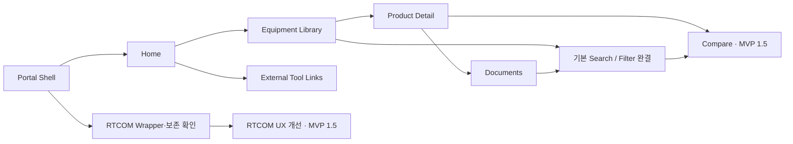

# UI / UX SPEC

## Product Detail 기획 보강 — 2026-09-24

이번 사용자 요청은 Product Detail의 정보 구조·UI 기준 보강 승인이다. 구현 착수·READY 전환·Final Schema·Database/Storage 결정 승인이 아니다. 기준 main은 888b035aafaeb9eb0472abcc2ec4e42a565b578f이며, W-013에서 공개된 베타 25개와 승인된 다섯 필드 범위를 유지한다. 아래 상세 요구는 향후 화면의 목표이며 현재 데이터에 없는 설명·사진·사양을 채우거나 공개하는 승인이 아니다. 기존 정식 공개 자료 요건과 제한된 베타의 승인 범위를 구분한다.

## 자료 수집 정책 정정 (2026-09-22)

이번 사용자 운영 결정은 아래 기존 URL·출처·자료 수집 요구와 충돌할 경우 우선한다. 최종 Schema나 수집 구현을 확정하는 작업이 아니다.

### RTCOM — 제조사 직접 제공 자료

RTCOM은 사용자가 제조사에서 직접 공식 자료를 제공받는다. **Work는 RTCOM 제품에 대해 별도 웹 조사·자동 웹 검색·크롤링을 수행하지 않는다.** Product / Model List, Datasheet / Specification, User Manual, Front Image, Rear Image, Drawing / CAD 및 기타 제조사 제공 기술자료를 최우선 공식 근거로 사용한다.

공개 Source URL이 없어도 제조사 직접 제공임을 확인할 수 있는 자료는 `MANUFACTURER_DIRECT`와 같은 출처 개념으로 공식성을 표현한다. 제공 주체·수령일·전달 경로·원본 파일·적용 모델/Revision을 추적하고, URL을 임의 생성하지 않는다. URL 부재만으로 직접 제공 자료를 비공식 또는 자료 누락으로 판정하지 않는다. 직접 제공 사실이 사양 충돌을 자동 해소하거나 개별 제품의 모든 공개 요건을 충족한다는 뜻은 아니다.

제품별 공식 웹사이트 또는 제품/Series 페이지 URL은 가능하면 제조사로부터 함께 제공받는다. 제품 전용 페이지가 실제로 존재하지 않는 경우, 공식 제조사 사이트 URL·관련 Series 페이지 URL·`DEDICATED_PRODUCT_PAGE_NOT_AVAILABLE` 같은 부재 사유 개념을 구분한다. 아직 URL을 받지 못한 경우와 전용 페이지가 없다고 확인된 경우는 다르다. 제품 전용 페이지 부재는 제조사 확인 근거와 함께 관리하고, 임의 링크 생성이나 별도 웹 조사로 해결하지 않는다.

Product Detail은 Manual / Datasheet 옆에 확보된 공식 링크를 제공하되 링크 종류를 ‘제조사 공식 제품 페이지’, ‘공식 Series 페이지’, ‘제조사 공식 사이트’로 정확히 표시한다. 전용 페이지가 없으면 그 사실을 구별하며 홈페이지를 전용 제품 페이지로 위장하지 않는다. 전용 페이지 부재는 일반 미수집과 구분하여 공개 준비 검토에 반영한다. 이는 Datasheet·Manual·고해상도 전면/후면 자료의 필수 확보 요건을 면제하는 것이 아니다.

### RTCOM 이외 제조사 — 지정 제품만 조사

Yamaha, Shure, Samsung, AMX, Analog Way 등은 **사용자가 제공한 조사 대상 장비 리스트에 있는 제품만** 조사한다. 제조사 전체 제품이나 관련 모델을 임의로 대량 수집하지 않는다. 지정 제품마다 제조사 공식 Product Page, 공식 Datasheet / Specification, 공식 User Manual, 공식 고해상도 Front Image, 공식 고해상도 Rear Image의 5종을 조사한다.

조사 순서는 **Manufacturer Official Product Page → Official Downloads / Support → Official Datasheet / Manual → Official Media Kit / Press Assets**다. 판매점·블로그·커뮤니티·비공식 이미지 사이트는 공식 자료의 대체 근거로 사용하지 않는다.

항목별 조사 결과는 `FOUND`, `MISSING`, `CONFLICTED`, `REVIEW REQUIRED` 같은 개념으로 남긴다. FOUND는 해당 자료를 찾았다는 뜻이며 자동으로 사양 검증 또는 공개 준비 완료를 뜻하지 않는다. 필수 자료의 누락은 기존 `REQUIRED / MISSING` 요구와 연결한다. 찾지 못한 자료를 추측하거나 다른 모델 자료로 대체하지 않는다.

### 공통 유지 기준

Front / Rear Image는 가능하면 긴 변 2000px 이상의 제조사 원본을 우선한다. 누락 이미지를 생성하거나 저해상도 AI 확대본을 공식 원본으로 취급하지 않는다. 공식 출처·적용 모델·이미지 역할과 실제 원본 해상도를 추적한다. 출처/상태 개념의 명칭은 예시이며 최종 필드명·enum·Product Data Schema는 미확정이다.

기존 4개 모델 제외, Portal 대상 28개 항목, 원본 자료 보존, 기존 시스템 코드·데이터 미변경 범위를 유지한다. 이번에는 자료 수집 정책만 반영하며 새 제품 조사·자료 수집·외부 발송은 실행하지 않는다.

## 정식 공개 자료 요건 추가 (2026-09-22)

앞으로 AV Portal에 정식 공개하는 모든 Product는 **① 제조사 공식 해당 제품 페이지 URL ② 공식 Datasheet / Specification ③ 공식 User Manual ④ 고해상도 Front Image ⑤ 고해상도 Rear Image**를 확보해야 한다. RTCOM의 출처 URL 및 전용 페이지 예외는 상단 자료 수집 정책 정정을 따른다. 이 기준은 아래의 자료 부족 제품 공개 관련 이전 제안보다 우선한다. 기존 28개 대상 항목도 자동으로 공개 준비 완료가 되는 것은 아니다.

- Product Detail의 Manual / Datasheet 옆에 **제조사 공식 제품 페이지**로 바로 이동하는 링크를 제공한다. 제조사 홈페이지 첫 화면이나 판매점 페이지를 해당 제품의 공식 페이지로 대체하지 않는다.
- Front / Rear는 제조사 공식 Product Page, Media Kit, Press Asset 등 공식 출처를 우선한다. 이미지별 Source URL(있는 경우) 또는 제조사 직접 제공 증빙, 제공 주체·원본 파일·해상도·적용 모델·전면/후면 역할의 출처를 추적할 수 있어야 한다. 문서도 공식 출처·적용 모델·Revision을 추적한다.
- 가능하면 긴 변 **2000px 이상인 고해상도 원본**을 우선한다. 2000px은 우선 확보 목표이며 이번 요구만으로 절대적인 최소 픽셀 기준을 확정하지 않는다. 고해상도 적합성 확인 없이 저해상도 자료를 충족 처리하지 않는다.
- 제조사가 Rear Image 또는 고해상도 이미지를 제공하지 않으면 해당 자료를 **`REQUIRED / MISSING`**으로 남긴다. 임의 생성, 다른 모델 사진 대체, AI 확대본을 공식 고해상도 원본으로 취급하는 것은 금지한다. 저해상도 참고 파일이 존재하더라도 필수 고해상도 자료의 충족과 구분한다.
- 5종 중 누락되거나 공식 출처·적용 대상이 확인되지 않은 자료가 있으면 **정식 공개 준비 완료로 판정하지 않는다.** 내부 준비·증빙 보존은 가능하다. 단순 파일 존재, 사양 검증 상태, 제품 판매 상태와 공개 준비 상태를 구분한다.
- `official_product_url`, `datasheet`, `user_manual`, `front_image`, `rear_image`, `image_source`, `document_source`, `publication_readiness`는 향후 Schema에서 표현할 **요구 개념**이다. 최종 필드명·자료형·상태 enum·저장 구조는 확정하지 않는다. 여기서 자료의 ‘필수’는 운영상 공개 요건이며 Database 필수 필드 설계가 아니다.
- 기존 4개 모델의 `EXCLUDED FROM PORTAL` 결정은 계속 적용한다. 제외 모델에 이 자료를 새로 수집·검증하지 않는다. 원본 자료는 보존한다.

## 운영 범위 정정 — 제품 제외 (2026-09-21)

사용자 운영 결정에 따라 **HS-88M-U, HS-88MX, HD-D104U, HD-D108U는 `EXCLUDED FROM PORTAL`**이다. 이 결정은 아래 과거 분석·보존 권고보다 우선한다.

- Equipment Library 등록, Search/Filter 결과, Product Detail 생성, Product Compare, Taxonomy Mapping, Migration, 제품 데이터 검증·수집, Portal 제품 수량 집계에서 모두 제외한다.
- 과거 조사 기록에 해당 모델이 남아 있더라도 증빙·이력일 뿐, 활성 제품·검증 대기·향후 자동 등록 후보가 아니다. 명칭·사양 충돌의 해소도 Portal의 후속 과제로 요구하지 않는다.
- 원본 ZIP/PDF/Catalog/Datasheet 및 기타 제조사 자료는 수정·삭제하지 않는다. 여러 제품이 수록된 문서도 전체 원본을 보존하되 제외 모델 구역은 제품 데이터 준비에 사용하지 않는다.
- 기존 Library **31개는 조사 당시 원본 수량**이다. 이 중 HS-88MX, HD-D104U, HD-D108U의 3개 항목을 제외하여 현재 Portal 기준은 **28개 장비·시리즈 항목**이다. HS-88M-U는 원래 31개 목록에 없으므로 다시 차감하지 않는다. Series·묶음이 포함되어 있으므로 28개 SKU를 뜻하지 않는다.
- 이후 분석과 Product Data 준비는 이 제외 범위를 적용한다. 이번 변경은 문서 반영이며 기존 시스템 코드·데이터를 변경한 것은 아니다.

**대상:** AV Equipment Library / RTCOM Configurator → AV Portal  
**상태:** 사용자 검토용 화면·동선 설계 / 미구현  
**작성일:** 2026-09-21  
**기준 문서:** [기존 시스템 평가](./EXISTING_SYSTEM_ASSESSMENT.md), [핵심 개념](./CORE_DOMAIN_CONCEPTS.md), [Portal MVP 기능 명세](./PORTAL_MVP_SPEC.md)

## 0. 문서 적용 원칙

이번 문서는 사용자의 최신 구현 단계 구분을 우선한다. 기존 기능 요구를 삭제하지 않고 **MVP 1 / MVP 1.5 / Phase 2**로 배치를 조정한다. 이전 PORTAL_MVP_SPEC에서 MVP로 표시한 Compare·Admin·RTCOM UX 개선의 첫 구현 여부는 이 문서를 따른다. 기존 세 문서는 수정하지 않는다.

목표는 화면 위치, 진입·복귀, 버튼 동작, 상태 표시, 반응형 구조를 설명하는 것이다. 표의 정보 항목은 화면 표시 요구이며 Database Schema가 아니다. 와이어프레임은 시각 디자인 확정안이나 실행 가능한 화면이 아니다. Framework, Architecture, Database, URL 설계, 실제 컴포넌트 코드 구조와 Codex 구현 지시문은 정하지 않는다.

기존 세 시스템의 관찰은 평가 문서의 조사 시점에 한정한다. 참고 사이트는 이전 단계에서 확인한 내용을 활용하며 이번에 제품 사양을 새로 검증하지 않는다. 가상 데이터로 제품 정보를 채우지 않는다.

## 1. 작은 구현 단계와 범위

| 단계 | 포함 화면·기능 | 완료 경계 |
|---|---|---|
| MVP 1 | Portal Shell, Home, Manufacturer 탐색, Library, Product Detail, Documents, 기본 Search/Filter, 외부 링크 2개, 기존 RTCOM 진입·복귀 | 장비·자료를 찾고 기존 도구를 사용할 수 있음. Compare·Admin 버튼이나 미완성 페이지는 노출하지 않음 |
| MVP 1.5 | Dynamic Filter 고도화, 2~4개 Product Compare, RTCOM 단계·슬롯 등 UX 개선 | MVP 1 안정화 후 진행. RTCOM 계산·검증·BOM Logic 변경을 자동 포함하지 않음 |
| Phase 2 | Admin UI·관리 기능, 고급 수치 검색, Compare 저장/출력, RTCOM Revision·자동 구성 검토, Documents 고급 관리, 운영 고도화 | 별도 검토와 요구 구체화 후 진행 |
| Future / 별도 범위 | AI 추천, 세 시스템 통합 가능성 등 기존 장기 항목 | 현재 구현 계획에 포함하지 않음 |

### 이전 명세와의 대응

| PORTAL_MVP_SPEC 항목 | 이번 적용 |
|---|---|
| M01, M02, M04, M08, M10 | MVP 1. M04의 비교 동작은 MVP 1.5에서만 노출 |
| M03 검색·Dynamic Filter | 기본 검색·공통 필터는 MVP 1. 일부 확인된 Category 필터는 조건부 적용. 고도화는 MVP 1.5 |
| M05 Product Compare | MVP 1.5 |
| M06 RTCOM 핵심 기능 유지 | MVP 1부터 회귀 확인 대상 |
| M07 RTCOM UX 개선 | 진입·복귀·화면 경계만 MVP 1. 내부 개선은 MVP 1.5 |
| M09 Admin | 요구사항 보존, 실제 UI·관리 기능은 Phase 2 |
| P01~P08 | 기존 후속 요구 보존. Phase 2에서 필요 확인 후 검토 |
| F01~F03 | 장기 참고 유지. 이번 설계가 개발 승인을 의미하지 않음 |

자동 추천·검증 Logic·BOM Logic 변경은 MVP 1에서 제외한다. MVP 1.5 이후라도 별도의 근거 검토와 승인 없이 변경하지 않는다. 자동 구성은 Phase 2 후보이며 AI 추천과 구분한다.

**첫 구현 제외:** Authentication, Admin, Builder/LED 변경, 데이터 Migration·통합, 공통 Project/BOM/Compatibility, 제품 데이터의 강제 통합. 원본 31개 항목의 관찰 이력은 보존하되 Portal에는 제외 모델을 뺀 28개 항목만 대상으로 하며, 모든 SKU·모든 사양을 채우는 것을 첫 출시 조건으로 삼지 않는다.

## 2. Global Navigation

### 2.1 메뉴와 화면 계층

| 표시명 | 동작 | 선택 표시 |
|---|---|---|
| Portal 이름/로고 | Home으로 이동 | Home 진입과 동일 |
| Home | 업무 시작 화면 | Home에서 활성 |
| Equipment Library | 기본 Library 목록 | 상세·Compare에서도 이 메뉴 활성 |
| RTCOM Configurator | Portal 내부 도구로 진입 | RTCOM 화면에서 활성 |
| Documents | 자료 목록 | 자료 탐색 중 활성 |
| External Tools | 두 외부 실행 링크를 펼침 | 내부 화면 선택 상태를 바꾸지 않음 |

Product Detail·Compare는 별도 상위 메뉴가 아니다. Manufacturer 탐색은 Home의 카드와 Library의 제조사 목록을 공유하는 동선이며 별도 홍보 페이지를 만들지 않는다. Admin은 MVP 1 Navigation에 없다. Phase 2에서 일반 메뉴와 분리한 관리 진입을 검토하되 로그인·권한 방식은 정하지 않는다.

### 2.2 Desktop / Tablet / Mobile

- **Desktop:** 상단 한 줄에 Portal 이름과 주요 메뉴. External Tools는 펼침 메뉴에 `AV System Builder ↗`, `LED Configurator ↗`를 제공한다. 검색은 Home·Library·Documents의 본문에서 수행해 검색 입력이 여러 개 경쟁하지 않게 한다.
- **Tablet:** 메뉴가 충분히 들어가면 Desktop 유지, 줄바꿈이 생기기 전에 Mobile 메뉴로 전환한다. 검색 입력은 화면별 본문에 남긴다.
- **Mobile:** 상단에 Portal 이름과 “메뉴” 버튼. 열면 화면 한쪽 또는 전체 높이 패널에 메뉴를 세로로 표시하며 External Tools 두 링크는 “외부 도구 · 새 탭” 그룹으로 구분한다. 배경 조작은 막고 닫기·Esc를 제공한다. 닫으면 메뉴 버튼으로 초점을 돌린다.

현재 메뉴는 색과 밑줄/표식·텍스트 상태를 함께 사용한다. 키보드 Tab으로 메뉴·본문에 접근하며 “본문으로 이동”을 제공한다. 메뉴를 닫거나 화면이 바뀔 때 초점이 사라지지 않도록 한다.

### 2.3 상태와 복귀 계약

| 이동 | 사용자에게 유지할 상태 |
|---|---|
| Library → Detail → 목록으로 | 검색어, 적용 필터, 정렬, 결과 위치·쪽. 돌아왔을 때 선택했던 카드 위치 확인 |
| Documents → 외부 자료 → Portal | 새 탭을 사용해 현재 목록 상태 유지 |
| Home 제조사/Category 선택 → Library | 선택한 한 조건을 초기 적용한 새 탐색. 과거 숨은 필터를 몰래 합치지 않음 |
| Detail에서 제조사/Series 클릭 | 해당 조건으로 새 Library 탐색. 이전 상세는 브라우저 뒤로 가기로 복귀 가능 |
| Library → Compare → 목록으로 | MVP 1.5부터 목록 상태와 선택 제품 유지 |
| RTCOM → Portal | §8의 구성 보호 원칙 적용. 브라우저 뒤로 가기만으로 저장을 보장하지 않음 |

상세를 직접 연 경우 “목록으로”는 Library 기본 화면으로 이동한다. 일반 메뉴의 Equipment Library도 기본 탐색 진입으로 사용하고, 진행 중 목록 복귀는 상세의 “목록으로”를 사용한다. 기기 간·로그인 간 상태 동기화는 요구하지 않는다.

## 3. Home / Dashboard

### 3.1 정보 순서

첫 화면의 우선순위는 **검색 → Category → Manufacturer → Design Tools → 주요 Documents**다. 큰 홍보 배너·자동 재생 영상·개인 통계는 포함하지 않는다. Desktop에서는 Category와 Manufacturer를 가까운 두 영역으로 배치해 스크롤을 줄일 수 있다.

| 영역 | 내용·동작 | 미등록 시 |
|---|---|---|
| Global Search | 라벨 “장비 검색”, 안내 “제조사, 모델명, 제품명, 기능으로 장비 검색”. Enter 또는 검색 버튼으로 Library 이동 | 빈 검색은 전체 장비 목록으로 이동 |
| Equipment Categories | 기존 5개 Category 카드, 실제 표시 항목 수. 클릭 시 해당 Category 적용 | Category가 없으면 영역에 “등록된 카테고리가 없습니다”; 검색·도구는 계속 사용 |
| Manufacturer Quick Access | 등록 제품이 있는 제조사 Logo Card, 제조사명 필수, “모든 제조사” | 로고가 없으면 제조사명을 텍스트 카드로 표시 |
| Design Tools | RTCOM 내부 카드, Builder·LED 외부 카드. 역할·실행 버튼 표시 | 다른 영역 오류와 무관하게 정적 실행 링크 제공 가능 |
| 주요 Documents | 공개 가능한 자료 3~5개, 제목·유형·제조사·출처, 전체 보기 | “주요 자료가 아직 지정되지 않았습니다”와 Documents 이동 |

Category는 모듈형 매트릭스 / 일체형 매트릭스 / 분배기·선택기 / 전송기·확장 / 케이블을 출발점으로 한다. 새 Category는 같은 카드 규칙으로 추가될 수 있다. “전체”는 Category 수에 포함하지 않는다. 항목 수는 구매 SKU 수로 오인되지 않게 “장비·시리즈 N개”로 표현한다.

### 3.2 Manufacturer 확장 UX

Home에는 제조사 카드를 최대 6개까지 배치하고 그 이상은 “모든 제조사”로 찾는다. Mobile은 2열 정적 카드로 보여주고 자동 슬라이드는 사용하지 않는다. 초기 RTCOM 하나만 있어도 빈 제조사 카드로 공간을 채우지 않는다. Yamaha·Shure·Samsung·AMX 등은 향후 예시이며 실제 등록 제품이 없으면 탐색 가능 제조사처럼 표시하지 않는다.

“모든 제조사”는 이름 검색과 이름순 목록이 있는 선택 패널을 연다. 제조사 선택 시 패널을 닫고 해당 제조사 Library를 연다. 목록의 검색은 제조사 이름만 좁히며 장비 통합 검색과 혼동하지 않게 “제조사 찾기”라고 표시한다. 닫기·Esc와 초점 복귀를 제공한다. 단일 제조사라면 작은 목록으로 유지하며 과도한 빈 검색 UI를 강제하지 않는다.

주요 자료는 기존 공개 자료 중 선정된 목록이며 개인의 최근 이력이 아니다. 추천 제조사 순위·광고 순위·미등록 브랜드의 상품 수를 만들지 않는다.

## 4. Equipment Library

### 4.1 Desktop 구조

상단에 제목·설명, 검색 입력, 결과 수·정렬을 배치한다. 그 아래 적용 Filter Chip과 전체 초기화를 둔다. 본문 왼쪽에는 Filter Panel, 오른쪽에는 Product Card 목록을 배치한다. 폭이 충분하면 3열, 부족하면 2열로 줄이고 카드를 과도하게 좁히지 않는다.

기본 필터 순서는 Manufacturer → Category → Series → Verification이다. 제조사·Series 목록이 길어지면 해당 그룹 안에 이름 검색을 제공한다. Category는 한 번에 하나 또는 전체, Manufacturer·Series·Verification은 복수 선택이 가능하다. 관련 없는 Series가 선택되어 결과를 막지 않게 §7의 전환 규칙을 적용한다.

검색 전 기본 정렬은 이름순, 검색어 입력 후는 관련도순을 기본으로 한다. 관련도는 정확한 Model/제품명 일치 우선이라는 사용자 기대를 충족하며 AI 추천을 뜻하지 않는다. 가격순·인기순은 없다.

결과가 많으면 24개 단위의 쪽 이동을 제안한다. 총 결과 수와 현재 범위를 표시하고 필터 변경 시 첫 쪽으로 이동한다. 상세에서 돌아오면 원래 쪽·카드 위치를 복원한다. 최종 개수는 실제 콘텐츠 검토로 조정 가능하며 무한 스크롤은 MVP 1에서 요구하지 않는다.

### 4.2 Product Card 정보 밀도

| 순서 | 표시 | 규칙 |
|---|---|---|
| 1 | 제품 이미지 | 일정한 이미지 영역 안에 잘리지 않게 배치. Missing Image 안내 |
| 2 | Manufacturer | 짧은 보조 텍스트 |
| 3 | Model / Product Name | 주요 클릭 링크. 이름을 억지로 한 줄에 잘라 식별 문구를 잃지 않음 |
| 4 | Category · Series | Series가 없으면 생략. 항목 유형이 Series/세트이면 별도 짧은 표식 |
| 5 | 핵심 특징 또는 사양 최대 2개 | 원문 근거 있는 내용만. 미확인 최대 성능을 확정값처럼 강조하지 않음 |
| 6 | Verification 요약 | “카탈로그 기준”, “확인 필요”, “자료 불일치” 등 정확한 범위 |
| 7 | 상세 보기 | 상세 진입. MVP 1에는 비교 체크박스·비교함 없음 |

중첩 버튼 충돌을 피하기 위해 카드 전체를 여러 동작을 가진 버튼처럼 만들지 않는다. 이미지/제품명/상세 링크는 같은 상세로 이동한다. 모든 문서·포트·긴 사양은 상세에 둔다. 완성도 정보는 §11의 짧은 문구 한 줄만 선택적으로 추가한다.

제품군·단품·TX/RX 묶음을 구별하되 실제 판매 단위를 추측하지 않는다. 예를 들어 `XDM Series · 제품군`으로 보여줄 수 있으며 이를 섀시 한 대의 완성 사양으로 표시하지 않는다.

## 5. Product Detail — AV Engineering Library

### 5.1 참고 원칙

[TechDataPS 제품 상세](https://techdata-ps.com/m21_view.php?listType=1&c_code=005004&idx=2655)의 제조사 맥락, 제품명·이미지·설명, 자료 바로가기 방식을 참고한다. 이전 단계에서 화면을 확인했으며 디자인·문구·이미지·제품 데이터를 복제하지 않는다. Portal은 Structured Specifications, I/O, Source와 향후 Compare를 연결한다.

### 5.2 기본 순서와 Product Header

탐색 경로 아래 기본 읽기·키보드 이동 순서는 **A Product Header → B Product Image Gallery → C Quick Documents → D Main Detail Sections**로 고정한다. Desktop에서도 이 순서를 유지하고, 기존 이미지/요약 2열 제안보다 이 기준을 우선한다. Header의 설명과 Quick Documents 사이에는 Gallery만 두며 홍보 배너를 끼우지 않는다.

| 순서 | 정보·동작 |
|---|---|
| A. Product Header | Manufacturer → Product / Model → Series → Category(복수 허용) → 짧은 영문 설명 → 한글 제품 설명 → Verification Summary |
| B. Product Image Gallery | 큰 대표 이미지, 하단 또는 측면 썸네일, 이미지 역할과 출처, 클릭 확대 |
| C. Quick Documents | 존재하며 공개 가능한 문서·공식 페이지의 유형별 카드 |
| D. Main Detail Sections | Overview → Features → Specifications → I/O → Documents → Sources & Verification |

Series·설명이 없으면 사실을 만들어 채우지 않고 미등록 상태로 안내한다. 영문 설명과 한글 설명은 각각 읽을 수 있게 두며 자동 번역을 검증된 설명으로 간주하지 않는다. Header의 검증 요약은 확인 범위를 밝히고 Sources & Verification으로 이동한다. RTCOM 진입은 지원되는 모델에서만, Compare는 기존 MVP 1.5 범위를 따른다.

본문은 Overview(용도·제품 개요)와 Features(특징)를 분리하고 마케팅 문구를 검증된 사양값처럼 표시하지 않는다. Desktop은 여섯 섹션으로 이동하는 Section Navigation을 기본으로 한다. Mobile은 가로 스크롤 가능한 Sticky Tab 형태의 섹션 링크를 사용하며 현재 섹션·초점을 표시한다. 본문은 같은 순서로 유지하고 고정 영역이 제목·키보드 초점을 가리지 않게 한다. 자료가 없는 섹션도 제목과 짧은 미등록 안내를 남긴다.

### 5.3 Product Image Gallery와 Quick Documents

이미지 역할은 **Main / Front / Rear / Perspective / Other**다. Front와 Rear 확보가 최소 목표이나 미확보를 다른 모델 사진·AI 생성 이미지로 대체하지 않는다. Main은 대표 이미지 선택 역할이며 Front 등 촬영 방향을 대체하지 않는다. 큰 대표 이미지 아래 또는 옆에 실제 이미지 썸네일을 두고 선택된 역할을 글자로 표시한다. Main 미지정 시 등록된 Front → Rear → Perspective → Other 순으로 대표 표시하되 실제 역할을 바꾸지 않는다.

Front 또는 Rear가 없으면 각각 “Missing Image — Front/Rear”를 비클릭 상태로 안내한다. 이미지가 전혀 없으면 Gallery 영역에 동일한 누락 안내를 제공하며 가짜 썸네일을 만들지 않는다. 전후면을 확인하지 못한 사진은 Other로 표시한다. 이미지별 제공 주체·출처·적용 모델과 공개 가능 여부를 구분한다. 사진에서 포트 수나 호환성을 추정하지 않는다.

클릭 확대는 닫기 버튼·Esc·초점 복귀·키보드 썸네일 선택을 제공하고 배경으로 초점이 빠지지 않게 한다. 이미지를 자동 회전시키지 않는다. 모바일에서는 화면 폭에 맞추며 확대 보기의 닫기 동작을 항상 유지한다.

Quick Documents 기본 유형은 User Manual, Datasheet, Specification, Technical Document, Drawing / CAD, Brochure, Official Product Page다. 기존 Installation Guide도 확인된 자료이면 유지한다. Datasheet와 Specification은 의미가 확인된 경우 구분하며 같은 파일로 두 카드를 부풀리지 않는다.

Desktop/Tablet은 2열 카드 배열(4개일 때 2×2, 6개일 때 2×3)을 우선 사용한다. 7개 이상은 같은 배열의 다음 행으로 이어지고 빈 칸을 가짜 버튼으로 채우지 않는다. Mobile은 가독성에 따라 1열 또는 2열로 전환한다. 카드에는 유형·자료명·언어·확인된 개정·출처와 열기/다운로드 동작을 표시한다. 설명에서 가까운 상단 영역에 유지한다.

등록되고 공개 가능한 자료만 노출한다. 여러 버전이면 제목·언어·개정/날짜·적용 모델·출처·형식이 있는 선택 목록을 연다. 확인되지 않은 파일을 최신 버전으로 자동 선택하지 않는다. 없는 유형에는 비활성 다운로드 버튼도 만들지 않는다. 자료가 전혀 없으면 짧은 안내만 표시한다.

Official Product Page는 실제 해당 제품 또는 적용 제품군의 확인된 주소여야 한다. 제조사 홈페이지를 개별 제품 페이지로 가장하지 않는다. 외부 링크임을 표시하고 Quick Documents와 Documents는 동일한 자료·개정을 가리킨다. 공식 링크 제공과 사진/PDF의 복제·재게시 권한은 별개다. 비공개 자료의 파일명·로컬 경로·업체값은 공개 화면에 노출하지 않는다.

### 5.4 Structured Specifications

그룹은 **General / Video / Audio / Control / Network / Power / Physical / Environment**를 기준으로 제품에 적용되는 그룹만 사용한다. 읽기 열은 **Name / Value / Unit / Condition / Source / Verification**이다. 이는 화면에서 보존할 의미이며 최종 DB 필드나 Schema 선언이 아니다.

단위 없는 설명형 값에 단위를 만들지 않는다. 긴 조건은 줄바꿈하며 툴팁에만 숨기지 않는다. Mobile은 항목별 세로 블록으로 같은 정보를 모두 보존한다. “0 / 미지원 / 해당 없음 / 미확인”을 구별한다.

Source의 근거 보기는 자료 제목·발행 주체·개정·확인된 페이지/절·적용 범위를 제공한다. 모르는 페이지나 개정을 만들지 않는다. 닫으면 해당 사양으로 초점이 돌아온다. 사양이 없으면 빈 행 대신 “구조화된 사양이 아직 등록되지 않았습니다”를 표시하고 공개 가능한 원문이 있을 때만 연결한다.

### 5.5 I/O Table

I/O는 Specifications와 독립된 섹션으로 유지한다. **Connector / Signal / Direction / Quantity / Protocol / Fixed 또는 Optional / Card 또는 Module / Condition**을 읽을 수 있게 하고 항목별 근거·검토 상태를 연결한다. 모르는 값은 미확인으로 남긴다.

Input / Output / Bidirectional을 구분한다. Connector와 Signal을 합치지 않고 양방향 한 포트를 입력·출력으로 이중 계산하지 않는다. 수량에는 장착 조건·독립 채널·복사/LOOP·논리 채널의 적용 범위를 표시한다. 제품군 최대값을 현재 장착 포트 수처럼 표시하지 않는다. Mobile에서는 방향별 카드에 같은 정보를 보존한다.

데이터가 없으면 “I/O 정보 미등록 · 포트가 없다는 뜻은 아닙니다”로 안내한다. 전면/후면 사진과 포트 행의 상호 강조·위치 연결은 향후 검토 대상이며 이번 필수 구현 요소·호환 계산·최종 Schema로 확정하지 않는다.

### 5.6 Sources & Verification

출처를 다음 두 그룹으로 분리하고 자료별 적용 모델·개정·확인일·검토 범위를 표시한다.

- Manufacturer Official: Product Page, Datasheet, Manual, Technical Documentation.
- Supplemental / Domestic: TechDataPS, 삼아프로사운드, 기타 승인된 보조 출처. 국내 출처라는 이유로 Manufacturer Official로 승격하지 않는다.

JBL / AMX / BSS는 Manufacturer Official + TechDataPS 비교, Shure는 Manufacturer Official + 삼아프로사운드 정책을 유지한다. 한국어 제조사 공식 자료 우선이며 없으면 글로벌 공식 자료를 사용한다. RTCOM은 직접 제공 자료 우선, 공식 홈페이지 제품 소개·특징의 기본 정보 조사 허용이라는 최신 정정을 유지한다. 이번 보강에서는 제품 조사를 수행하지 않는다.

Review Status는 **VERIFIED(해당 범위 검증됨) / CONFLICTED(자료 불일치) / REVIEW REQUIRED(검토 필요)**로 표시한다. 미등록·미검토 항목은 검증 완료로 계산하지 않는다. VERIFIED에는 근거와 범위를 연결하고 일부 사양의 확인을 제품 전체 보증으로 표시하지 않는다. 충돌 시 양쪽 값·출처·조건을 함께 보이며 문서 날짜만으로 자동 채택하지 않는다.

자료 확보 여부, 사실·사양 검증 상태, 공개/재게시 허가 상태는 각각 구분한다. 이 상태명은 UI 표시 계약이며 저장 enum 확정이 아니다. 공개 준비 관련 내부 기록을 사용자용 출처 영역에 그대로 노출하지 않는다.

### 5.7 시각 방향과 향후 구현 검수 기준

기존 RTCOM / LED Configurator의 밝은 iOS 계열을 따른다. White / Light Gray 바탕, Blue Accent, 제한적인 Blue-Purple Gradient, 큰 Border Radius의 Rounded Card, Soft Shadow, Glass / Layered 표현, Pill Tab을 사용한다. TechDataPS의 Dark Theme·레이아웃 장식·자산을 복제하지 않는다. 반투명 효과보다 본문 대비와 엔지니어링 정보의 가독성을 우선한다.

향후 구현에서는 다음을 확인한다. 이번 문서 변경에서 실행한 앱 테스트를 뜻하지 않는다.

- Desktop/Mobile의 A → B → C → D 순서, 한·영 설명과 여섯 본문 섹션의 분리.
- 이미지 0장·Front만 있음·Front/Rear 있음의 누락 안내, 역할 선택, 확대/닫기·Esc·초점 복귀.
- 문서 0/1/4/6/7개 및 여러 개정의 카드 배열·버전 선택, 없는 버튼 미생성.
- 긴 사양·복수 Category·긴 모델명에서 잘림 없이 읽기; Sticky Tab이 내용·초점을 가리지 않음.
- I/O 조건과 근거 유지, 공식/보조 출처 분리, 세 검토 상태와 공개 권한의 독립 표시.
- 25개 베타 범위·기존 데이터·공개 승인 범위 불변. 자료 미확보는 Missing 상태로 설명하고 임의로 보충하지 않음.

## 6. Documents Library

### 6.1 화면 구조

상단은 제목·자료 검색, 본문은 Filter Panel과 목록이다. 필터는 Manufacturer, Product, Series, Document Type, 출처 구분으로 구성한다. Product와 Series가 길면 필터 안에서 이름을 검색한다. 각 제품 상세에서 넘어올 때 적용된 제품 조건을 Chip으로 보여준다.

Keyword는 문서 제목·등록된 설명·관련 제품명을 검색한다. PDF/CAD 본문 검색은 Phase 2이며, MVP 1에서 문서 내용 전체를 검색한다고 안내하지 않는다. 기본 정렬은 제목순으로 두고 날짜 미확인 자료를 최신 자료라고 부르지 않는다.

### 6.2 Document Item

| 표시 | 규칙 |
|---|---|
| 제목·유형 | 문서의 이름과 Datasheet/Manual/Drawing 등의 유형 구분 |
| 적용 제품·Series·Manufacturer | 확인된 관련 범위만. 관련 제품이 많으면 “외 N개”를 펼침 |
| 발행 주체 / 제공 위치 | 제조사 공식, 파트너 작성, 내부 작성, 출처 확인 필요를 구분 |
| 버전·날짜·언어 | 미확인 값은 미등록 표시. 등록일을 발행일로 표시하지 않음 |
| 파일 형식 | PDF, HWP, PPTX, CAD 등 확인된 형식. 확장자로 공식 여부를 판단하지 않음 |
| 열기 / 다운로드 | 동작을 명시. 웹 페이지는 새 탭 열기, 실제 파일 제공이 가능할 때 다운로드 |

자료 유형은 Datasheet, User Manual, Installation Guide, Catalog, Drawing/CAD, 시방서, Firmware/Software 관련 자료다. CAD 전용 뷰어·Firmware 설치·자동 다운로드는 만들지 않는다. Firmware/Software는 기본적으로 공식 안내 페이지로 이동한다.

동일 Catalog가 여러 제품에 연결되어도 Documents 전체 목록에서는 같은 자료를 제품 수만큼 중복 노출하지 않는다. 자동 파일 중복 판별을 구현한다는 뜻은 아니며 동일하게 등록된 자료의 표시 기준이다.

공개 범위가 확인된 자료만 일반 목록에 제공한다. 내부/파트너 배지는 접근 권한이 아니다. MVP 1에는 비공개 자료 열람이나 관리 기능을 만들지 않으며, 공개 여부 미확정 자료를 소개 카드로 노출하지 않는다.

## 7. Search / Filter UX

### 7.1 기본 검색 동작 — MVP 1

검색 입력은 Enter 또는 “검색”으로 확정한다. 입력 중 매 글자마다 화면이 이동하지 않는다. 기존 검색 결과가 있으면 입력을 수정해도 확정 전에는 결과를 유지하며, 입력 비우기 버튼과 적용 조건 초기화를 구분한다. 공백만 입력해 검색하면 필터를 유지한 전체 결과를 표시한다.

Manufacturer, Category, Series, Model/제품명, 등록된 Keyword를 검색한다. 대소문자와 일반적인 공백 차이는 처리하되 TX/RX/PSE와 같은 구분은 유지한다. 여러 단어는 모두 포함하는 결과를 기본으로 하며, 확인된 동의어만 사용한다. 숫자 조건의 의미 해석·AI 추천은 하지 않는다.

Desktop의 필터 선택은 즉시 적용하고 결과 수·Chip을 함께 갱신한다. Mobile/좁은 Tablet의 필터 패널에서는 임시 선택 후 “적용”을 눌러 반영한다. “취소/닫기”는 패널을 열기 전 조건을 유지하고 “초기화”는 임시 선택을 지운다. 배경의 실제 결과 수와 패널의 아직 적용하지 않은 조건을 혼동시키지 않는다.

### 7.2 조건 조합과 전환

- Category는 단일 선택 또는 전체다. 같은 필터의 여러 선택은 OR, 서로 다른 필터와 검색어는 AND로 처리한다. 사용자 설명은 “선택 값 중 하나 / 조건 모두 충족”처럼 쓴다.
- Category 변경 시 이전 전용 조건을 제거하고 “분류가 변경되어 TX/RX 조건을 해제했습니다”처럼 안내한다. Manufacturer 등 유효한 공통 조건은 유지한다.
- Manufacturer·Category 변화로 Series가 해당하지 않게 되면 그 Series 조건을 해제하고 알린다. 숨겨진 조건 때문에 결과가 줄지 않게 한다.
- 기본 필터 외 전송기 역할(TX/RX), 전송 매체, Signal 등의 단순 선택은 확인된 데이터가 있는 Category에서만 MVP 1에 노출할 수 있다. 불명확하면 필터를 만들지 않고 사양 상세로 안내한다.
- 미확인 사양을 특정 조건 충족으로 포함하지 않는다. “정보 미등록” 조회는 해당 개념이 적용되는 제품의 누락 상태만 다루며 “해당 없음”과 구별한다.

### 7.3 0개 결과의 설명

“선택한 조건에 맞는 장비가 없습니다” 아래에 검색어와 모든 Chip을 표시한다. 필터 값 옆 수량은 **다른 조건을 유지한 채 그 값이 가능한 수량**이라는 의미를 일관되게 적용한다. 단일 Category 값을 바꿀 때는 기존 Category를 대체한 기준이다.

가능하면 적용 조건별 “이 조건만 해제 시 N개”를 보여줘 사용자가 원인을 탐색하도록 한다. 이는 조건을 제거한 결과를 설명하는 것이며 해당 조건이 잘못됐다고 단정하는 메시지가 아니다. 여러 조건의 조합 때문에 0개일 수 있으므로 근거 없이 특정 필터를 원인으로 지목하지 않는다.

조건별 해제·검색어 지우기·전체 초기화가 실제 행동이다. 조회 결과가 없다는 이유로 조건을 자동 완화하거나 추천 제품을 채우지 않는다. 필터를 모두 지워도 항목이 없으면 No Search Results 대신 Library Empty 상태로 전환한다.

### 7.4 MVP 1.5 이후

MVP 1.5에서는 Category별 필터 범위와 관련 조건 안내를 고도화하되 현재 선택·복귀 계약을 유지한다. 고급 수치 범위·단위 변환 조건은 Phase 2다. 검색 조건 저장·기기 간 공유·자연어 의미 검색은 첫 구현에서 제외한다.

## 8. RTCOM Configurator Portal Wrapper

### 8.1 첫 구현의 책임

Wrapper는 Portal과 기존 구성 화면의 **시각적 경계와 이동 수단**을 뜻한다. iframe, 별도 앱, 특정 렌더링 구조를 선택하는 기술 명세가 아니다. 기존 단계·슬롯 배치·계산·저장·검증·BOM·출력 동작을 유지한다.

Home의 내부 도구 카드와 Main Navigation에서 진입한다. 상세의 RTCOM 버튼은 해당 제품군 연결이 확인된 항목에만 표시한다. MVP 1에서는 기존 구성기에서 제품군을 선택하게 하며 현재 작업을 자동으로 새 모델로 초기화하지 않는다.

### 8.2 Navigation 관계와 복귀

기존 구성 화면 위에 얇은 Portal 식별 영역과 “Portal로 돌아가기”를 제공한다. 일반 Library의 Filter Panel·검색창을 구성 화면 옆에 얹지 않는다. 도구의 작업 폭과 고유 조작 메뉴를 확보하고 Portal 메뉴가 슬롯·모달 위에 겹치지 않게 한다.

현재 도구의 저장 상태를 신뢰할 수 있게 표시하는 기능이 있으면 기존 표시를 유지한다. Wrapper에서 확인하지 못한 저장 완료를 새로 표시하지 않는다. 기존 앱 내부의 이탈 경고도 그대로 유지한다.

**MVP 1 기본 복귀:** 작업 보존을 확신할 수 없는 동안 “Portal로 돌아가기 ↗”는 Home을 새 탭으로 열어 기존 구성 탭을 남긴다. “현재 구성 화면은 이 탭에 유지됩니다”라고 설명한다. 이것은 Portal 내부 기능을 외부 도구로 분류한다는 뜻이 아니라 작업 손실을 줄이는 이동 선택이다.

같은 탭 복귀는 기존 저장·복원 동작으로 동일 구성을 유지함을 확인한 경우에만 후속 검토한다. MVP 1을 위해 새 저장 Logic이나 자동 Migration을 추가하지 않는다. 기존 RTCOM 페이지의 직접 진입도 계속 사용할 수 있어야 한다.

### 8.3 디자인 연결과 경계

Portal 로고·제목·바깥 여백·복귀 버튼의 표현부터 맞춘다. 내부 슬롯 크기·색의 의미·카드 위치·조작 순서까지 전역 스타일로 바꾸지 않는다. 기존 입력·모달·인쇄/출력 화면이 Wrapper의 헤더에 가려지지 않아야 한다.

Mobile에서는 Wrapper가 작동하고 기존 도구의 내용이 잘리지 않도록 한다. 기존 도구가 넓은 작업면을 요구하면 해당 영역만 가로 이동을 허용하며 Desktop 사용 권장 안내를 제공한다. 이를 기존 도구의 완전한 Mobile 재설계로 확대하지 않는다.

MVP 1.5의 단계·Slot UX 개선은 기존 대표 구성의 입력/결과 보존 확인 후 별도 진행한다. 정확성 검토가 필요한 사항은 평가 문서에 남아 있으며, 이번 연결만으로 문제가 해결됐다고 표시하지 않는다.

## 9. External Tools

| 도구 | 설명·버튼 | 연결 주소 |
|---|---|---|
| AV System Builder | “장비 배치와 결선 구성도 작성” / “AV System Builder 열기 ↗” | https://seoul-visual-tech.github.io/av-system-builder/ |
| LED Configurator | “LED 배열·공간·사양 검토” / “LED Configurator 열기 ↗” | https://hkkim0454.github.io/svt-led-calculator/src/index.html |

Home 카드와 External Tools 메뉴는 같은 이름·주소를 사용한다. 두 실행 버튼에 “외부 시스템 · 새 탭”을 명시한다. RTCOM 카드는 “Portal 내부 도구”로 구분한다. 외부 도구 소개 전용 페이지나 중간 확인창은 만들지 않는다.

클릭은 지정 URL을 여는 것만 수행한다. “선택 제품 전달”, “프로젝트 이어서 설계”, “동기화됨” 같은 표현은 사용하지 않는다. 검색어·선택 제품·구성을 URL에 붙여 보내지 않는다. 기존 서비스의 로그인·저장·데이터는 해당 도구의 영역으로 둔다.

새 탭 열기가 허용되지 않은 환경에서는 동일 링크를 다시 열 수 있는 일반 링크를 제공한다. Portal이 관찰할 수 없는 외부 서비스의 로그인·저장 성공을 성공 알림으로 표시하지 않는다. 외부 사이트 오류의 복구를 위해 기존 시스템을 수정하지 않는다.

## 10. Product Compare — MVP 1.5

### 10.1 선택과 진입

MVP 1.5에서만 Product Card와 Detail에 “비교에 추가”를 제공한다. Library 하단의 비교함에는 선택 제품명·개수·제거·비교 시작을 표시하며 결과 목록을 가리지 않게 공간을 확보한다.

| 선택 상태 | 표시·동작 |
|---|---|
| 0개 | 비교함을 감추고 카드의 추가 동작만 제공 |
| 1개 | 제품명과 “한 개 이상 더 선택하세요”. 비교 시작은 사용할 수 없는 이유와 함께 비활성 |
| 2~4개 | 비교 시작 가능. 선택 순서대로 열 배치 |
| 다섯 번째 추가 | 기존 선택 유지, “최대 4개까지 비교할 수 있습니다” |
| 같은 항목 재선택 | 중복 추가하지 않음. 선택 해제로 처리하거나 해제 동작을 명확히 제공 |
| 다른 Category/다른 수준 | 기존 선택 유지, “같은 분류와 같은 수준의 항목끼리 비교할 수 있습니다”와 상세 보기/새 비교 시작 선택 |

“새 비교 시작”은 기존 선택을 교체함을 안내한 뒤 사용자가 선택했을 때만 실행한다. Series와 개별 Model, 묶음과 단품을 무조건 같은 표로 만들지 않는다. 같은 Category라도 의미가 다른 사양은 별도 표시한다.

### 10.2 화면 구성

상단에 목록 복귀, 비교 제목·선택 수, 전체 사양/차이만 보기 전환을 둔다. 제품 열 헤더에는 이미지·제조사·Model·확인 상태·제거·상세 링크를 배치한다. 본문은 공통 사양 → 추가/차이 사양 → I/O → Documents와 근거 순서다.

사양명·의미·단위·조건이 맞는 경우만 같은 행으로 놓는다. “차이만 보기”에서도 정보 미등록·조건 불일치를 숨기지 않는다. 숫자가 크다는 이유로 우수·추천·우승 배지를 붙이지 않는다. 문서와 근거는 각 제품 기준으로 연결한다.

제품을 제거해 1개가 되면 결과를 파괴하지 않고 “비교할 제품 추가”와 목록 복귀를 제공한다. 이후 후보 추가 시 기존 선택을 유지한다. 비교 저장·출력·공유는 Phase 2이며 MVP 1.5에도 미완성 버튼으로 보여주지 않는다.

## 11. Product Data Completeness UX

### 11.1 완성도와 정확성을 분리

Basic / Standard / Engineering의 단일 등급은 초기에는 사용하지 않을 것을 제안한다. 제품군마다 필요한 항목이 달라 등급이 품질 보증으로 오인될 수 있다. 대신 **정보 제공 현황**과 **Verification**을 나란히 표시한다.

Detail의 제품 요약 아래에 `이미지 등록 / 기술자료 2개 / 사양 일부 등록 / I/O 정보 미등록` 같은 현황을 짧게 표시하고 클릭하면 해당 섹션으로 이동한다. 비율 점수·완성도 100%·제품 우열 등급은 사용하지 않는다. 개수는 실제 공개 자료 기준이다.

| 예시 | 정보 제공 현황 | Verification의 별도 표현 |
|---|---|---|
| 제품 A: 이미지·Datasheet·주요 사양·I/O 존재 | “이미지·기술자료·사양·I/O 제공” | 확인된 범위에 한해 “I/O 근거 확인”. 나머지 전체 검증을 뜻하지 않음 |
| 제품 B: 제품명·설명만 존재 | “기본 소개 제공 · 기술 정보 미등록” | “검토 근거 미등록” 또는 실제 확인 상태 |
| 제품 C: 사양과 여러 자료 존재하지만 수치 충돌 | “사양·기술자료 제공” | “자료 불일치 · 근거 확인 필요” |

Card에는 긴 현황 목록 대신 “기술 정보 일부 미등록” 정도만 표시한다. 정보가 적어도 검색 결과에서 자동 제외하지 않는다. Source가 없다는 이유로 현재 값을 다른 제품 값으로 보충하지 않는다.

### 11.2 네 값의 표시 규칙

| 의미 | 표시 예 | 허용 근거 |
|---|---|---|
| 0 | `0 EA` | 해당 수량이 실제 0이라고 확인된 경우 |
| 지원하지 않음 | `미지원` | 해당 기능의 미지원이 확인된 경우 |
| 해당 없음 | `해당 없음` | 해당 제품에 그 개념을 적용하지 않는 것이 확인된 경우 |
| 정보 없음 | `정보 미등록` 또는 `확인 필요` | 값이 없거나 근거가 불충분한 경우 |

원문에 값이 있으나 검증하지 않았다면 값을 보존하면서 “미검증/카탈로그 기준”으로 표시할 수 있다. 값을 모르는 상태와 검증되지 않은 값이 있는 상태를 구별한다. 빈 칸·대시 하나로 위 네 상태를 모두 표현하지 않는다.

## 12. Responsive UX

### 12.1 제안하는 화면 폭 기준

Desktop은 약 1200px 이상, Tablet은 약 768~1199px, Mobile은 그보다 좁은 화면을 기준으로 검토한다. 이는 레이아웃 점검용 제안이며 Framework breakpoint를 지정하는 명세가 아니다. 실제 내용이 겹치면 폭 명칭보다 가독성을 우선한다.

본문은 Desktop에서 과도하게 넓어지지 않도록 약 1280~1440px 수준의 읽기 폭을 검토하되 RTCOM 작업면은 기존 필요한 폭을 우선한다. 버튼·선택 영역은 손가락으로 누르기 쉬운 약 44px 높이를 목표로 하고, 긴 문서명·한글·영문 모델명이 섞여도 잘리지 않게 한다.

### 12.2 화면별 배치

| 화면/영역 | Desktop | Tablet | Mobile |
|---|---|---|---|
| Home | 검색 전체 폭, Category·제조사 근접 배치, 도구 3열 | Category·제조사 카드 2~3열, 도구 2열 또는 세로 | 검색 우선, Category·제조사 2열, 도구 세로, 자료 목록 |
| Library Filter | 왼쪽 고정 폭 패널, 결과와 함께 보임 | 결과 2열 확보가 어려우면 “필터 N” 버튼과 패널 | “필터 N” 버튼, 전체 높이 패널, 하단 적용/취소 |
| Product Card | 2~3열 | 2열 | 기본 1열. 좁은 폭에서 글자를 줄여 2열을 강제하지 않음 |
| Detail Header | A Header → B Gallery → C Quick Documents | 같은 순서, 카드 2열 우선 | 같은 순서, 카드 1~2열·Sticky 섹션 링크 |
| Specifications | 6열 의미 표, 조건 줄바꿈 | 값·단위 병합 표시 가능, 조건·근거 줄바꿈 | 사양별 블록: 이름/값·단위/조건/상태/근거. 정보 삭제 없음 |
| I/O | 방향 그룹별 표 | 열 수가 많으면 행 안 조건 줄바꿈 | 방향별 카드: Connector·Signal·수량·고정/옵션·근거 |
| Documents | 필터+넓은 행 목록 | 접이 필터, 제목·메타정보 2줄 | 한 자료당 세로 카드, 열기/다운로드 구분 |
| Compare | 항목 열과 제품 2~4열, 헤더 식별 유지 | 비교 영역만 가로 스크롤 | 제품 헤더·항목을 식별 가능한 가로 스크롤 표. “옆으로 이동해 비교” 안내 |
| RTCOM Wrapper | 얇은 상단 경계+기존 작업면 | 기존 작업면 폭 보존 | 복귀 버튼 정상 작동, 작업 영역 가로 이동·Desktop 권장 안내 |

Compare는 차이를 같은 행에서 대조하는 목적 때문에 Mobile에서 제품별 긴 세로 목록으로 바꾸지 않는다. 반대로 단일 제품 사양은 세로 블록으로 읽게 한다. 페이지 전체가 옆으로 밀리는 대신 표·작업 영역만 필요한 가로 이동을 허용한다.

확대 보기·자료 선택·Source·제조사 선택 패널은 Mobile에서 전체 화면 형태로 전환할 수 있다. 닫기 버튼을 항상 찾을 수 있게 하며 배경은 스크롤하지 않는다. 고정 헤더·섹션 바로가기가 본문 제목·초점·비교 버튼을 가리지 않게 한다.

## 13. 화면별 상태와 회복 행동

### 13.1 공통 상태 정의

| 상태 | 사용자 메시지·표현 | 행동 |
|---|---|---|
| Loading | 해당 영역 형태의 자리 표시와 “불러오는 중” | 완료 전 0개·자료 없음으로 표시하지 않음 |
| Empty | “등록된 장비/자료가 아직 없습니다” | 가능한 다른 메뉴·도구로 이동 |
| No Search Results | “선택한 조건에 맞는 결과가 없습니다” | 조건별 해제, 전체 초기화. 조건 자동 완화 없음 |
| Missing Image | “제품 이미지 미등록” 자리 표시 | 상세 내용은 계속 사용 |
| Missing Specification | “구조화된 사양 미등록” | 근거 자료가 있으면 원문 보기 |
| Missing Document | “등록된 관련 자료가 없습니다” | 다른 제품/자료 검색. 가짜 링크 없음 |
| Unverified Data | “카탈로그 기준/확인 필요/자료 불일치” | 확인 범위·Source 열기 |
| Error | “정보를 불러오지 못했습니다” + 실패 영역 | 재시도·복귀. 기존 검색 조건·작업 유지 |

### 13.2 화면별 적용

| 화면 | Loading / Error | Empty / No Search Results | 이미지·사양·문서 누락 / Unverified |
|---|---|---|---|
| Home | Category·제조사·자료 영역별 처리. 한 영역 실패가 도구 링크를 막지 않음 | 미등록 영역 안내; 검색 결과 없음은 Library에서 표시 | 제조사 로고 없으면 이름, 자료 없으면 목록 이동. 제품 검증 배지는 Home에서 추정하지 않음 |
| Library | 카드 영역 로딩, 실패 시 조건 보존·재시도 | 전체 등록 없음과 필터 0개 분리 | 이미지 자리 표시, 미등록 핵심 사양을 생략, 상태 요약 유지. 문서 상세 누락은 Detail에서 안내 |
| Product Detail | 제품 읽기 실패 시 재시도·목록. 존재하지 않는 항목은 “제품을 찾을 수 없습니다” | 식별 정보만 있으면 Empty 전체 화면 대신 기본 소개 유지. 검색 0개는 해당 없음 | 섹션별 누락 메시지, Source 상태를 정확히 표시 |
| Documents | 목록 로딩과 실패 구분, 원문 실패는 개별 자료 수준 | 등록 자료 없음과 조건 0개 분리 | 이미지·사양 상태는 해당 없음. 출처 불명·버전 미확인 표시, 파일 없는 자료는 설명된 웹 링크만 |
| RTCOM Wrapper | Portal 경계 오류와 기존 도구 오류 구분. 기존 오류 안내·직접 진입 경로 유지 | 새 구성의 비어 있는 작업면은 정상 초기 상태 | 기존 표시 보존. Wrapper에서 사양·자료·검증 결과를 새로 생성하지 않음 |
| Compare (1.5) | 일부 제품 실패를 해당 열에 표시, 나머지 비교 유지 | 0/1개 선택 안내. 검색 0개는 Library에서 처리 | 해당 셀의 누락·미확인 유지, 차이 보기에서도 감추지 않음 |

빠른 연속 검색·필터 변경 시 화면에는 마지막으로 적용한 조건의 결과만 표시한다. 이전 조회 결과를 최신 결과 수처럼 보여주지 않는다. 부분 로딩 오류로 이미 읽은 내용과 선택이 모두 사라지지 않게 한다.

모든 상태는 텍스트로 설명하고 색상만으로 구분하지 않는다. 재시도·조건 해제 후 초점이 의미 있는 위치에 남아야 한다. 현재 페이지 바깥의 외부 파일 열기 성공까지 Portal이 보장하는 알림을 만들지 않는다.

## 14. Low-Fidelity Wireframes

아래는 Desktop의 정보 배치도다. `[ ]`는 버튼/선택 영역, `↗`는 새 탭, “등록 시”는 실제 자료가 있을 때만 표시한다. 제품명·개수는 설명용 자리이며 실제 데이터 생성 지시가 아니다. 카드와 표는 최종 시각 스타일을 정하지 않는다.

### 14.1 Home / Dashboard — MVP 1

```text
+-------------------------------------------------------------------+
| Portal | Home | Equipment Library | RTCOM | Documents | 외부 도구 v |
+-------------------------------------------------------------------+
| 장비와 기술 자료를 찾아 설계를 시작하세요                           |
| 장비 검색 [제조사, 모델명, 제품명, 기능..................] [검색]   |
+----------------------------------+--------------------------------+
| 카테고리로 찾기                   | 제조사로 찾기 [모든 제조사]     |
| [모듈형] [일체형] [분배/선택]     | [등록 제조사 로고/이름]         |
| [전송/확장] [케이블]              | 최대 6개, 미등록 브랜드 없음    |
+----------------------------------+--------------------------------+
| 설계 도구                                                         |
| [RTCOM Configurator] [AV System Builder ↗] [LED Configurator ↗]    |
|  Portal 내부 도구      외부 시스템·새 탭      외부 시스템·새 탭    |
+-------------------------------------------------------------------+
| 주요 Documents                                  [모든 자료 보기] |
| 유형 · 자료명 · 제조사 · 출처                              [열기] |
+-------------------------------------------------------------------+
```

Mobile: Header/메뉴 → 검색 → Category 2열 → Manufacturer 2열·전체 목록 → 도구 세로 3개 → 주요 자료. 첫 화면에서 검색 동작을 바로 찾을 수 있게 한다.

### 14.2 Equipment Library — MVP 1

```text
+-------------------------------------------------------------------+
| Portal | Home | Equipment Library* | RTCOM | Documents | 외부 도구 |
+-------------------------------------------------------------------+
| Equipment Library                                                 |
| [검색어................................................] [검색]  |
| 결과 N개  [제조사 x] [Category x] [전체 초기화]    [정렬: 이름순 v] |
+-------------------+-----------------------------------------------+
| 필터              | [이미지]        [이미지]        [이미지]      |
| Manufacturer      | 제조사          제조사          제조사        |
| [선택 목록]       | 제품명          제품명          제품명        |
| Category          | 분류·Series     분류·Series     분류·Series   |
| (전체/단일 선택)  | 핵심 정보 2개   핵심 정보 2개   핵심 정보 2개 |
| Series            | 확인 상태       확인 상태       확인 상태     |
| Verification      | [상세 보기]     [상세 보기]     [상세 보기]    |
| 확인된 추가 조건  |                                               |
| (해당 분류만)     |                 [이전] [1] [2] [다음]         |
+-------------------+-----------------------------------------------+
| MVP 1에는 비교함·비교 버튼 없음                                    |
+-------------------------------------------------------------------+
```

Mobile: 제목 → 검색 → 결과 수·정렬 → `[필터 N]` → Chip → 카드 1열 → 쪽 이동. 필터 패널은 `닫기 / 조건 목록 / 초기화 / 취소 / 적용` 순서이며 결과는 적용 후 바뀐다.

### 14.3 Product Detail — MVP 1

```text
[목록으로] 제조사 > Category > Series
A Header: Manufacturer / Product·Model / Series / Category
          짧은 영문 설명 / 한글 제품 설명 / Verification Summary
B Gallery: 큰 대표 이미지
           Main · Front · Rear · Perspective · Other 실제 썸네일
           미확보 역할: Missing Image (비클릭)
C Quick Documents: 실제 공개 가능 자료 카드, 2열 우선
                   여러 개정은 선택 목록, 없는 자료 버튼 없음
D Section Navigation (Mobile: 가로 스크롤 Sticky Pill 링크)
[Overview] [Features] [Specifications] [I/O] [Documents] [Sources & Verification]
Overview: 용도·개요
Features: 특징
Specifications: 그룹별 Name / Value / Unit / Condition / Source / Verification
I/O: Connector / Signal / Direction / Quantity / Protocol
     Fixed·Optional / Card·Module / Condition / 근거
Documents: 관련 공개 가능 자료 전체 목록
Sources & Verification: 공식·보조 출처 / 검토 범위·충돌·미확인
```

Mobile도 같은 순서다. 사양과 I/O는 세로 블록으로 정보를 보존한다. Compare는 기존 MVP 1.5 범위이며 이 보강으로 앞당기지 않는다.

### 14.4 Documents — MVP 1

```text
+-------------------------------------------------------------------+
| Portal | Home | Equipment Library | RTCOM | Documents* | 외부 도구 |
+-------------------------------------------------------------------+
| Documents                                                         |
| [자료 제목, 제품명, 키워드...............................] [검색] |
| 결과 N개 [적용 조건 x] [전체 초기화]                 [이름순 v]    |
+-------------------+-----------------------------------------------+
| Manufacturer      | [유형] 문서 제목                              |
| Product 찾기      | 제조사·관련 제품·Series                       |
| Series 찾기       | 발행 주체 / 제공처 · 버전·언어·형식             |
| Document Type     |                                [열기 ↗][다운로드]|
| 출처 구분         |-----------------------------------------------|
|                   | 다음 자료                                     |
+-------------------+-----------------------------------------------+
```

Mobile: 검색 → 필터 버튼·Chip → 자료 카드. 문서 제목은 줄바꿈하고 출처·적용 제품을 제목 근처에 둔다. 열기와 다운로드를 아이콘만으로 구별하지 않는다.

### 14.5 RTCOM Configurator Portal Wrapper — MVP 1

```text
+-------------------------------------------------------------------+
| AV Portal / RTCOM Configurator             [Portal로 돌아가기 ↗] |
| Portal 내부 도구 · 현재 구성 화면은 이 탭에 유지됩니다             |
+-------------------------------------------------------------------+
|                                                                   |
|                   기존 RTCOM 구성 화면                            |
|                                                                   |
|   기존 제품군·프레임 선택 / 슬롯·카드 / TX·RX / 검증               |
|   기존 저장·불러오기 / 자체 BOM / 출력 동작                         |
|                                                                   |
|     이 영역의 계산·조작 순서·저장 Logic을 MVP 1에서 바꾸지 않음     |
|                                                                   |
+-------------------------------------------------------------------+
```

Mobile: Portal 식별·복귀를 줄바꿈 가능한 작은 상단 영역으로 제공하고 기존 작업면을 보존한다. 가로 이동 안내는 작업면 앞에 둔다. 넓은 작업면을 잘라 버튼이나 결과를 가리지 않는다.

### 14.6 Compare 보조 구조 — MVP 1.5

```text
| [목록으로] 제품 비교 3개                    [전체] [차이만 보기] |
| 항목             | 제품 A [제거] | 제품 B [제거] | 제품 C [제거] |
| 이미지·모델      |               |               |               |
| 사양·조건        | 값·상태·근거  | 값·상태·근거  | 정보 미등록   |
| I/O              |               |               |               |
| Documents        | [자료]        | [자료]        | 자료 없음     |
```

Mobile: 위 비교 영역만 가로 스크롤한다. 어떤 제품·사양을 보고 있는지 제품 헤더와 항목명으로 식별 가능하게 한다.

## 15. Component Inventory와 공통 동작 후보

아래 이름은 UI 책임을 나누는 설명용 명칭이다. 실제 Framework Component 이름·파일·코드 계층을 지정하지 않는다.

| UI 후보 | 역할·주요 상태 | 사용 화면 | 단계 |
|---|---|---|---|
| Header / Main Navigation | 현재 화면, 펼침·닫힘, Mobile 메뉴·초점 복귀 | Portal 전반 | MVP 1 |
| Breadcrumb / Back Link | 탐색 맥락·목록 복귀 | Detail, Compare | MVP 1 / 1.5 |
| Global Search | 입력·검색 확정·지우기 | Home, Library | MVP 1 |
| Document Search | 자료 메타정보 검색, 장비 검색과 라벨 구분 | Documents | MVP 1 |
| Manufacturer Card / Picker | 로고 또는 이름, 목록 검색·선택 | Home, Library | MVP 1 |
| Category Card | 분류명·항목 수·선택 이동 | Home | MVP 1 |
| Product Card | 제품 식별·이미지·최소 정보·상태·상세 | Library | MVP 1 |
| Filter Panel / Filter Group | 선택, 유효성, Mobile 임시 선택·적용 | Library, Documents | MVP 1 |
| Filter Chip / Results Summary | 적용 조건·해제·결과 수 | 목록 화면 | MVP 1 |
| Sort / Pagination | 정렬·범위·쪽 이동·복귀 | 목록 화면 | MVP 1 |
| Image Gallery / Image Viewer | 역할별 선택, 확대·닫기, Missing Image | Detail | MVP 1 |
| Quick Document / Document Item | 자료 유형·출처·버전 선택·열기 | Home, Detail, Documents | MVP 1 |
| Section Navigation | 섹션 이동, 좁은 화면 가로 이동 | Detail | MVP 1 |
| Specification Table / I/O Table | 의미별 열·조건·근거·Mobile 블록 | Detail, Compare | MVP 1 / 1.5 |
| Verification Badge / Source Panel | 상태와 근거 범위, 열기·닫기 | Card, Detail, Compare | MVP 1 / 1.5 |
| Data Availability Summary | 정보 존재와 검증을 분리 | Detail | MVP 1 |
| Empty / Error / Loading State | 상태별 메시지·회복 동작 | 해당 화면 | MVP 1 |
| External Tool Card | 외부·새 탭 표시, 정확한 URL | Home, 메뉴 | MVP 1 |
| Configurator Return Bar | Portal 식별·기존 작업 보존 복귀 | RTCOM Wrapper | MVP 1 |
| Compare Selection / Comparison Grid | 선택 한도·비교 가능 범위·행 대조 | Library, Detail, Compare | MVP 1.5 |
| Management Forms | 기존 명세의 편집·게시 요구 | 향후 Admin 별도 진입 | Phase 2 |

같은 문서·상태·사양은 화면마다 다르게 해석하지 않는다. 공통 UI 후보가 있다는 이유로 세 시스템의 공통 코드 라이브러리나 데이터 구조를 도입하는 것은 아니다.

## 16. 화면 의존성·작은 단계별 확인·검토 요청

### 16.1 화면 의존성



이 순서는 작은 확인 단위의 관계다. 기본 검색은 Home·Library 단계에서부터 동작을 연결하고 뒤 단계에서 모든 화면의 조건·복귀를 완결한다. External Links는 기술적 선행 작업이 필요하지 않으므로 Home에서 일찍 연결하고 마지막으로 일관성을 확인할 수 있다. RTCOM 보존 확인은 시작부터 끝까지 유지한다.

### 16.2 단계별 확인 가능한 결과

| 순서 | 작은 작업 범위 | 독립적으로 확인할 결과 | 이전 단계 보호 |
|---|---|---|---|
| 0 | 기존 RTCOM 대표 사용 흐름의 기준 확인 | 프레임·카드·TX/RX·저장·검증·BOM·출력의 현재 결과와 한계 확인 | 제품 데이터·Logic 변경 없음. 실제 시도는 향후 구현 검토 때 수행 |
| 1 | Portal Shell + RTCOM 진입·복귀 경계 | Desktop/Mobile 메뉴와 내부/외부 구분, 기존 도구 직접 진입 유지 | Portal 경계가 기존 입력·모달·출력을 가리지 않는지 확인 |
| 2 | Home + 외부 도구 카드 | 검색·Category·Manufacturer·주요 자료의 이동 목표가 분명함 | 카드 추가로 Navigation·RTCOM 링크가 바뀌지 않음 |
| 3 | Library + 기본 조건 선택 | 실제 항목·결과 수·정렬·빈 결과·카드 상세 동선 확인 | 기존 항목이 유형 차이 때문에 숨겨지거나 구매 SKU로 오표시되지 않음 |
| 4 | Product Detail | 사양·I/O·자료·근거 및 각 Missing 상태 확인 | 목록 조건·쪽·위치 복귀, RTCOM 작업 자동 초기화 없음 |
| 5 | Documents | 제품별/전체 자료 탐색·유형·출처·열기 확인 | Quick Documents와 본문이 같은 자료를 안내 |
| 6 | Search / Filter 전 화면 완결 | Home 검색→목록, Category 변경, Mobile 적용/취소, 0개 조건 해제 | 연속 조작에도 마지막 조건·결과·초점이 일치 |
| 7 | External Links·MVP 1 통합 사용 확인 | 두 정확한 URL 새 탭, Portal 목록 상태 유지 | Builder/LED에 데이터 전달 없음. 기존 RTCOM 기준 흐름 재확인 |
| 8 | MVP 1.5 Dynamic Filter·Compare | 조건·선택 한도·비교 범위·근거·Mobile 비교 확인 | MVP 1의 검색·상세·Documents 복귀 계약 유지 |
| 9 | MVP 1.5 RTCOM UX 개선 | 작은 UX 변경별 현재 입력/결과 보존 비교 | Logic·BOM 변경과 분리. 실패 시 미완료로 판단 |
| 10 | Phase 2 운영 기능 | 기존 요구를 기준으로 Admin 등 상세 검토 | MVP 1/1.5를 Admin 완성의 선행 대기로 묶지 않음 |

아직 준비되지 않은 다음 화면은 개발 중 검토에서는 미완료로 표시할 수 있으나, 사용자에게 제공하는 MVP 1에는 막다른 동작·가짜 버튼·Compare/Admin 준비중 메뉴를 노출하지 않는다. 위 표는 구현 명령이나 실행한 테스트 보고서가 아니다.

### 16.3 MVP 1 검토 체크리스트

- Home에서 검색·Manufacturer·Category로 Library에 진입하고 상세·자료까지 탐색할 수 있는가?
- Product Detail이 소개뿐 아니라 구조화 사양·I/O·Source를 읽게 하며, 누락값을 추정하지 않는가?
- Library와 Documents의 Empty/0개 결과/Error를 구분하고 조건 해제·재시도로 회복할 수 있는가?
- Desktop·Tablet·Mobile에서 메뉴·필터·자료·사양을 가림 없이 사용할 수 있는가?
- 공개 가능한 자료만 표시하고 공식/파트너/내부 출처를 혼동하지 않는가?
- 기존 RTCOM의 동작과 직접 진입을 유지하며 Portal 복귀가 작업을 덮어쓰지 않는가?
- Builder·LED가 정확한 기존 주소로 열리고 데이터 전달·동기화처럼 표현되지 않는가?
- 첫 구현에서 Compare·Admin·자동 추천·고급 검색을 제외했는가?

### 16.4 사용자 검토 요청

다음 제안을 중심으로 검토해 주세요.

1. MVP 1은 탐색·상세·자료·외부 실행·기존 RTCOM 보존에 집중하고 Compare는 MVP 1.5, Admin은 Phase 2로 미루는 구성.
2. Product Detail의 정보 제공 현황과 Verification을 분리하고, 사양·I/O의 근거에 직접 접근하는 방식.
3. Mobile의 필터 적용/취소, 단일 제품의 세로 사양 블록, Compare의 가로 대조 표.
4. 기존 RTCOM 작업 보존이 확인되기 전에는 Portal 복귀를 새 탭으로 제공하는 방식.

**이전 작성 단계의 종료 기록:** 당시 결과물은 UI_UX_SPEC.md 한 개였다. 코드·기존 데이터·기존 문서를 수정하지 않았다. Framework·Database·Architecture·최종 Product Schema·Authentication을 결정하지 않았으며, Admin·Builder·LED·RTCOM Logic·공통 BOM·공통 Compatibility·AI 추천을 구현하지 않았다. 문서 작성 후 작업을 멈추고 사용자 검토를 기다린다.

## 추가 UX 요구 — 공식 자료와 공개 준비

Product Detail의 자료 접근 영역에 **[User Manual] [Datasheet / Specification] [제조사 공식 제품 페이지 ↗]**를 인접 배치한다. 외부 링크임을 표시하고 해당 제품의 공식 페이지로 바로 이동한다. Front / Rear는 명확히 구분하며 이미지별 출처 링크·제공 주체를 확인할 수 있게 한다. 자료 출처와 적용 모델을 함께 확인할 수 있어야 한다.

정식 공개 전 검토에서는 제품별 필수 5종의 확보 여부를 따로 보여 주고, 누락 항목을 REQUIRED / MISSING으로 표시한다. 검토되지 않은 자료를 단순 존재만으로 충족 처리하지 않는다. Admin 구현 단계는 기존 Phase 2를 유지하며, 그 전에도 운영 검토에서 동일한 공개 요건을 적용한다. 사용자용 상세 화면에 가짜 이미지나 없는 자료 링크를 만들지 않는다.

이 공개 자료 요건은 모든 기술 사양의 검증 완료를 의미하지 않는다. 기술 사양의 불명확성·출처 표시 요구는 별도로 유지한다. 정식 공개 준비 상태의 최종 명칭·관리 화면·Schema 구현은 이번에 확정하지 않는다.
