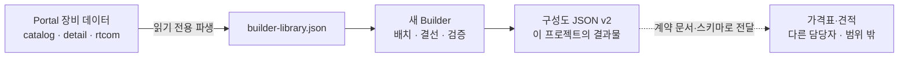
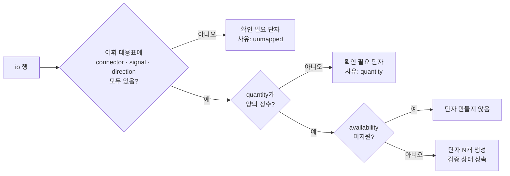

# AV System Builder 통합 재구축 기획 (2026-10-06)

- 문서 상태: **DRAFT 기획 (2판)**. 방향은 승인됐고, 단계별 구현 승인은 아직 받지 않았다.
- 작성: Claude Code (Work 역할), 2026-10-06
- 기준: `origin/main` `1517d14`, 구 AV System Builder `seoul-visual-tech/av-system-builder` `main` `2fd568e` (v1.20.1)

**사용자 지시 (2026-10-06)**

1판 지시:

> av-portal 안에도 장비에 대한 여러 정보들이 있는데 그 정보를 기준으로 av system builder를 만들어 통합된 장비라이브러리를 가지고 서비스를 만들기 위해서야. 더 나아가선 이렇게 생성된 구성도json을 가지고 견적을 자동으로 만들어주는 것까지 이어가려고 해. … 완전히 리팩토링 해도 되니까 기획서를 작성해줘.

2판 정정:

> av-system-builder의 구현방식만 가져오고 데이터는 av포탈에 있는걸 그대로 사용할거야. av-system-builder에서 지금까지 사용한 데이터는 다 폐기하고 av포탈의 데이터에 맞춰 리팩토링을 한다고 가정해줘. 가격표-견적 부분은 다른 사람이 따로 제작하고 있어서 우리의 제작범위에선 신경쓰지 않아도 돼. 우리는 제대로된 구성도json을 생성하는 거에 목표가 있어.

**승인 범위**

| 구분 | 내용 |
|---|---|
| 승인됨 | Portal 데이터를 원본으로 Builder를 재작성하는 방향 |
| 승인됨 | 구 Builder 데이터 전량 폐기 |
| 승인됨 | 완전한 리팩토링 |
| 범위 밖 | 가격표·견적. 다른 담당자가 제작한다 |
| 미승인 | 각 단계의 구현 착수. §11 결정과 단계별 W 명세 READY가 각각 필요하다 |

**이 문서가 대체하는 기존 결정** (Builder 관련 부분만, 그 밖의 제품 데이터 규칙은 그대로 유지한다)

- `AGENTS.md` "AV System Builder는 외부 링크만 유지"
- `WORK_HANDOFF.md` §2·§5 "Builder 데이터 통합·Repository 통합·Builder 수정 제외"
- `PORTAL_MVP_SPEC.md` "Builder 코드·Database 변경 금지"
- `CORE_DOMAIN_CONCEPTS.md` §0 "Builder 이관 범위 밖"

---

## 1. 목표와 범위

**목표: Portal 장비 데이터로 정확한 구성도 JSON을 만든다.**



"정확한 구성도 JSON"은 다음 다섯 가지를 모두 만족하는 파일이다.

1. **추적 가능.** 모든 장비는 Portal 제품 ID를 가리키고, 모든 연결은 그 제품의 실제 단자를 가리킨다. 출처가 없는 장비·단자는 그 사실이 파일에 드러난다.
2. **재현 가능.** Portal 데이터가 나중에 바뀌어도, 파일만으로 당시 장비·단자 구성을 다시 볼 수 있다.
3. **검증 가능.** 스키마 검사와 의미 검사(참조 무결성, 단자 방향, 양방향 잭 중복 등)를 통과한다. 미확인 사항은 숨기지 않고 `issues`에 남긴다.
4. **그림과 분리.** 화면 좌표 없이도 "무엇이 몇 대, 어떤 단자끼리, 어떤 케이블로" 연결됐는지 읽을 수 있다. 견적 쪽은 이 부분만 읽으면 된다.
5. **결정적.** 같은 구성은 같은 파일을 만든다. 키 순서와 배열 정렬 규칙이 고정돼 있어 diff로 변경을 비교할 수 있다.

| 범위 안 | 범위 밖 |
|---|---|
| Portal 데이터 → 결선용 라이브러리 파생 | 가격표, 단가, 견적 계산, 견적서 |
| 단자 표기 표준화(어휘)와 연결 규칙 | 구 Builder 장비·옵션·케이블·프리셋·공유 데이터 이관 |
| 구성도 JSON v2 스키마·검증기·예제·계약 문서 | 구 Builder JSON(v1.1) 가져오기 |
| 새 Builder 앱(구 Builder의 구현 방식 재사용) | LED Configurator 통합 |
| Portal 데이터 보강이 필요한 곳의 목록화 | 대역폭·HDCP·해상도까지 보는 호환성 엔진 |
| | 사용자가 다시 제안하지 말라고 한 기능: 마이크 커버리지 시뮬레이션, 글로벌 벤더 카탈로그 연동 |

---

## 2. Portal 데이터 현황 (2026-10-06 실측)

### 2.1 저장 방식

Portal에는 DB나 서버가 없다. 장비 데이터는 **Git 저장소의 정적 JSON 파일**이고, GitHub Pages가 그대로 공개한다. 변경은 PR로 하고, 배포 전에 `beta/verify-pages.mjs`와 테스트 369개가 구조와 내용을 검사한다.

| 파일 | 역할 | 관리 방식 |
|---|---|---|
| `beta/site/catalog.json` | 제품 목록 267건. 브랜드·제품명·3단계 카테고리·공식 링크·매뉴얼 링크·카드 사진·`slug` | **원본.** 직접 편집 |
| `beta/site/detail/data/<slug>.json` | 제품 상세 260건. 사양·I/O·사진·문서·출처·검증 상태·Port Map | **원본.** 직접 편집 |
| `beta/site/rtcom/raw/index.json` | RTCOM 32건(시리즈 3, 일체형 2, 분배기 8, 연장기 15, 케이블 4) | `rtcom-configurator`에서 동기화한 사본. Portal에서 고치지 않는다 |
| `beta/site/search-index.json`, `catalog.html`, `llms.txt`, `beta/public-snapshot.json` | 검색 인덱스, 읽기용 목록, 해시 고정값 | 스크립트가 만드는 **파생본**. `--check`로 원본과 일치를 확인한다 |

- 제품 ID는 `slug`(`^[a-z0-9-]+$`)다. 예: `ec-4bv`, `eb-pq2220b`, 삼성은 `lh43qmcebgcxkr`, RTCOM은 `rtcom-<id>`.
- 상세가 없는 7건(Ross 6, Televic 1)은 ID가 없다.
- 상세 JSON은 여러 테스트가 바이트 SHA로 고정하고 있다. 조금만 바꿔도 snapshot과 history 모듈 갱신이 함께 필요하다. Builder는 이 파일을 **고치지 않고 읽기만** 해야 한다.

### 2.2 제품 하나의 모양 (실제 데이터)

목록 항목 `catalog.json`:

```json
{ "brand": "BSS Audio", "product": "EC-4BV", "categories": ["오디오", "Control", "Control Interface"],
  "kind": "equipment", "official_links": ["https://bssaudio.com/en-US/products/EC-4BV"],
  "manual_link": "…", "slug": "ec-4bv", "card_image": "ec-4bv-main.webp" }
```

상세 `detail/data/eb-pq2220b.json`의 I/O 행(`io[]`, 4행 발췌):

```json
[
  { "group": "Video", "connector": "HDMI",        "signal": "디지털 비디오 입력", "direction": "IN",     "quantity": "2", "verification": "FOUND" },
  { "group": "Video", "connector": "HDMI",        "signal": "디지털 비디오 출력", "direction": "OUT",    "quantity": "1", "verification": "FOUND" },
  { "group": "Audio", "connector": "Stereo mini", "signal": "오디오 출력",        "direction": "OUT",    "quantity": "1", "verification": "FOUND" },
  { "group": "USB",   "connector": "USB Type-A",  "signal": "USB",               "direction": "IN/OUT", "quantity": "2", "verification": "FOUND" }
]
```

실제 행에는 `protocol`, `availability`, `condition`, `source` 필드도 있다.

같은 제품의 Port Map(후면 사진 위 번호표, 2개 발췌):

```json
{ "image": "Rear", "items": [
  { "n": 1, "label": "HDMI 1 입력", "desc": "HDMI Type A · 디지털 영상 입력(Deep Color/CEC).", "x1": 437, "x2": 465, "y": 57, "side": "top" },
  { "n": 2, "label": "HDMI 2 입력", "desc": "HDMI Type A · 디지털 영상 입력(Deep Color/CEC).", "x1": 483, "x2": 511, "y": 79, "side": "bottom" } ] }
```

**I/O 행과 Port Map의 차이:**

- I/O 행은 "HDMI 입력 2개"처럼 **종류별로 묶은 표**다.
- Port Map은 "HDMI 1 입력", "HDMI 2 입력"처럼 **단자 하나하나**를 사진 좌표와 함께 적는다.
- 두 자료를 잇는 키는 없다.

그 밖의 상세 필드는 `specifications[]`(사양 행 5,924개, 행마다 `group·name·value·unit·condition·source·verification`), `images[]`(역할 Main·Front·Rear·Perspective·Other·Diagram), `documents`, `sources`, `issues`, `packageStatus`다.

### 2.3 결선 도구 관점에서 본 상태

| 항목 | 상태 | Builder에 주는 의미 |
|---|---|---|
| I/O 행이 있는 제품 | 263/299 (상세 240/260, RTCOM 23/32), 1,404행 | 대부분 제품은 단자를 만들 수 있다 |
| 단자 표기 | 자유 텍스트. connector 342종(`RJ-45`/`RJ45`/`RJ45(LAN)` …), signal 417종(한·영 혼재, "디지털 비디오 입력"처럼 방향이 섞인 문장형), direction 10종 이상(`IN`·`OUT`·`IN/OUT`·`I/O`·`입력`·`양방향`·`BIDIR`·`IN/LOOP`·빈값·`N/A`) | **표준 어휘로 정규화해야 연결 검사에 쓸 수 있다.** 가장 큰 작업이다 |
| quantity | 정수 989행. 빈값 135행. `"4채널"`, `"1/1"`, `"슬롯당 4, 최대 16"` 같은 문자열 | 정수가 아니면 단자를 자동으로 펼칠 수 없다 |
| 미지원 표시 | `availability`에 `미지원(…)` 16행 | 단자를 만들지 않는다 |
| 검증 상태 | 행 단위. FOUND 620 / VERIFIED 573 / PARTIAL 66 / REVIEW REQUIRED 17 / MISSING 3 | 단자마다 신뢰도를 표시할 수 있다 |
| Port Map | 99제품, 번호 673개 | 개별 단자 이름의 근거로 쓸 수 있다. 단, I/O 행과 연결하는 대응표가 필요하다 |
| 사진 | 대표 사진 256, 후면 133 | 노드 썸네일, 후면 보기 |
| TX/RX 쌍 | RTCOM 연장기는 한 쌍이 ID 하나(`ct101-u-cr101-u`). I/O 행의 `group: "TX · Video"`, `condition: "CT101-U"`로 구분 | **배치할 때는 TX와 RX가 다른 장소에 놓인다.** 하나의 제품을 두 배치 단위로 나눠야 한다 |
| 모듈형 프레임 | RTCOM XDM·SPX·VDM은 `itemType: SERIES`. 모델은 `lineup[]`에 있고, 카드는 자유 텍스트 `summary`에만 있다. 프레임별 슬롯 수와 카드 호환 규칙은 없다 | 카드 장착 구성은 **지금 데이터로 만들 수 없다.** Portal 데이터 보강이 먼저 필요하다 |
| 옵션·액세서리 관계 | 없음 | 옵션 카드 기능은 데이터가 생긴 뒤에 다룬다 |
| 케이블 제품 | RTCOM 케이블 4건뿐 | 케이블은 제품 참조 없이 "종류·커넥터·길이"로 기록한다 |
| 단종 | 플래그 없이 데이터에서 삭제 | 삭제된 제품을 가리키는 구성도는 스냅샷으로 계속 보여야 한다 |

---

## 3. 설계 원칙

1. **Portal 원본은 읽기 전용이다.**
   - Builder용 단자 정보는 생성기 `beta/build-builder-library.mjs`가 파생 파일 `builder-library.json`으로 만든다. 검색 인덱스와 같은 방식이고, `--check`로 원본과의 일치를 확인한다.
   - 표기 정규화 규칙은 데이터 파일 `beta/port-vocabulary.mjs`에 둔다. 사람이 PR에서 검토한다.
2. **장비 정보는 Builder에서 고치지 않는다.** 단자가 틀렸거나 비어 있으면 Portal 상세 데이터를 기존 절차(W 명세, 공식 자료 확인)로 고친다. 그러면 파생본이 따라온다. Builder는 "보강 필요 목록"을 만들어 그 작업을 돕는다.
3. **추측하지 않고, 막지도 않는다.**
   - 대응표에 없는 표기, 정수가 아닌 수량, 방향 미상은 자동으로 메우지 않는다. "확인 필요 단자"로 드러낸다.
   - 미확인은 비호환이 아니다(`CORE_DOMAIN_CONCEPTS.md` §5). 연결은 허용하고 `issues`에 남긴다.
4. **구성도 JSON이 결과물이고, 그림은 부산물이다.**
   - 장비 인스턴스와 연결이 중심이다. 화면 좌표·스타일은 `layout`으로 분리한다.
   - 인스턴스는 Portal 제품을 **참조**하면서, 배치 당시의 단자 구성을 **스냅샷**으로 함께 저장한다.
5. **공개와 비공개를 나눈다.**
   - Builder 앱 코드, 파생 라이브러리, 어휘, 스키마, 가상 예제는 공개 저장소에 둔다.
   - 실제 구성도 파일(고객·현장 정보가 들어갈 수 있음)은 **저장소에 커밋하지 않는다.**
   - 테스트 예제는 가상의 현장명만 쓴다.

---

## 4. 라이브러리 파생 (`builder-library.json`)

### 4.1 I/O 행 → 단자 변환



- **방향 정규화:** `IN`·`입력` → `IN`. `OUT`·`출력` → `OUT`. `IN/OUT`·`I/O`·`양방향`·`BIDIR` → `BIDIR`. `IN/LOOP`처럼 루프아웃이 섞인 것은 대응표에서 개별 지정한다. 빈값·`N/A`는 `UNKNOWN`이다.
- **신호 정규화:** "디지털 비디오 입력"처럼 방향이 섞인 문장은 대응표에서 `signal: HDMI` + `direction: IN`으로 나눈다. 대응은 사람이 정한다. 같은 문장이라도 커넥터가 다르면 다른 신호일 수 있으므로 대응 키는 `(connector, signal)` 쌍으로 한다.
- **한 단자, 여러 신호:** RJ45의 `Ethernet (제어/구성/모니터링/PoE 전원)` → `signals: [ETHERNET, POE]`.
- **단자 ID:** `<productId>/<signal>-<direction>-<n>` 형식이다. 같은 신호·방향이 여러 행으로 나뉘면 행 `group`을 붙여 구분한다. **행 순서에 의존하지 않는다.** 상세 JSON에서 행 순서가 바뀌어도 ID가 유지된다.
- **단자 이름:** 기본값은 생성 이름이다(`HDMI 입력 1`).
  - Port Map이 있는 제품은 별도 대응표 `beta/builder-port-links.mjs`(Port Map 번호 ↔ 단자 ID)를 사람이 채우면 `HDMI 1 입력` 같은 실제 이름과 사진 좌표를 쓴다.
  - 이름이 비슷하다는 이유로 자동 연결하지 않는다.
- **검증 상태:** 행의 `verification`을 단자에 그대로 복사한다. 화면 배지와 JSON 스냅샷에 남는다.
- **전원 단자:** `POWER` 신호는 단자로 만들되 기본 화면에서는 접는다. 결선도에 전원을 그릴지는 §11 D5에서 결정한다.

### 4.2 표준 어휘 (초안, P1에서 확정)

| 축 | 표준값 예 |
|---|---|
| connector | `HDMI-A`, `DP`, `mDP`, `DVI-D`, `VGA`, `BNC`, `RJ45`, `SFP`, `LC`, `SC`, `XLR-F`, `XLR-M`, `XLR-COMBO`, `TRS-6.3`, `TRS-3.5`, `RCA`, `PHOENIX`, `EUROBLOCK`, `SPEAKON`, `BINDING-POST`, `USB-A`, `USB-B`, `USB-C`, `DB9`, `IEC-C14`, `DC-JACK`, `TERMINAL` |
| signal | `HDMI`, `DP`, `DVI`, `SDI`, `HDBASET`, `ANALOG-VIDEO`, `LINE-AUDIO`, `MIC-AUDIO`, `SPEAKER`, `AES3`, `DANTE`, `AES67`, `AVB`, `ETHERNET`, `POE`, `FIBER`, `RS-232`, `RS-485`, `IR`, `RELAY`, `GPIO`, `USB`, `POWER` |
| direction | `IN`, `OUT`, `BIDIR`, `LOOP-OUT`, `UNKNOWN` |

- 원칙은 형상(connector)과 신호(signal)를 분리하는 것이다(`CORE_DOMAIN_CONCEPTS.md` §5). 같은 RJ45라도 신호는 ETHERNET·DANTE·HDBASET·RS-232로 다르다.
- 선 색은 신호 기준이다. 구 Builder의 색 체계(HDMI 빨강, SDI 회색, 오디오 보라, LAN 초록, USB 파랑, 제어 주황, DP 분홍)는 **구현 방식으로서** 이어받는다.

### 4.3 특수 제품

| 유형 | 처리 |
|---|---|
| **TX/RX 쌍** (`ct101-u-cr101-u` 등) | 하나의 Portal 제품을 **배치 단위(unit) 2개**로 나눈다. 나누는 근거는 I/O 행의 `group`/`condition`(예: `CT101-U`)이다. 근거가 모호하면 나누지 않고 "확인 필요"로 둔다. 인스턴스는 `product.id` + `unit`(예: `TX`)으로 가리킨다 |
| **RTCOM 시리즈** (XDM·SPX·VDM) | 배치할 때 `lineup[]`에서 모델을 고른다(`variant`). 카드 장착은 카드 단위 데이터가 생길 때까지 지원하지 않는다. 대신 프레임을 "카드 구성 미정" 이슈와 함께 배치할 수 있다 |
| **I/O 없는 제품** (36건) | 배치는 가능하다. 단자가 없다는 이슈를 표시하고 보강 목록에 올린다 |
| **상세 없는 목록 항목** (7건) | 1단계에서는 제외한다. ID가 없기 때문이다 |

### 4.4 파일 형태 (초안)

```json
{
  "schema": "av-portal.builder-library",
  "schemaVersion": "1.0.0",
  "source": { "catalogSha": "…", "detailSetSha": "…", "rtcomSha": "…", "vocabularyVersion": "1.0.0" },
  "products": [
    {
      "id": "eb-pq2220b", "brand": "Epson", "model": "EB-PQ2220B",
      "categories": ["프로젝터", "Display", "…"],
      "image": { "card": "…/eb-pq2220b-main.webp", "rear": "…" },
      "detailUrl": "detail/eb-pq2220b/",
      "units": [ { "unit": null, "ports": [
        { "id": "eb-pq2220b/hdmi-in-1", "label": "HDMI 입력 1", "connector": "HDMI-A",
          "signals": ["HDMI"], "direction": "IN", "verification": "FOUND", "from": { "ioGroup": "Video" } }
      ] } ],
      "unresolved": [ { "ioGroup": "…", "reason": "unmapped-signal", "raw": { "connector": "…", "signal": "…" } } ],
      "readiness": { "ports": 9, "unresolved": 1, "verified": 0 }
    }
  ]
}
```

- 이 파일은 `beta/site/`에 두고 커밋한다. `verify-pages.mjs` 최상위 파일 목록(22행)에 한 줄을 추가하고, 공개 차단 문자열 검사(316행)도 그대로 적용받는다.
- 생성기는 함께 **결선 준비도 보고서**를 출력한다. 내용은 제품별 단자 수, 확인 필요 행, 미매핑 표기 빈도표다. 이 보고서가 Portal 데이터 보강 작업의 우선순위 목록이 된다.

---

## 5. 연결 규칙

| 판정 | 조건 | 처리 |
|---|---|---|
| 허용 | 방향이 맞고(OUT→IN, LOOP-OUT→IN, BIDIR↔IN/OUT/BIDIR), 신호 집합이 겹치고, 커넥터가 같다 | 연결 |
| 경고 | 신호는 맞지만 커넥터가 다르다(HDMI-A ↔ DVI-D, XLR ↔ PHOENIX) | 연결. `issues`에 `connector-adapter` 기록 |
| 경고 | 어느 한쪽이 `UNKNOWN` 방향이거나 단자 검증 상태가 REVIEW REQUIRED·PARTIAL이다 | 연결. `issues`에 `unverified-port` 기록 |
| 경고 | 신호 계열은 같지만 종류가 다르다(LINE-AUDIO ↔ MIC-AUDIO) | 연결. `issues`에 `signal-level` 기록 |
| 차단 | 같은 방향끼리 연결(IN↔IN, OUT↔OUT)하거나, 신호가 전혀 다르다(SPEAKER ↔ HDMI) | 연결 불가 |
| 차단 | BIDIR 잭 하나에 이미 연결이 있다 | 연결 불가. 구 Builder의 단일 잭 규칙을 이어받는다 |
| 차단 | 같은 IN 단자에 두 번째 연결을 한다 | 연결 불가. 분배는 분배기 장비로 표현한다 |

- 규칙 표 자체를 데이터(`engine/rules`)로 두고 단위 테스트로 고정한다.
- 화면의 연결 가능 표시와 JSON 검증기가 **같은 규칙 모듈**을 쓴다.

---

## 6. 구성도 JSON v2 명세 (초안, 이 프로젝트의 핵심 산출물)

### 6.1 최상위 구조

```json
{
  "schema": "av-portal.diagram",
  "schemaVersion": "2.0.0",
  "generator": { "app": "av-portal-builder", "version": "0.1.0" },
  "meta": { "id": "dgm-01J…", "title": "…", "createdAt": "…", "updatedAt": "…" },
  "library": { "schemaVersion": "1.0.0", "source": { "catalogSha": "…", "detailSetSha": "…", "rtcomSha": "…", "vocabularyVersion": "1.0.0" } },
  "rooms": [],
  "instances": [],
  "connections": [],
  "annotations": [],
  "issues": [],
  "layout": {}
}
```

- 견적 쪽이 읽을 부분은 `meta`, `library`, `rooms`, `instances`, `connections`, `issues`다. `annotations`와 `layout`은 화면 전용이며 무시해도 된다.

### 6.2 `instances[]` (배치된 장비)

| 필드 | 필수 | 의미 |
|---|---|---|
| `id` | ✓ | 구성도 안에서 고유한 안정 ID(`inst-` + ULID). 복사·붙여넣기 시 새로 발급 |
| `tag` | | 도면 표기 번호(예: `DSP-01`). 결선표·케이블 라벨에 쓴다 |
| `product.source` | ✓ | `portal` · `rtcom` · `unregistered` |
| `product.id` | portal/rtcom이면 ✓ | Portal 제품 ID(`slug` 또는 `rtcom-<id>`) |
| `product.unit` | | TX/RX 쌍의 배치 단위(`TX`·`RX`) |
| `product.variant` | | 시리즈 제품의 선택 모델(예: XDM `lineup`의 모델명) |
| `snapshot` | ✓ | 배치 당시의 `brand`, `model`, `productName`, `categories`, `ports[]`(§4.4 단자 구조 그대로)와 `verification` 요약 |
| `quantity` | ✓ | 이 노드가 나타내는 같은 장비의 대수. 기본 1. 의미는 §11 D3 |
| `roomId` | | 설치 공간 |
| `role` | | 역할 메모(예: "메인 디스플레이") |
| `acquisition` | ✓ | `new`(신규) · `reused`(기존 장비 재사용) · `owner-supplied`(발주처 제공). 구 Builder의 "재활용" 배지를 넓힌 것. 견적 쪽은 `new`만 구매 대상으로 본다 |
| `adHocPorts[]` | | Portal에 없는 단자를 이 인스턴스에만 임시로 추가한 것. 화면과 `issues`에 표시한다 |
| `notes` | | 자유 메모 |

- `unregistered` 장비(Portal에 아직 없는 장비)를 허용할지는 §11 D1에서 결정한다. 허용하면 `brand`·`model`을 직접 입력하고 단자는 `adHocPorts`로만 만든다. `issues`에 반드시 남는다.

### 6.3 `connections[]` (결선)

| 필드 | 필수 | 의미 |
|---|---|---|
| `id` | ✓ | 안정 ID(`conn-` + ULID) |
| `from` / `to` | ✓ | `{ instance, port }`. `port`는 해당 인스턴스 `snapshot.ports[].id` 또는 `adHocPorts[].id` |
| `signal` | ✓ | 이 결선이 실제로 나르는 신호 하나(두 단자 신호 집합의 교집합 중 선택) |
| `cable.kind` | ✓ | `ready-made`(기성) · `custom`(제작) · `none`(내장·무선 등 케이블 없음) · `unspecified`(미정) |
| `cable.type` | | 커넥터 쌍 + 신호에서 만든 케이블 종류 키(예: `HDMI-A/HDMI-A`, `XLR-M/XLR-F`) |
| `cable.length_m` | | 길이(m). 모르면 생략하고 `issues`에 `cable-length-missing` |
| `cable.quantity` | ✓ | 케이블 가닥 수. 기본 1 |
| `cable.repeatPerUnit` | | `quantity > 1` 인스턴스 사이에서 대수만큼 반복할지(§11 D3) |
| `label` | | 선 라벨 |
| `direction` | ✓ | 저장된 `from → to`가 신호 흐름 방향임을 보장한다. 양방향끼리는 화면 배치와 무관하게 저장 순서를 고정한다(구 Builder의 렌더 방향 정규화는 화면에만 적용) |

### 6.4 `rooms[]`, `annotations[]`, `layout`

- `rooms[]`: `{ id, name, parentId? }`. 구 Builder의 영역(Shape) 노드를 "설치 공간"으로 승격한 것이다. 실별 수량 집계의 기준이 된다.
- `annotations[]`: 텍스트 메모와 도형. 의미 없음.
- `layout`: `{ nodes: { [instanceId]: {x, y, w?, h?} }, rooms: {...}, viewport, locked, theme }`. 화면 전용이다.

### 6.5 `issues[]` (검증 결과)

```json
{ "code": "unverified-port", "severity": "warning", "target": { "connection": "conn-…" }, "detail": "…" }
```

| 코드 예 | 심각도 | 뜻 |
|---|---|---|
| `unregistered-product` | warning | Portal에 없는 장비 |
| `no-ports` | warning | Portal에 I/O 정보가 없는 제품 |
| `adhoc-port` | warning | 임시 단자 사용 |
| `unverified-port` | info/warning | 단자 검증 상태가 VERIFIED/FOUND가 아님 |
| `connector-adapter` | warning | 커넥터 변환 필요 |
| `signal-level` | warning | 마이크·라인 레벨 차이 등 |
| `cable-unspecified`, `cable-length-missing` | warning | 케이블 정보 미정 |
| `series-config-pending` | warning | 모듈형 프레임의 카드 구성 미정 |
| `library-drift` | info | 저장 이후 Portal 데이터가 바뀌어 스냅샷과 현재 라이브러리가 다름 |

- `issues`는 저장할 때마다 검증기가 **다시 계산**한다. 사람이 손으로 쓰는 필드가 아니다.
- 오류(error) 수준은 저장 자체를 막는다(참조 깨짐, 단자 중복 연결 등). 그래서 저장된 파일에는 warning·info만 남는다.

### 6.6 무결성·직렬화 규칙

- **참조:** 모든 `from/to.instance`는 존재하는 인스턴스, 모든 `port`는 해당 인스턴스의 단자다. `roomId`는 존재하는 공간이다.
- **단자 점유:** IN 단자와 BIDIR 단자는 연결 1개까지다. OUT 단자는 여러 연결을 허용할지 §11 D4에서 결정한다(분배 표현).
- **재현:** `snapshot`만으로 화면을 다시 그릴 수 있다. Portal에서 제품이 삭제(단종)되거나 단자가 바뀌어도 파일은 열린다. 차이는 `library-drift`로 알린다.
- **결정적 직렬화:** 키 순서를 고정한다. `instances`·`connections`는 `id` 순, 단자는 라이브러리 순서를 따른다. 들여쓰기 2칸, UTF-8, 끝 줄바꿈 1개. 같은 구성은 같은 바이트를 만든다.
- **버전:**
  - `schemaVersion`은 semver다. 필드 추가는 minor, 의미 변경·삭제는 major다.
  - major가 바뀌면 `engine/migrate`에 변환기를 두고 이전 파일을 계속 열 수 있게 한다.
- **크기:** 사진은 넣지 않는다. 사진은 Portal 경로 참조로만 둔다. 구 Builder의 Base64 이미지 때문에 용량을 초과하던 문제를 반복하지 않는다.

### 6.7 견적 담당자와의 계약

견적은 범위 밖이지만, 구성도 JSON은 견적이 읽는 **입력 계약**이다. 다음을 공개 저장소에 함께 둔다.

1. `builder/schema/diagram.v2.schema.json` (JSON Schema 2020-12)
2. 의미 검증기와 CLI: `node builder/cli/validate.mjs <파일>`
   - 스키마 검사, 참조 무결성 검사, 연결 규칙 검사, `issues` 재계산을 한다.
   - 견적 쪽도 같은 검사기를 쓸 수 있다.
3. 가상 예제 3종과 검사 테스트: 소회의실, 중강당(믹서·DSP·앰프·스피커), RTCOM 연장기가 들어간 영상 분배
4. 필드 의미 문서: 위 §6.1~§6.6를 확정한 판. "수량 해석", "`acquisition`별 구매 여부", "`cable.kind`별 집계 방법"을 명시한다

P1에서 견적 담당자에게 초안을 보내 **필요한 필드가 빠졌는지** 확인을 받는다. 담당자와 연락 경로는 §11 D2에서 정한다.

---

## 7. 구 Builder에서 가져오는 구현 방식

데이터는 전부 버리고, 검증된 **구현**만 가져온다. 코드를 그대로 복사하기보다, 필요한 모듈을 골라 테스트를 붙여 새 구조로 옮긴다. 구 저장소의 Git 이력은 가져오지 않는다. 이력에 고객 구성도가 남아 있기 때문이다.

| 구 Builder 구현 | 처리 | 메모 |
|---|---|---|
| React 19 + TS + Vite + @xyflow/react + zustand | **유지** | 결선 편집기에 맞는 검증된 조합 |
| 엣지 기하·교차 점프 `utils/edgeGeometry.ts` (227줄) | **이식** | 순수 함수. 회귀 테스트 추가 |
| 평행선 간격·채널 순서 `utils/edgeProcessing.ts` (432줄) | **이식** | Stage 0~4, `optimizeChannelOrder`. 기록된 함정(클램프 순서, 팬아웃 가정)을 테스트로 만든다 |
| 오토 레이아웃 `utils/layout.ts` (223줄, Dagre + barycenter) | **이식** | 신호선/보조선 가중치를 표준 신호 기준으로 바꾼다 |
| 포트 좌표·노드 높이 계산 (`store.ts:308-378`) | 재작성 | 렌더링 상수와 한 모듈로 묶는다(헤더 54px 불일치 함정) |
| 단일 잭 양방향 규칙, 렌더 방향 정규화 | 규칙만 이식 | §5, §6.3에 반영 |
| Undo/Redo, 복사·붙여넣기, Lock, MiniMap, LOD 확대·축소 표시, 다크/라이트 | 재작성 | 기능은 같게, 상태 구조는 v2 기준 |
| 주석·영역 노드 | 재작성 | 영역은 `rooms`로 승격 |
| PDF 내보내기 (화면 PNG 한 장) | 재작성 | SVG 벡터 기본, PDF는 SVG에서 생성 |
| 사이드바 장비 검색·그룹 | 재작성 | Portal 카테고리와 제조사 축을 사용. 검색 정규화는 Portal 검색 인덱스 방식을 재사용 |
| 옵션 카드 포트 합성 (`MODULAR_SLOT_PORT_SPEC.md`) | 설계만 보관 | Portal에 카드 데이터가 생기면(P9) 다시 쓴다 |
| 장비 DB 편집·Excel 일괄 등록·라인 타입 편집 | **폐기** | 장비 정보는 Portal 절차로만 고친다 |
| Firestore 실시간 동기화·프리셋·공유 링크 | **폐기** (1단계) | 팀 저장·공유는 백엔드 결정 후 별도(P8). 구 구조의 diff→delete 문제(`librarySync.ts:274-279`)는 반복하지 않는다 |
| BOM 케이블 모드 | 재설계 | 연결 편집 패널의 `cable` 필드로 통합. 집계·가격은 견적 쪽 몫 |
| 빠른제작 템플릿 | 보류 | 운영 데이터 0건. 필요하면 P9 이후 |
| 인앱 릴리즈노트 | 재작성 | CHANGELOG 원문을 번들에 넣지 않는다(고객명 노출 사례) |

**반복하지 말 함정** (구 `CLAUDE.md` 기록):

- 교차 점프를 앱 단계 memo에서 계산하면 한 프레임 늦은 좌표에 고정된다.
- 렌더 상수와 좌표 계산 상수가 따로 놀면 선이 단자에서 어긋난다.
- 포트 타입을 하드코딩하면 선 종류 목록과 어긋난다.
- lucide `Map` 아이콘이 전역 `Map`을 가린다.
- 같은 중분류 이름이 여러 카테고리에 섞인다.
- 저장 데이터에 렌더용 값(`dimmed` 등)이 섞인다. 이 때문에 v2는 의미 모델과 `layout`을 분리했다.

---

## 8. 저장소와 배포

```
AV-Portal/
├─ beta/
│  ├─ port-vocabulary.mjs          # 표기 → 표준값 대응표 (사람이 검토)
│  ├─ builder-port-links.mjs       # Port Map 번호 ↔ 단자 ID 대응표 (선택)
│  ├─ build-builder-library.mjs    # 파생본 생성·--check·준비도 보고서
│  └─ site/builder-library.json    # 파생본 (커밋)
├─ builder/                        # 새 Builder (자체 package.json·lockfile)
│  ├─ schema/diagram.v2.schema.json
│  ├─ src/engine/                  # 순수 로직: model, rules, validate, serialize, migrate
│  ├─ src/canvas/                  # React Flow 렌더링: 노드·엣지·레이아웃 이식 모듈
│  ├─ src/ui/                      # 화면
│  ├─ cli/validate.mjs             # 구성도 JSON 검증 CLI
│  ├─ examples/                    # 가상 예제
│  └─ test/
└─ .github/workflows/
   ├─ builder-ci.yml               # PR: 타입검사·린트·테스트·빌드
   └─ pages.yml                    # 기존 검증 → builder 빌드 → 합쳐서 업로드
```

**배포 흐름:**

1. `pages.yml`의 기존 단계(`system-version`, `build-readable-catalog`, `build-search-index --check`, `verify-pages`, `npm test`)는 그대로 둔다.
2. `build-builder-library --check`를 추가한다.
3. `builder/`에서 `npm ci && npm run build`를 실행한다.
4. `_site/`에 `beta/site/`와 `builder/dist`(→ `_site/builder/`)를 합쳐 업로드한다.

**운영 조건:**

- 주소는 `https://seoulav.github.io/AV-Portal/builder/`다. Vite `base`는 `/AV-Portal/builder/`로 두고 소스맵은 배포하지 않는다.
- 루트 `package.json`은 의존성 0인 상태로 유지한다.
- Builder 빌드 실패가 카탈로그 배포를 막지 않도록 `builder-ci.yml`을 PR 필수 검사로 둔다.
- 저장 방식은 1단계에서 **브라우저 자동 저장 + JSON 파일 내보내기·열기**만 둔다. 서버가 필요 없고, 구성도가 외부로 나가지 않는다. 팀 저장·공유 링크는 백엔드를 결정한 뒤 별도로 한다(§11 D6).

---

## 9. 단계별 로드맵

각 단계는 별도 W 명세로 만든다. READY와 사용자 승인을 받은 뒤 착수하고, 앞 단계 결과를 반영해 다음 명세를 만든다.

| 단계 | 내용 | 완료 조건 | 선행 |
|---|---|---|---|
| **P1 기반 명세** | 표준 어휘 확정, 단자 ID 규칙, TX/RX 분리 규칙, 연결 규칙 표, 구성도 JSON v2 필드 의미 확정, 견적 담당자 확인 | 사용자와 견적 담당자 확인, `Work/기획/` 명세 병합 | 이 기획 승인 |
| **P2 라이브러리 생성기** | `port-vocabulary.mjs`, `build-builder-library.mjs --check`, 결선 준비도 보고서 | `--check`·`verify-pages`·`npm test` 통과. 준비도 보고서 공개(단자 생성 제품 수, 미매핑 표기 빈도) | P1 |
| **P3 엔진·스키마·CLI** | `diagram.v2.schema.json`, 의미 검증기, 결정적 직렬화, 가상 예제 3종, `validate` CLI. **화면 없음** | 예제 3종이 검증 통과. 깨진 예제(참조 오류·IN 중복 등)가 정확한 코드로 실패 | P2 |
| **P4 Builder 골격** | `builder/` 앱, CI, Pages 합치기, 장비 검색·배치·결선(규칙 적용)·이슈 패널, 자동 저장, JSON 내보내기·열기 | `/AV-Portal/builder/` 배포. 화면에서 만든 예제가 CLI 검증 통과, 다시 열었을 때 바이트 동일 | P3 |
| **P5 편집 기능 이식** | 레이아웃·교차 점프·평행선(회귀 테스트), Undo/Redo, 복사, 주석·공간, Lock, LOD, 테마, SVG/PDF | 구 Builder 수준의 도면을 같은 품질로 작성 | P4 |
| **P6 데이터 보강 순환** (P2 이후 상시) | 준비도 보고서 상위 항목을 Portal 데이터 W 작업으로 처리(표기 정리, 정수 수량, Port Map 대응표) | 매 회차 단자 생성 제품 수·미매핑 수 변화 기록 | P2 |
| **P7 구 Builder 종료** | 구 사이트에 새 주소 안내 → 공존 기간 → 안내 페이지로 교체, 구 저장소 보관. 데이터는 이관하지 않는다 | 사용자 확인 | P5, D7 |
| **P8 팀 저장·공유** (선택) | 백엔드·로그인 결정 후 구성도 저장·공유 링크 | 비로그인 사용자의 비공개 구성도 접근 불가(규칙 테스트) | D6 |
| **P9 이후** | RTCOM 카드·슬롯 데이터(Portal 보강) → 카드 장착 구성, Port Map 후면 보기 노드, 빠른제작 | 개별 명세 | — |

- 구성도 JSON의 품질은 P3에서 화면보다 먼저 확정한다. 화면이 생기기 전에 계약을 고정해야 견적 쪽이 병행 개발할 수 있다.
- 사람이 검토해야 하는 단계는 P1(어휘·규칙)과 P2(정규화 결과)다. 추론 강도를 높게 배정한다(`Work/기획/모델추론강도기준-2026-10-05.md`). P3의 스키마·검증기는 테스트가 잡아 주므로 기본 강도로 충분하다.

---

## 10. 리스크와 대응

| 리스크 | 영향 | 대응 |
|---|---|---|
| 단자 표기 정규화 범위가 크다(connector 342, signal 417) | 연결 가능한 단자가 적어 쓸모가 낮아 보인다 | P2에서 빈도순으로 대응표를 채운다. 상위 표기만으로 대부분 행이 해결되는지 먼저 측정한다. 미매핑 단자도 "확인 필요"로 화면에 보여 작업을 막지 않는다 |
| Portal에 없는 장비가 실제 도면에 필요하다 | 도면을 완성할 수 없다 | §11 D1. `unregistered` 허용 시 이슈로 남기고 Portal 등록 요청 목록으로 모은다 |
| TX/RX·시리즈·카드형 데이터가 부족하다 | 매트릭스·연장기 구성이 부정확해진다 | 근거가 있는 것만 나눈다. 카드 구성은 "미정" 이슈로 남기고, Portal 데이터 보강(P9)을 먼저 한다 |
| Portal 데이터 수정이 구성도 단자 참조를 깨뜨린다 | 저장된 파일이 열리지 않는다 | 단자 ID를 행 순서와 분리하고 스냅샷으로 재현한다. `library-drift` 이슈를 둔다 |
| 견적 쪽 요구와 JSON이 어긋난다 | 다시 작업해야 한다 | P1에서 초안을 확인받고, P3에서 스키마와 CLI를 먼저 공개한다 |
| Builder 빌드가 Portal 배포를 막는다 | 카탈로그·RTCOM 갱신이 지연된다 | `builder-ci.yml`을 필수 검사로 둔다. Builder 단계는 기존 검증 뒤에 실행한다 |
| 실제 구성도가 공개 저장소에 들어간다 | 고객·현장 정보가 영구히 노출된다 | 예제는 가상만 쓴다. `builder/examples` 외의 `*.diagram.json`은 `.gitignore`에 넣는다. 1단계 저장은 로컬만 |

**구 Builder 별도 권고 (이 기획의 범위 밖):**

- 구 Builder의 CHANGELOG·CLAUDE.md에 고객 현장명이 있고, 공개된 앱의 릴리즈노트 화면에 그대로 보인다.
- Firestore 규칙이 전부 `if true`다.
- 데이터를 폐기하더라도 **구 사이트가 공개돼 있는 동안**은 정리가 필요하다.

---

## 11. 결정이 필요한 사항

| ID | 질문 | 권장안 |
|---|---|---|
| D1 | Portal에 없는 장비를 도면에 넣어야 할 때 | 허용. `unregistered`로 표시하고 단자는 임시 단자로만 만든다. `issues`와 Portal 등록 요청 목록에 남긴다 |
| D2 | 견적 담당자와 JSON 계약 확인 | P1 초안을 누구에게, 어떤 경로로 보낼지 알려 주세요. 견적 쪽이 이미 쓰는 입력 형식이 있으면 받아서 맞춘다 |
| D3 | 노드 하나에 "N대"를 허용할지, 케이블 수량 규칙 | 허용. 케이블은 기본 1가닥이고, "대수만큼 반복"(`repeatPerUnit`)을 선택할 수 있게 한다. 위치·역할이 다르면 노드를 나누도록 안내한다 |
| D4 | OUT 단자 하나에서 여러 장비로 연결(분배)을 허용할지 | 차단. 실제 결선과 같게 분배기 장비로 표현한다. 단, 네트워크 스위치처럼 포트가 많은 장비는 포트별로 연결한다 |
| D5 | 전원 결선을 구성도에 그릴지 | 1단계에서는 그리지 않는다. 전원 단자는 장비 정보로만 보인다 |
| D6 | 구성도 저장 위치 | 1단계는 브라우저 자동 저장 + JSON 파일. 팀 저장·공유는 P8에서 백엔드를 정한 뒤 |
| D7 | 구 Builder 종료 시점 | P5 완료 후 1개월 공존. 이후 새 주소 안내 페이지로 교체. 데이터는 옮기지 않는다 |
| D8 | 새 Builder 작업 절차 | Portal의 W 명세·Codex 절차를 따른다 |

---

## 12. 유지하는 규칙과 바뀌는 결정

**유지한다:**

- 제조사 사양을 추측하지 않는다.
- 정보 없음·0·미지원·해당 없음을 구분한다.
- 모델 일치를 확인하고 단종 모델은 등록하지 않는다.
- 공식 링크 출처 우선순위와 삼성 국내 자료 제한을 지킨다.
- 비공개 자료는 커밋하지 않는다.
- 검색 인덱스와 RTCOM 동기화 절차를 지킨다.
- **Builder를 위해 Portal 제품 데이터를 고칠 때도 지금의 Portal 데이터 절차를 똑같이 따른다.**

**바뀐다:**

- AV System Builder는 "외부 링크만 유지" 대상에서 **Portal 데이터 기반 재작성 대상**으로 바뀐다.
- 단계별 W 명세가 READY가 되기 전에는 구현하지 않고 기존 외부 링크를 유지한다.
- 구 Builder 데이터는 쓰지 않는다. 구 저장소의 이력도 가져오지 않는다.
- 가격·견적은 이 프로젝트의 범위가 아니다.

---

## 13. 근거 자료

- **Portal 데이터 실측 (2026-10-06):** `beta/site/catalog.json`, `beta/site/detail/data/*.json`(예: `ec-4bv.json`, `eb-pq2220b.json`), `beta/site/rtcom/raw/index.json`, `beta/verify-pages.mjs:22,278,316`
- **구 Builder 구현:** `src/utils/edgeGeometry.ts`, `src/utils/edgeProcessing.ts`, `src/utils/layout.ts`, `src/store.ts:308-378`, `src/App.tsx:612`(연결 검사), `src/librarySync.ts:274-279`, `MODULAR_SLOT_PORT_SPEC.md`, `CLAUDE.md`(아키텍처·함정 기록)
- **개념 기준:** [핵심 도메인 개념](CORE_DOMAIN_CONCEPTS.md) §2·§5, [기존 시스템 분석](EXISTING_SYSTEM_ASSESSMENT.md) §4, [데이터 스키마 초안](PRODUCT_DATA_SCHEMA_SKELETON.md) §2
- **조사 방법:**
  - 구 Builder 저장소와 Firestore는 읽기만 했다(REST GET).
  - 프리셋·공유 문서는 개수와 구조만 셌다.
  - 집계용 임시 파일은 저장소 밖에 두었고 커밋하지 않았다.
