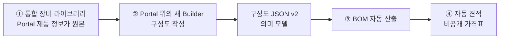
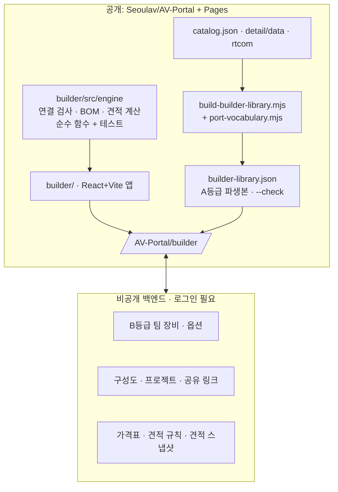
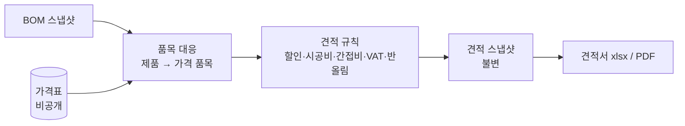

# AV System Builder 통합 재구축 기획 (2026-10-06)

- 문서 상태: **DRAFT 기획**. 방향 승인은 받았지만 단계별 구현 승인은 아직 받지 않았다.
- 작성: Claude Code (Work 역할), 2026-10-06
- 기준: `origin/main` `f91fe12`, AV System Builder `seoul-visual-tech/av-system-builder` `main` `2fd568e` (v1.20.1)
- 사용자 지시 원문 (2026-10-06):
  > 이전하려는 이유는 av-portal 안에도 장비에 대한 여러 정보들이 있는데 그 정보를 기준으로 av system builder를 만들어 통합된 장비라이브러리를 가지고 서비스를 만들기 위해서야. 더 나아가선 이렇게 생성된 구성도json을 가지고 견적을 자동으로 만들어주는 것까지 이어가려고 해. 이런 배경을 가지고 완전히 리팩토링 해도 되니까 기획서를 작성해줘.
- 승인 범위:
  - **승인됨:** Builder를 Portal 장비 정보 기반으로 통합하는 방향, 완전한 재작성(리팩토링) 허용
  - **미승인:** 각 단계의 구현 착수, 백엔드·인증 선택, 가격 데이터 취급. §10의 결정과 단계별 W 명세 READY가 각각 필요하다.

이 문서는 아래 기존 결정 가운데 **Builder 관련 부분만** 대체한다. 나머지 제품 데이터 규칙은 그대로 유지한다(§11).

- `AGENTS.md`의 "AV System Builder는 외부 링크만 유지"
- `WORK_HANDOFF.md` §2·§5의 "Builder 데이터 통합·Repository 통합·Builder 수정 제외"
- `PORTAL_MVP_SPEC.md`의 "Builder 코드·Database 변경 금지"
- `CORE_DOMAIN_CONCEPTS.md` §0·§4의 "Builder 이관 범위 밖"

---

## 1. 목표



1. **통합 장비 라이브러리.** Portal의 제품·사양·I/O·사진이 장비의 단일 원본이다. Builder는 이 원본을 읽기만 하고 자기 장비 DB를 따로 두지 않는다.
2. **Builder 재구축.** Portal 저장소 안에서 새로 만들어 `seoulav.github.io/AV-Portal/builder/`로 배포한다. 기존 기능 가운데 실제로 쓰는 것을 옮긴다.
3. **구성도 JSON v2.** 화면 좌표가 아니라 "어떤 제품 몇 대가 어떤 단자로 어떤 케이블로 연결되는가"를 기록하는 의미 모델이다. 견적 계산의 입력이 된다.
4. **BOM과 견적 자동화.** 구성도 → BOM(장비·옵션 카드·케이블) → 가격표 적용 → 견적서를 만든다. 가격이 없는 품목은 0원으로 처리하지 않고 "단가 미정"으로 남긴다.

### 비목표

- LED Configurator는 계속 외부 링크로 둔다.
- 사용자가 다시 제안하지 말라고 결정한 기능(2026-07-08)은 넣지 않는다: 마이크 커버리지 시뮬레이션, 글로벌 벤더 카탈로그 연동.
- 공통 Compatibility Engine, 즉 대역폭·HDCP·해상도까지 판정하는 호환성 엔진은 만들지 않는다. 연결 검사는 단자·신호·방향 수준까지만 한다.
- 실시간 동시 편집(CRDT)은 넣지 않는다. 저장 단위는 last-write-wins와 버전 충돌 경고로 처리한다.

---

## 2. 현재 상태 (2026-10-06 실측)

### 2.1 Portal 장비 데이터

| 항목 | 값 | 근거 |
|---|---|---|
| 제품 | 267건 (상세 260, 목록만 7) + RTCOM 32 = 299 | `beta/site/catalog.json`, `detail/data/*.json`, `rtcom/` |
| 제조사 | 28곳 + RTCOM | 동일 |
| I/O 행이 있는 제품 | 263 (상세 240 + RTCOM 23), 1,404행 | `detail.io[]` |
| I/O 행 구조 | `{group, connector, signal, direction, quantity, protocol, availability, condition, source, verification}`. 모두 자유 텍스트 | `verify-pages.mjs:278` |
| 표기 불일치 | connector 342종(`RJ-45`/`RJ45`/`RJ45(LAN)` 등), signal 417종(한·영 혼재), direction 10종 이상(`IN`·`I/O`·`IN/OUT`·`입력`·`BIDIR` 등), quantity에 비정수 문자열 135+행 | 실측 |
| Port Map | 99제품(상세 74 + RTCOM 25), 번호 673개. **번호와 io 행을 잇는 키가 없다** | `detail.portMap` |
| 후면 사진 | 133제품 | `images[].role = Rear` |
| 검증 상태 | 행 단위. io는 FOUND 620 / VERIFIED 573 / PARTIAL 66 / REVIEW REQUIRED 17 / MISSING 3 | `io[].verification` |
| 가격·SKU·옵션 관계·단종 플래그 | **없음.** 단종 모델은 데이터에서 삭제한다 | `tests/discontinued-product.test.mjs:10` |
| RTCOM 카드·슬롯 | 카드는 `lineup[].summary` 자유 텍스트에만 있다. 프레임별 슬롯 수와 카드 호환 규칙은 이 저장소에 없다 | `rtcom/` |
| 공개 차단 | `단가`·`공급처`·`내부 메모` 문자열이 공개 파일에 있으면 배포가 실패한다 | `beta/verify-pages.mjs:316` |
| 변경 비용 | 상세 JSON을 바꾸면 SHA 고정 테스트와 history 모듈 갱신이 함께 필요하다 | `tests/remaining-port-maps.test.mjs:77-110` 등 |

### 2.2 기존 Builder

| 항목 | 값 | 근거 |
|---|---|---|
| 스택 | React 19, TS 6, Vite 8, @xyflow/react 12, dagre, zustand, Firebase Firestore | `package.json` |
| 코드 규모 | `src/` 9,351줄 (App.tsx 1,569, store.ts 899). 테스트 0개, 린트 오류 73건 | 실측 |
| 장비 | Firestore 674건. 포트 입력률 36%(242건). 실제 쓰는 포트 타입은 3종(network·audio·video)뿐이고 SDI·HDMI·HDBaseT가 모두 `video`. 포트 라벨의 87%가 "In N/Out N" 같은 일반명. 제조사 미입력 175건 | Firestore 읽기 |
| 옵션 카드 | 132건 (모델 지정 103, 시리즈 지정 29) | 동일 |
| 케이블 카탈로그 | 185건. 가격·길이 필드가 없고 길이는 설명 텍스트에 있다 | 동일 |
| 프리셋·공유 | 프리셋 6건(평균 노드 14, 엣지 15), 공유 스냅샷 6건, 빠른제작 템플릿 0건 | 동일 |
| BOM | 케이블만 다룬다. 프리셋 엣지 92개 중 2개만 사용. 장비 BOM은 없다 | `BomReportModal.tsx` |
| 노드 수량 | 코드에서는 2026-06-26에 제거됐다(`cd49845`). 데이터 14개 노드에는 "x3"·"21ea" 같은 값이 남아 있다 | 실측 |
| 가격 | 어디에도 없다 | 실측 |
| 보안 | Firestore 규칙이 전부 `allow read, write: if true`. 저장소는 비공개이고, 이력과 CHANGELOG에 고객사 현장명이 남아 있다. CHANGELOG는 앱의 릴리즈노트 화면에 그대로 표시된다 | `CLAUDE.md:262-274`, `ReleaseNotesModal.tsx:8` |

### 2.3 두 장비 목록의 대조 (모델명 영숫자 정규화 기준 추정)

| 구분 | 건수 | 의미 |
|---|---|---|
| Builder ∩ Portal (정확 일치) | 약 156~166 | 정규화 방식에 따라 다르다. 이관 시 Portal 제품으로 바로 연결할 후보 |
| 앞부분 일치 후보 | 약 44 | 사람이 확인해야 한다 (예: 삼성 `LH55QMC` ↔ `lh55qmcebgcxkr`) |
| Builder에만 있음 | 약 474 | 제조사 미입력 160, 삼성 52, RTCOM 32, EPSON 24, CROWN 23, Poly 23 … |
| Portal에만 있음 | 144 | Builder에서 바로 쓸 수 있게 되는 제품 |

브랜드 표기도 서로 다르다(`CROWN`↔`Crown`, `BSS`↔`BSS Audio`). 대조 결과는 사람이 검토해야 하는 **후보**이며 동일성을 확정한 것이 아니다(`CORE_DOMAIN_CONCEPTS.md` §2.3).

**결론:**

- Portal은 I/O 정보의 깊이와 근거 면에서 Builder보다 훨씬 낫다. 다만 표기가 자유 텍스트라 결선 도구가 그대로 쓸 수 없다.
- Builder는 장비 범위가 넓다(프로젝터·스크린·스피커·네트워크). 하지만 포트 정보가 얕고 출처가 없다.
- 그래서 **"Portal 원본 + 정규화 계층 + 팀 보조 장비"**로 구성해야 한다.

---

## 3. 핵심 설계 원칙

### 3.1 원본은 하나이고, Builder는 파생본을 읽는다

- Portal의 `catalog.json`과 `detail/data/*.json`은 그대로 둔다.
- 결선에 필요한 정보는 생성기 `beta/build-builder-library.mjs`가 **파생 파일**로 만든다. 검색 인덱스와 같은 방식이다.
- 이렇게 하면 SHA 고정 테스트와 history 체계를 건드리지 않고, 원본이 고쳐지면 파생본이 자동으로 따라온다.
- 정규화 규칙(표기 → 표준값)은 별도 데이터 파일 `beta/port-vocabulary.mjs`에 둔다. 리뷰어가 PR diff에서 바로 볼 수 있다.

### 3.2 장비는 세 등급으로 나눈다

| 등급 | 원본 | 공개 | 검증 | 쓰임 |
|---|---|---|---|---|
| **A. Portal 제품** | Portal 공개 데이터 | 공개 | 행 단위 FOUND/VERIFIED 등 | 기본 라이브러리 |
| **B. 팀 설계용 장비** | 비공개 팀 저장소 | 로그인 사용자만 | 없음. 화면에 "미검증" 배지 | Portal에 아직 없는 장비. 기존 Builder 전용 약 474건의 이관처 |
| **C. 도면 전용 장비** | 해당 구성도 파일 안 | 구성도와 함께 | 없음 | 일회성 장비. 라이브러리에 들어가지 않는다 |

- B를 Portal 공개 데이터에 바로 넣지 않는 이유가 있다. Portal의 "추측 금지·출처·모델 일치" 규칙과 정면으로 부딪히기 때문이다. 일반명 포트와 제조사 미입력 장비가 공개 카탈로그에 섞이면 그동안 쌓은 검증 체계가 무너진다.
- **B → A 승격**은 기존 Portal 제품 추가 절차(W 명세, 공식 자료 확인)를 그대로 밟는다. 승격되면 B 항목은 A 제품을 가리키는 별칭으로 남는다. 기존 구성도가 깨지지 않게 하기 위해서다.
- 화면에서는 세 등급을 같은 검색창에서 찾되 배지로 구분한다.

### 3.3 구성도는 "의미"가 먼저이고 "그림"은 나중이다

- 구성도 JSON v2의 중심은 인스턴스(배치된 장비)와 연결(단자 ↔ 단자 + 케이블)이다.
- React Flow 좌표·스타일은 `layout` 하위 객체로 분리한다. 견적 엔진은 그림을 몰라도 계산할 수 있어야 한다.
- 인스턴스는 제품을 **참조**하면서, 배치 당시의 제품 정보를 **스냅샷**으로 함께 저장한다. 라이브러리가 바뀌어도 과거 구성도를 재현할 수 있다(`CORE_DOMAIN_CONCEPTS.md` §3.4). 기존 Builder의 "노드가 장비 정보를 통째로 품는다"는 장점은 살리고, 카탈로그와 연결이 끊기는 약점은 참조로 보완한다.

### 3.4 BOM과 견적은 순수 함수다

- `구성도 v2 + 라이브러리 스냅샷 → BOM 스냅샷`과 `BOM 스냅샷 + 가격표 + 견적 규칙 → 견적 스냅샷`을 각각 **UI와 분리된 순수 계산 모듈**로 만든다.
- Node 테스트로 같은 입력이면 같은 결과가 나오는지 검증한다.
- 각 결과 행은 어느 인스턴스·연결에서 나왔는지 역추적할 수 있어야 한다(`CORE_DOMAIN_CONCEPTS.md` §4.2).
- 미확정 수량은 0이 아니고, 미확정 가격은 0원이 아니다. 미확정 항목이 하나라도 있으면 결과 전체를 "부분 견적"으로 표시한다(`CORE_DOMAIN_CONCEPTS.md` §4.7).

### 3.5 공개와 비공개의 경계

`Seoulav/AV-Portal`은 공개 저장소이고 Pages도 공개다. Git 이력은 영구히 남는다(`AGENTS.md` "비공개 자료는 올리기 전에 암호화한다").

| 데이터 | 위치 |
|---|---|
| Builder 앱 코드, A등급 라이브러리 파생본, 포트 어휘 | 공개 저장소·Pages |
| 구성도·프로젝트·고객·현장 정보 | 비공개 백엔드 또는 사용자 로컬 파일. **저장소에 커밋하지 않는다** |
| B등급 팀 장비 | 비공개 백엔드 |
| 가격표(원가·판매가), 견적 결과 | 비공개 백엔드에서 권한자만. **저장소·Pages·번들 어디에도 넣지 않는다** |
| 테스트용 견본 | 가상의 제품·가격만 쓴다 |

---

## 4. 목표 구조



### 4.1 저장소 배치

```
AV-Portal/
├─ beta/
│  ├─ build-builder-library.mjs   # A등급 파생본 생성·--check
│  ├─ port-vocabulary.mjs         # 표기 → 표준값 대응표
│  └─ site/builder-library.json   # 파생본 (커밋, 검색 인덱스와 같은 관리 방식)
├─ builder/                       # 새 Builder 앱 (자체 package.json·lockfile)
│  ├─ src/engine/                 # 순수 로직: schema, connect, bom, quote, migrate-v1
│  ├─ src/canvas/                 # React Flow 렌더링: 노드·엣지·레이아웃
│  ├─ src/ui/                     # 화면
│  └─ test/                       # vitest
└─ .github/workflows/
   ├─ builder-ci.yml              # PR: 타입검사·린트·테스트·빌드
   └─ pages.yml                   # 기존 검증 → builder 빌드 → 합쳐서 업로드
```

- 루트 `package.json`은 의존성 0인 상태로 둔다. npm 의존성은 `builder/` 안에서만 쓴다.

### 4.2 배포

현재 `pages.yml`은 `beta/site`를 그대로 업로드한다. 이를 다음과 같이 바꾼다.

1. 기존 단계(`system-version`, `build-readable-catalog`, `build-search-index --check`, `verify-pages`, `npm test`)를 **그대로** 실행한다.
2. 추가로 `build-builder-library --check`를 실행한다.
3. `builder/`에서 `npm ci && npm run build`를 실행한다.
4. `_site/`에 `beta/site/`를 복사하고, `builder/dist`를 `_site/builder/`에 넣은 뒤 업로드한다.

- `verify-pages.mjs`의 `beta/site` 최상위 목록 검사(22행)는 `builder-library.json` 한 줄만 추가한다. 검사를 완화하지 않는다.
- Builder 빌드가 깨져 카탈로그 배포까지 막히는 것은 `builder-ci.yml`을 PR 필수 검사로 둬서 병합 전에 막는다. RTCOM 자동 동기화도 PR을 거치므로 같은 보호를 받는다.
- Vite `base`는 `/AV-Portal/builder/`로 둔다. 소스맵은 배포하지 않는다.

### 4.3 백엔드 (권장안, §10 D1에서 결정)

**권장: 기존 Firebase 프로젝트를 유지하고 Firebase Auth를 붙인다.**

- 회사 Google 계정(`@seoulav.co.kr`)만 로그인할 수 있게 한다. Firestore 규칙에서 이메일 도메인과 역할을 검사한다.
- 역할은 `viewer`(구성도 열람), `designer`(구성도·팀 장비 편집), `estimator`(가격표·견적), `admin`이다.
- 기존 공유 링크와 팀 데이터의 연속성을 지킬 수 있고, 서버를 운영할 필요가 없다.
- Firebase Auth는 승인 도메인에 `seoulav.github.io`를 등록해야 한다.
- 로그인하지 않은 사용자는 A등급 라이브러리와 로컬 파일 저장만 쓸 수 있다.
- 다른 선택지: 새 Firebase 프로젝트(Seoulav 소유)는 기존 공유 링크를 옮겨야 한다. Supabase는 관계형 가격·견적에 유리하지만 새 기술을 도입해야 한다.

---

## 5. 데이터 모델

### 5.1 포트 어휘와 연결 규칙

Portal io 행의 세 축을 표준값으로 정규화한다(`CORE_DOMAIN_CONCEPTS.md` §5의 Connector / Signal / Protocol 분리).

| 축 | 표준값 예 (초안) | 비고 |
|---|---|---|
| connector | `HDMI-A`, `DP`, `mDP`, `DVI-D`, `VGA`, `BNC`, `RJ45`, `SFP`, `XLR-F`, `XLR-M`, `TRS-6.3`, `TRS-3.5`, `RCA`, `PHOENIX`, `SPEAKON`, `USB-A`, `USB-B`, `USB-C`, `DB9`, `IEC-C13/C14`, `DC-JACK`, `TERMINAL` … | 형상 기준. 개수는 수십 종 |
| signal | `HDMI`, `DP`, `SDI`, `HDBASET`, `ANALOG-VIDEO`, `ANALOG-AUDIO-LINE`, `ANALOG-AUDIO-MIC`, `SPEAKER`, `AES3`, `DANTE`, `AES67`, `AVB`, `ETHERNET`, `RS-232`, `RS-485`, `IR`, `RELAY`, `GPIO`, `USB`, `POWER` … | 한 단자가 여러 신호를 가질 수 있다(RJ45 = ETHERNET + DANTE + POE) |
| direction | `IN`, `OUT`, `BIDIR`, `LOOP-OUT` | `I/O`·`IN/OUT`·`양방향` → `BIDIR`. 값이 없으면 `UNKNOWN` |

**정규화 원칙:**

- 대응표에 없는 표기는 **추측해서 붙이지 않는다.** 생성기가 "미매핑 목록"으로 출력하고, 사람이 대응표에 추가한다.
- quantity가 정수가 아닌 행(`"슬롯당 4, 최대 16"` 등)과 `availability`가 미지원인 행은 연결용 포트를 만들지 않는다. 대신 "확인 필요 단자"로 제품 정보 패널에만 표시한다.
- 포트 ID는 `<productId>/<signal>-<direction>-<n>` 같은 규칙으로 행 순서와 무관하게 안정적으로 만든다. 같은 신호·방향이 여러 행으로 나뉘면 행 group으로 구분한다. 상세 규칙은 P1 명세에서 확정한다.
- 생성기는 제품별 "결선 준비도"를 함께 출력한다. 연결 가능 포트 수, 확인 필요 행 수, 미매핑 표기 수를 담는다. 데이터 보강 우선순위를 정하는 데 쓴다.

**연결 규칙 (기존 "타입이 같으면 연결"을 대체):**

| 판정 | 조건 | 처리 |
|---|---|---|
| 허용 | 방향이 맞고(OUT→IN, BIDIR↔IN/OUT/BIDIR), 신호 집합이 겹치며, 커넥터가 같다 | 연결 |
| 경고 | 신호는 맞지만 커넥터가 다르다(HDMI ↔ DVI-D 등) | 연결하고 "변환 케이블·젠더 필요"를 BOM 검토 항목으로 남긴다 |
| 경고 | 어느 한쪽 포트가 `UNKNOWN`이거나 검증 상태가 REVIEW REQUIRED다 | 연결은 허용한다. 미확인은 비호환이 아니다(`CORE_DOMAIN_CONCEPTS.md` §5) |
| 차단 | 방향이 반대(IN↔IN, OUT↔OUT)이거나 신호가 전혀 다르다(SPEAKER ↔ HDMI) | 연결 불가 |
| 차단 | 단일 잭 BIDIR 포트에 이미 연결이 있다 | 기존 Builder 규칙 유지 |

- 선 색은 신호(signal) 기준으로 정한다. 기존 라인 타입 7종(HDMI·SDI·A.AUDIO·LAN·USB·Control·DP)은 signal 표준값에 대응시켜 그대로 옮긴다.

### 5.2 `builder-library.json` (A등급 파생본) 초안

```json
{
  "schema": "av-portal.builder-library.v1",
  "generatedFrom": { "catalogSha": "…", "detailSetSha": "…", "rtcomSha": "…" },
  "vocabularyVersion": "2026-10-xx",
  "products": [
    {
      "id": "ec-4bv",
      "tier": "A",
      "brand": "BSS Audio",
      "model": "EC-4BV",
      "categories": ["오디오", "Control", "Control Interface"],
      "image": { "card": "detail/…/ec-4bv-main.webp", "rear": "…" },
      "detailUrl": "detail/ec-4bv/",
      "ports": [
        { "id": "ec-4bv/ethernet-bidir-1", "label": "Ethernet", "connector": "RJ45",
          "signals": ["ETHERNET", "POE"], "direction": "BIDIR", "verification": "VERIFIED", "ioRow": 0 }
      ],
      "unresolvedIo": [ { "ioRow": 3, "reason": "quantity-not-integer" } ],
      "readiness": { "connectable": 1, "unresolved": 1 }
    }
  ]
}
```

- 가격·공급처는 넣지 않는다. `verify-pages.mjs:316`의 공개 차단 문자열 검사도 이 파일에 적용된다.
- RTCOM 섀시·카드는 현재 데이터로는 카드 단위 포트와 슬롯 수를 만들 수 없다(§2.1). P2에서는 TX/RX 쌍과 일체형 제품만 다룬다. 카드형 프레임은 기존 Builder 옵션 카드(B등급)로 임시 지원하고, 제조사 자료로 카드·슬롯 데이터를 만든 뒤 A등급으로 옮긴다(P9).

### 5.3 구성도 JSON v2 초안

```json
{
  "schema": "av-portal.diagram.v2",
  "meta": { "id": "…", "title": "…", "createdAt": "…", "updatedAt": "…",
            "libraryRef": { "builderLibrarySha": "…", "vocabularyVersion": "…" } },
  "projectRef": { "projectId": "…", "revision": "R1", "package": "대회의실" },
  "rooms": [ { "id": "room-1", "name": "대회의실" } ],
  "instances": [
    {
      "id": "inst-01",
      "product": { "tier": "A", "id": "lh55qmcebgcxkr", "brand": "Samsung", "model": "LH55QMC" },
      "snapshot": { "label": "…", "ports": [ … ] },
      "quantity": 1,
      "roomId": "room-1",
      "role": "메인 디스플레이",
      "acquisition": "new",
      "options": [ { "product": { "tier": "B", "id": "…" }, "quantity": 2, "slot": null } ]
    }
  ],
  "connections": [
    {
      "id": "conn-01",
      "from": { "instance": "inst-02", "port": "…/hdmi-out-1" },
      "to":   { "instance": "inst-01", "port": "…/hdmi-in-1" },
      "signal": "HDMI",
      "cable": { "kind": "ready-made", "product": null, "connectorA": "HDMI-A", "connectorB": "HDMI-A",
                 "length_m": 3, "quantity": 1 },
      "label": "",
      "warnings": []
    }
  ],
  "annotations": [ … ],
  "layout": { "nodes": { "inst-01": { "x": 0, "y": 0 } }, "viewport": { … }, "locked": false }
}
```

- `acquisition`은 `new`(신규 구매), `reused`(기존 장비 재사용), `owner-supplied`(발주처 제공)를 구분한다. 기존 `isReused`를 확장한 것이다. 설계에는 남기고 구매·견적 수량에서는 빠진다(`CORE_DOMAIN_CONCEPTS.md` §4.6).
- `rooms`는 기존 Shape/Zone 노드를 "공간"으로 승격한 것이다. 실별 견적과 실별 BOM에 쓴다.
- `quantity > 1` 인스턴스의 연결 수량 규칙은 §10 D6에서 결정한다.
- `cable.kind`는 `ready-made`(기성), `custom`(제작), `none`(케이블 없음, 무선·내장 등), `unspecified`(미지정)다. 미지정은 BOM에서 "케이블 미지정"으로 드러난다.
- 기존 v1.1 JSON(`{version:'1.1', nodes, edges, lineTypes, equipmentDB}`)은 `engine/migrate-v1`이 v2로 바꾼다.
  - 매칭된 장비는 A·B 참조로 바꾼다.
  - 매칭되지 않은 장비는 C등급 스냅샷으로 보존한다.
  - 데이터에 남은 노드 `quantity` 문자열("x3"·"21ea")은 자동 해석하지 않고 검토 항목으로 표시한다.

### 5.4 BOM 스냅샷

| 섹션 | 생성 규칙 |
|---|---|
| 장비 | `acquisition = new`인 인스턴스를 제품별로 합산한다. 실별 소계를 유지한다 |
| 옵션·카드 | 인스턴스 `options` 수량 × 인스턴스 수량 |
| 기성 케이블 | 케이블 제품(또는 커넥터 쌍 + 길이)별 개수 합산 |
| 제작 케이블 | 케이블 원자재별 총 길이(m) + 커넥터(단말) 개수. 기성 케이블과 합치지 않는다(`CORE_DOMAIN_CONCEPTS.md` §4.5) |
| 검토 필요 | 케이블 미지정, 커넥터 변환 필요, C등급 장비, 단가 미정, 노드 수량 해석 필요 |
| 재사용·제공품 | 수량은 표시하되 구매 합계에서 뺀다 |

- 각 행은 원천 인스턴스·연결 ID 목록을 갖는다.
- 제품의 기본 구성품(랙 키트, 전원 어댑터 등)과 부속 자동 추가 규칙은 근거 데이터가 생긴 뒤에 다룬다(P9). 추정해서 추가하지 않는다.

### 5.5 가격표와 견적



- **가격 품목:**
  - 필드: `{itemKey, productRef, sku?, unit(EA/SET/m/식), currency, cost?, listPrice?, sellPrice, validFrom, validTo?, note}`
  - 제품과 가격 품목은 1:1이 아니다(세트, 단위). 대응은 표로 관리한다(`CORE_DOMAIN_CONCEPTS.md` §2.2).
- **견적 규칙:**
  - 할인율·마진, 시공비 산정(장비당·케이블 단말당·식), 간접비, 부가세 10%, 반올림 단위, 환율 기준일
  - 규칙 자체를 버전으로 저장한다.
- **견적 스냅샷:**
  - 사용한 BOM, 가격 값, 규칙 버전, 결과를 함께 고정한다. 이미 만든 견적은 고치지 않고 새 Revision으로 만든다(`CORE_DOMAIN_CONCEPTS.md` §3.4).
- **표시:**
  - 장비·자재 소계와 시공·기타 소계를 구분한다.
  - 단가 미정 행이 있으면 합계 옆에 "부분 견적 — 단가 미정 N건"을 표시한다.
- **첫 단계 (P7a):** 백엔드에 가격을 올리기 전에, 사용자가 가격표 엑셀을 **브라우저에서 직접 열어** 견적을 만드는 방식부터 시작한다. 가격이 네트워크로 나가지 않아 유출 위험이 없고, 계산 엔진과 양식을 먼저 검증할 수 있다.

---

## 6. 기존 Builder 기능 처리

| 기능 | 처리 | 이유·메모 |
|---|---|---|
| 캔버스, 드래그 배치, 연결 | 재작성 | 연결 검사를 신호·방향 기준으로 교체 |
| 엣지 기하·교차 점프 (`edgeGeometry.ts` 227줄) | **이식** | 순수 함수. 테스트를 붙여 그대로 옮긴다 |
| 평행선 간격·채널 순서 (`edgeProcessing.ts` 432줄) | **이식** | Stage 0~4와 `optimizeChannelOrder`. 기록된 함정(클램프 순서, 팬아웃 가정)을 회귀 테스트로 만든다 |
| 오토 레이아웃 (`layout.ts` 223줄) | **이식** | 신호선 가중치를 signal 표준값 기준으로 바꾼다 |
| 포트 좌표·노드 높이 계산 | 재작성 | 렌더링 상수와 한 모듈로 묶어 어긋나지 않게 한다(헤더 54px 함정) |
| 옵션 카드 포트 합성 | 이식 | `opt-{카드}-{n}-{포트}` 규칙을 v2 `options`로 옮긴다 |
| Undo/Redo, 복사·붙여넣기, Lock, MiniMap, LOD, 다크/라이트 | 재작성 | 기능은 같게, 구조는 새로 |
| 주석·영역 노드 | 재작성 | 영역은 `rooms`로 승격 |
| PDF 내보내기 | 재작성 | 지금은 화면 PNG 한 장. SVG 벡터 출력을 기본으로 한다 |
| 프리셋, 공유 링크 | 재작성 | 비공개 백엔드에 권한을 두고 저장 |
| BOM 케이블 모드 | 재설계 | 연결 편집 패널의 `cable` 필드로 통합 |
| 장비 DB 편집, Excel 일괄 등록 | 재설계 | A등급은 Portal 절차로만 고친다. B등급 편집 화면만 둔다 |
| 빠른제작 템플릿 | 후순위 이식 | 운영 데이터 0건. P8 이후 사용자 판단 |
| 인앱 릴리즈노트 | 재작성 | CHANGELOG 원문을 그대로 번들에 넣지 않는다(고객명 노출 사례) |
| Firestore 실시간 동기화 (`librarySync.ts`) | 폐기 후 재설계 | diff→delete 구조가 오래된 가져오기 파일로 팀 데이터를 지우는 문제가 있다(`librarySync.ts:274-279`). 문서 단위 저장과 버전 충돌 검사로 바꾼다 |

**재작성 시 반복하지 말 함정** (기존 `CLAUDE.md` 기록):

- Firestore가 `undefined` 값을 거부한다.
- 교차 점프를 앱 단계 memo에서 계산하면 한 프레임 늦은 좌표에 고정된다.
- 양방향 잭에 이중 연결이 생긴다.
- 포트 타입을 하드코딩하면 선 종류 목록과 어긋난다.
- xlsx는 반드시 라이브러리로 파싱한다(셀 안 줄바꿈 문제).
- lucide `Map` 아이콘이 전역 `Map`을 가린다.
- 같은 중분류 이름이 여러 카테고리에 섞인다.

---

## 7. 기존 데이터 이관

| 대상 | 방법 | 완료 조건 |
|---|---|---|
| 장비 674건 | 대응표 작성: Portal 제품 ID 후보(정확 일치·앞부분 일치) → 사람이 확인. 확인된 것은 A 참조, 나머지는 B등급으로 이관(출처 없음 배지) | 674건 모두 A·B·폐기 중 하나로 판정 |
| 옵션 카드 132건 | B등급 옵션으로 이관. 호스트 관계(`compatibleModels`/`Series`)는 새 제품 ID로 다시 연결 | 호스트 미연결 9건 별도 판정 |
| 케이블 185건 | B등급 케이블 품목. 설명에 있는 길이는 자동 파싱하지 않고 검토 표에 표시 | 이후 가격 품목과 연결 |
| 프리셋 6건, 공유 스냅샷 6건 | `migrate-v1`으로 v2 변환. 원본 문서는 보존 | 변환본을 새 Builder에서 열어 노드·연결 수가 일치 |
| 사용자 로컬 작업 (구 주소의 localStorage) | 구 사이트 배너: "현재 도면 내보내기 → 새 Builder에서 열기". 새 Builder는 v1.1 파일 가져오기를 지원 | 실제 브라우저에서 왕복 확인 |
| 라인 타입 7종 | signal 표준값과 색 대응표로 이관 | — |

- 대응표 자체(Builder 장비 ID ↔ Portal 제품 ID)는 고객정보가 아니지만 B등급 항목이 섞여 있다. 그래서 비공개 백엔드나 로컬에 둔다. 공개 저장소에는 A등급 매칭 결과만 넣을 수 있다.
- 기존 Firestore 데이터는 이관 전에 전체를 백업한다. 이관은 **새 컬렉션에 추가**하는 방식으로 하고 기존 컬렉션은 지우지 않는다. 구 Builder가 공존 기간에도 계속 동작해야 하기 때문이다.

---

## 8. 단계별 로드맵

각 단계는 별도 W 명세로 만들고, READY와 사용자 승인을 받은 뒤 착수한다. 앞 단계의 실제 결과를 반영한 뒤 다음 명세를 READY로 만든다.

| 단계 | 내용 | 산출물 | 완료 조건 | 선행 |
|---|---|---|---|---|
| **P0 사전 정리** (구 Builder 저장소) | 고객 현장명 제거(CHANGELOG·CLAUDE.md, 릴리즈노트 화면), Firestore 전체 백업, 규칙 최소 강화(delete 금지) | Builder v1.20.2 | 공개 화면·번들에서 고객명 0건, 백업 파일 확보 | 없음. **이전과 무관하게 바로 할 수 있다** |
| **P1 기반 명세** | 포트 어휘 표준값, 포트 ID 규칙, 구성도 v2 JSON Schema, 등급 정책, 백엔드·권한 설계 확정 | `Work/기획/` 명세 문서, JSON Schema 초안 | §10 결정 반영, 사용자 승인 | 이 기획 승인 |
| **P2 라이브러리 생성기** | `port-vocabulary.mjs`, `build-builder-library.mjs --check`, 결선 준비도·미매핑 보고서 | `builder-library.json`, 테스트 | `--check`·`verify-pages`·`npm test` 통과, 미매핑 목록 공개 | P1 |
| **P3 Builder 골격** | `builder/` 앱, CI, Pages 합치기, A등급 검색·배치·연결 검사, 로컬 v2 저장·열기 | `/AV-Portal/builder/` 첫 배포 | 엔진 단위 테스트 통과, 실제 제품 5종 결선 시연 | P2 |
| **P4 기능 이식** | 레이아웃·교차 점프·평행선 이식(회귀 테스트 포함), Undo/Redo, 복사, 주석·공간, Lock, LOD, 테마, SVG/PDF 출력 | — | 기존 프리셋 수준의 도면을 같은 품질로 작성 | P3 |
| **P5 인증·저장·이관** | Firebase Auth, 역할, 구성도·프로젝트 저장, 공유 링크, B등급 팀 장비·옵션, `migrate-v1`, 장비 대응표 검토 | — | 프리셋·공유 스냅샷 12건 변환 성공, 비로그인 사용자가 비공개 데이터에 접근 불가(규칙 테스트) | P4, D1 |
| **P6 BOM** | BOM 엔진, BOM 화면(실별·섹션별), CSV/xlsx 출력 | — | 견본 구성도 3종의 BOM이 수작업 결과와 일치 | P5 |
| **P7a 견적 (로컬 가격표)** | 가격표 엑셀을 브라우저에서 열어 견적 생성, 회사 견적서 양식 xlsx/PDF | — | 과거 실제 견적 1건을 같은 금액으로 재현 | P6, D4·D5 |
| **P7b 견적 (팀 가격표)** | 가격표·견적 규칙·견적 스냅샷을 비공개 백엔드로, `estimator` 권한 | — | 권한 없는 계정은 가격을 읽을 수 없음(규칙 테스트) | P7a |
| **P8 구 Builder 종료** | 구 사이트 배너 → 공존 기간 → `?share=`를 보존하는 JS 리다이렉트, 구 저장소 보관 | — | 구 공유 링크가 새 Builder에서 열림 | P5, D7 |
| **P9 이후** | RTCOM 카드·슬롯 A등급화, Port Map 후면 보기 노드, 기본 구성품·부속 규칙, B → A 승격 일괄 처리, 빠른제작, Project/Revision 화면 | — | 개별 명세 | — |

- 첫 배포 가능 시점은 P3이다. 기존 Builder를 대체할 수 있는 시점은 P5이고, 견적은 P7a부터 시작한다.
- 위험이 가장 큰 단계는 P2(표기 정규화)와 P7a(실제 견적 재현)다. 사람이 검토해야 하는 단계이므로 추론 강도를 높게 배정한다(`Work/기획/모델추론강도기준-2026-10-05.md`).

---

## 9. 리스크와 대응

| 리스크 | 영향 | 대응 |
|---|---|---|
| Portal I/O 표기 정규화가 생각보다 어렵다(342·417종) | 연결 가능 포트가 적어 Builder가 쓸모없어 보인다 | P2에서 결선 준비도를 먼저 측정한다. 상위 빈도 표기부터 대응표를 채운다. 미매핑 단자는 "확인 필요"로 보이게 해 사용을 막지 않는다 |
| Portal에 없는 장비(약 474건)가 많다 | A등급만으로는 실제 도면을 못 그린다 | B등급으로 즉시 이관한다. 사용 빈도가 높은 것부터 A로 승격한다 |
| RTCOM 카드·슬롯 데이터 부재 | 매트릭스 구성 표현이 약하다 | B등급 옵션 카드로 임시 지원. 사용자 제공 매뉴얼로 카드 데이터를 만든다(P9) |
| 가격·고객정보 유출 | 공개 저장소 이력에 영구히 남는다 | §3.5 경계. 테스트 견본은 가상 데이터만 쓴다. `verify-pages` 차단 문자열에 가격 관련 키를 추가한다. 가격은 P7a까지 브라우저 밖으로 나가지 않는다 |
| Builder 빌드가 Portal 배포를 막는다 | 카탈로그·RTCOM 갱신 지연 | `builder-ci.yml`을 필수 검사로 둔다. Builder 단계는 기존 검증 뒤에 실행한다 |
| 기존 사용자 이탈·데이터 분실 | 구 도면을 열 수 없다 | 공존 기간, v1.1 가져오기, 원본 Firestore 컬렉션 보존 |
| 견적 규칙이 사람마다 다르다 | 자동 견적을 신뢰하지 못한다 | P7a의 "과거 견적 재현"을 완료 조건으로 둔다. 규칙을 버전으로 저장한다 |
| 두 저장소 작업 규칙 충돌 | 기준 문서가 모호하다 | 새 Builder는 Portal의 W/Codex 절차만 따른다. 구 저장소는 P0·P8 작업만 한다 |

---

## 10. 결정이 필요한 사항

| ID | 질문 | 권장안 |
|---|---|---|
| D1 | 인증·저장 백엔드 | 기존 Firebase 프로젝트 유지 + Auth(회사 Google 계정 도메인 제한). 콘솔 소유자·권한자 확인 필요 |
| D2 | 로그인 없이 Builder를 쓸 수 있게 할지 | 허용. A등급 라이브러리 + 로컬 파일 저장만. 팀 장비·저장·견적은 로그인 필요 |
| D3 | Portal에 없는 장비(약 474건) 처리 | B등급(비공개 팀 장비)으로 이관한 뒤 단계적으로 A 승격. Portal 공개 데이터에 미검증 상태로 바로 넣지 않는다 |
| D4 | 가격 원천과 열람 권한 | 가격표 원본이 어디에 있는지(엑셀·ERP), 원가를 누가 볼 수 있는지 알려 주세요. 판매가와 원가를 분리할지도 함께 결정 |
| D5 | 견적 양식과 규칙 | 현재 쓰는 견적서 양식 파일 1건, 시공비·간접비·할인·반올림 기준, 재현 검증용 과거 견적 1건(고객명을 가려도 됨)이 필요하다. **저장소에는 올리지 않는다** |
| D6 | 노드 수량 의미 | 노드 1개 = 같은 장비 N대를 허용하되, 연결의 케이블 수량은 기본 1로 두고 "대수만큼 반복" 선택지를 둔다 |
| D7 | 구 Builder 공존 기간 | P5 배포 후 최소 1개월. 이후 리다이렉트 |
| D8 | 새 Builder 작업 절차 | Portal의 W 명세·Codex 절차를 따른다. 구 저장소의 CHANGELOG·아티팩트 규칙은 P0·P8 작업에만 적용한다 |

---

## 11. 유지하는 규칙과 바뀌는 결정

**유지한다:**

- 제조사 사양을 추측하지 않는다.
- 정보 없음·0·미지원·해당 없음을 구분한다.
- 모델 일치를 확인하고 단종 모델은 등록하지 않는다.
- 공식 링크 출처 우선순위와 삼성 국내 자료 제한을 지킨다.
- 비공개 자료는 암호화하거나 커밋하지 않는다.
- 검색 인덱스와 RTCOM 동기화 절차를 따른다.
- A등급 제품의 추가·수정은 지금처럼 Portal 상세 데이터 절차로만 한다. Builder 화면에서 A등급 제품을 고치지 않는다.

**바뀐다:**

- AV System Builder는 "외부 링크만 유지" 대상에서 **Portal 통합 재구축 대상**으로 바뀐다.
- 단계별 W 명세가 READY가 되기 전까지는 기존 외부 링크를 유지한다.
- Builder·Portal의 장비 데이터 통합과 Builder BOM·견적은 이 기획의 범위가 된다.
- Repository 통합은 **새 코드를 Portal 저장소에서 작성하는 방식**으로 한다. 구 저장소의 Git 이력은 가져오지 않는다. 이력에 고객정보가 있기 때문이다.

---

## 12. 근거 자료

- Portal 데이터 실측: `beta/site/catalog.json`, `beta/site/detail/data/*.json`, `beta/site/rtcom/`, `beta/verify-pages.mjs:22,278,316`
- 구 Builder 코드: `src/store.ts:30-206`, `src/librarySync.ts:49-61,269-279`, `src/cloud.ts:65,95`, `src/App.tsx:487,497,612`, `src/BomReportModal.tsx:13-69`
- 구 Builder 문서: `CLAUDE.md`, `SYSTEM_OVERVIEW.md`, `MODULAR_SLOT_PORT_SPEC.md`, `EQUIPMENT_DB_SCHEMA.md`, `REFACTORING_PLAN.md`
- Firestore 운영 데이터: 2026-10-06 REST GET으로 읽기 전용 집계. 프리셋·공유 문서는 개수와 구조만 셌다.
- 개념 기준: [핵심 도메인 개념](CORE_DOMAIN_CONCEPTS.md) §2–§5, [기존 시스템 분석](EXISTING_SYSTEM_ASSESSMENT.md) §4, [데이터 스키마 초안](PRODUCT_DATA_SCHEMA_SKELETON.md) §2
- 장비 목록 대조는 로컬 임시 요약 파일로 계산했고 저장소에 올리지 않았다. 수치는 모델명 문자열 비교 추정값이다.
