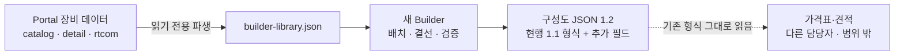
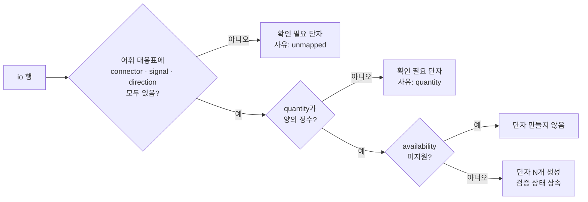

# AV System Builder 통합 재구축 기획 (2026-10-06)

- 문서 상태: **DRAFT 기획 (4판)**. 방향과 주요 결정은 받았다. 단계별 구현 승인은 아직 받지 않았다.
- 작성: Claude Code (Work 역할), 2026-10-06
- 기준: `origin/main` `1517d14`, 구 AV System Builder `seoul-visual-tech/av-system-builder` `main` `2fd568e` (v1.20.1)

## 0. 사용자 지시와 결정 기록 (2026-10-06)

**1차 지시:**

> av-portal 안에도 장비에 대한 여러 정보들이 있는데 그 정보를 기준으로 av system builder를 만들어 통합된 장비라이브러리를 가지고 서비스를 만들기 위해서야. 더 나아가선 이렇게 생성된 구성도json을 가지고 견적을 자동으로 만들어주는 것까지 이어가려고 해. … 완전히 리팩토링 해도 되니까 기획서를 작성해줘.

**2차 정정:**

> av-system-builder의 구현방식만 가져오고 데이터는 av포탈에 있는걸 그대로 사용할거야. av-system-builder에서 지금까지 사용한 데이터는 다 폐기하고 av포탈의 데이터에 맞춰 리팩토링을 한다고 가정해줘. 가격표-견적 부분은 다른 사람이 따로 제작하고 있어서 우리의 제작범위에선 신경쓰지 않아도 돼. 우리는 제대로된 구성도json을 생성하는 거에 목표가 있어.

**3차 결정:**

| 항목 | 사용자 결정 | 이 문서에 반영한 방식 |
|---|---|---|
| Portal에 없는 장비 | "포탈에 없고 빌더에 있는 장비는 단종되거나 더이상 취급하지 않는 장비라고 생각해줘" | 미등록 장비 기능을 두지 않는다. 장비는 Portal 제품만 쓴다 |
| JSON 형식 | "현재 빌더의 json 산출물을 바탕으로 해당 서비스를 개발을 하고 있기 때문에 지금과 같은 형태면 충분해" | **현행 1.1 형식을 유지하고 필드는 추가만 한다**(§6). 새 구조로 바꾸지 않는다 |
| 노드 하나로 N대 | "노드 하나로 n대 기능은 취소할게. 제거해줘" | 노드 1개 = 장비 1대. `quantity` 필드를 쓰지 않는다 |
| 출력 단자 분배 | "D4는 맞는 방향이야" | 출력 단자 하나는 연결 1개. 분배는 분배기 장비로 표현한다 |
| 전원 결선 | "현재 상황에선 필요없지만, 나중에 그릴 수 있도록 확장가능성은 염두해줘" | 전원 단자를 라이브러리에 유지하고 선 종류·규칙 자리를 예약한다(§5.3) |
| 저장 위치 | "일단은 추천사항대로 진행" | 브라우저 자동 저장 + JSON 파일 내보내기·열기 |
| 구 Builder 종료 | "좋아" | P5 완료 후 1개월 공존한 뒤 안내 페이지로 교체. 데이터는 옮기지 않는다 |
| 작업 절차 | "포탈의 명세절차를 좀 더 자세히 설명해줘" → 이어서 "나는 코덱스가 없어서 우리 작업은 코덱스 부분은 걷어내고 작업할 수 있도록 하자. 우리 작업의 흐름은 따로 정의해서 그 흐름을 따라 진행하는 걸로 할거야" | Codex 없는 Builder 전용 흐름을 [Builder 작업 흐름](../빌더/README.md)에 정의했다(§10) |
| 추가 요구 | 근접 연결, 왼쪽 드래그 범위 선택, 가운데 버튼 드래그로 화면 이동, 여러 단자 선택 후 평행선 한꺼번에 연결 | §7 편집 상호작용 |

**승인 범위:**

- 승인됨:
  - Portal 데이터를 원본으로 한 Builder 재작성
  - 구 Builder 데이터 전량 폐기
  - 완전한 리팩토링
  - 위 표의 결정
- 범위 밖: 가격표·견적. 다른 담당자가 제작한다.
- 미승인: 각 단계의 구현 착수. 작업(B-ID)마다 사용자 승인이 필요하다(§10).

**이 문서가 대체하는 기존 결정** (Builder 관련 부분만)

- `AGENTS.md` "AV System Builder는 외부 링크만 유지"
- `WORK_HANDOFF.md` §2·§5 "Builder 데이터 통합·Repository 통합·Builder 수정 제외"
- `PORTAL_MVP_SPEC.md` "Builder 코드·Database 변경 금지"
- `CORE_DOMAIN_CONCEPTS.md` §0 "Builder 이관 범위 밖"

그 밖의 제품 데이터 규칙은 그대로 유지한다.

---

## 1. 목표와 범위

**목표: Portal 장비 데이터로, 현행 Builder 형식과 호환되는 정확한 구성도 JSON을 만든다.**



"정확한 구성도 JSON"은 다음 다섯 가지를 모두 만족하는 파일이다.

1. **호환.** 현행 1.1 파일을 읽던 프로그램이 새 파일도 그대로 읽는다. 기존 키의 이름·위치·의미를 바꾸지 않는다.
2. **추적 가능.** 모든 장비가 Portal 제품 ID를 가리키고, 모든 연결이 그 제품의 실제 단자를 가리킨다.
3. **재현 가능.** 노드가 배치 당시의 장비·단자 정보를 품는다. Portal 데이터가 나중에 바뀌거나 제품이 단종돼 삭제돼도 파일이 열린다.
4. **검증 가능.** 스키마 검사와 의미 검사(참조 무결성, 단자 방향, 단자 중복 연결)를 통과한다. 미확인 사항은 `issues`에 남는다.
5. **결정적.** 같은 구성은 같은 바이트를 만든다. 화면 전용 값(`selected`, `dragging`, `dimmed` 등)은 저장하지 않는다.

| 범위 안 | 범위 밖 |
|---|---|
| Portal 데이터 → 결선용 라이브러리 파생 | 가격표, 단가, 견적 계산, 견적서 |
| 단자 표기 표준화(어휘)와 연결 규칙 | 구 Builder 장비·옵션·케이블·프리셋·공유 데이터 |
| 구성도 JSON 1.2 호환 명세, 스키마, 검증기, 가상 예제 | Portal에 없는 장비(단종·미취급으로 본다) |
| 새 Builder 앱(구 Builder의 구현 방식 재사용) | 노드 하나로 N대를 나타내는 기능 |
| 편집 상호작용 개선(§7) | LED Configurator 통합 |
| Portal 데이터 보강이 필요한 곳의 목록화 | 대역폭·HDCP·해상도까지 보는 호환성 엔진 |
| | 다시 제안하지 말라고 한 기능: 마이크 커버리지 시뮬레이션, 글로벌 벤더 카탈로그 연동 |

---

## 2. Portal 데이터 현황 (2026-10-06 실측)

### 2.1 저장 방식

Portal에는 DB나 서버가 없다. 장비 데이터는 **Git 저장소의 정적 JSON 파일**이고, GitHub Pages가 그대로 공개한다. 변경은 PR로 하고, 배포 전에 `beta/verify-pages.mjs`와 테스트 369개가 구조와 내용을 검사한다.

| 파일 | 역할 | 관리 방식 |
|---|---|---|
| `beta/site/catalog.json` | 제품 목록 267건: 브랜드, 제품명, 카테고리 3단계, 공식 링크, 매뉴얼 링크, 카드 사진, `slug` | **원본.** 직접 편집 |
| `beta/site/detail/data/<slug>.json` | 제품 상세 260건: 사양, I/O, 사진, 문서, 출처, 검증 상태, Port Map | **원본.** 직접 편집 |
| `beta/site/rtcom/raw/index.json` | RTCOM 32건: 시리즈 3, 일체형 2, 분배기 8, 연장기 15, 케이블 4 | `rtcom-configurator`에서 동기화한 사본. Portal에서 고치지 않는다 |
| `search-index.json`, `catalog.html`, `llms.txt`, `beta/public-snapshot.json` | 검색 인덱스, 읽기용 목록, 해시 고정값 | 스크립트가 만드는 **파생본**. `--check`로 원본과 일치하는지 확인한다 |

- 제품 ID는 `slug`(`^[a-z0-9-]+$`)다. 예: `ec-4bv`, `eb-pq2220b`, 삼성 `lh43qmcebgcxkr`, RTCOM `rtcom-<id>`.
- 상세가 없는 7건(Ross 6, Televic 1)은 ID가 없다.
- 상세 JSON은 여러 테스트가 바이트 SHA로 고정한다. 조금만 바꿔도 snapshot과 history 모듈 갱신이 함께 필요하다. Builder는 이 파일을 **읽기만** 한다.

### 2.2 제품 하나의 모양 (실제 데이터)

목록 항목 `catalog.json`:

```json
{ "brand": "BSS Audio", "product": "EC-4BV", "categories": ["오디오", "Control", "Control Interface"],
  "kind": "equipment", "official_links": ["https://bssaudio.com/en-US/products/EC-4BV"],
  "manual_link": "…", "slug": "ec-4bv", "card_image": "ec-4bv-main.webp" }
```

상세 `detail/data/eb-pq2220b.json`의 I/O 행(`io[]`), 4행 발췌:

```json
[
  { "group": "Video", "connector": "HDMI",        "signal": "디지털 비디오 입력", "direction": "IN",     "quantity": "2", "verification": "FOUND" },
  { "group": "Video", "connector": "HDMI",        "signal": "디지털 비디오 출력", "direction": "OUT",    "quantity": "1", "verification": "FOUND" },
  { "group": "Audio", "connector": "Stereo mini", "signal": "오디오 출력",        "direction": "OUT",    "quantity": "1", "verification": "FOUND" },
  { "group": "USB",   "connector": "USB Type-A",  "signal": "USB",               "direction": "IN/OUT", "quantity": "2", "verification": "FOUND" }
]
```

실제 행에는 이 밖에 `protocol`, `availability`, `condition`, `source` 필드가 더 있다.

같은 제품의 Port Map(후면 사진 위 번호표), 2개 발췌:

```json
{ "image": "Rear", "items": [
  { "n": 1, "label": "HDMI 1 입력", "desc": "HDMI Type A · 디지털 영상 입력(Deep Color/CEC).", "x1": 437, "x2": 465, "y": 57, "side": "top" },
  { "n": 2, "label": "HDMI 2 입력", "desc": "HDMI Type A · 디지털 영상 입력(Deep Color/CEC).", "x1": 483, "x2": 511, "y": 79, "side": "bottom" } ] }
```

- I/O 행은 "HDMI 입력 2개"처럼 **종류별로 묶은 표**다.
- Port Map은 단자 **하나하나**를 사진 좌표와 함께 적는다.
- 두 자료를 잇는 키는 없다.

그 밖의 상세 필드는 다음과 같다.

- `specifications[]`: 사양 행 5,924개, 행마다 `group·name·value·unit·condition·source·verification`
- `images[]`: 역할 Main·Front·Rear·Perspective·Other·Diagram
- `documents`, `sources`, `issues`, `packageStatus`

### 2.3 결선 도구 관점에서 본 상태

| 항목 | 상태 | Builder에 주는 의미 |
|---|---|---|
| I/O 행이 있는 제품 | 263/299 (상세 240/260, RTCOM 23/32), 1,404행 | 대부분 제품은 단자를 만들 수 있다 |
| 단자 표기 | 자유 텍스트. connector 342종(`RJ-45`/`RJ45`/`RJ45(LAN)` …). signal 417종(한·영 혼재, "디지털 비디오 입력"처럼 방향이 섞인 문장형). direction 10종 이상(`IN`·`OUT`·`IN/OUT`·`I/O`·`입력`·`양방향`·`BIDIR`·`IN/LOOP`·빈값·`N/A`) | **표준 어휘로 정규화해야 연결 검사에 쓸 수 있다.** 가장 큰 작업이다 |
| quantity | 정수 989행. 빈값 135행. `"4채널"`, `"1/1"`, `"슬롯당 4, 최대 16"` 같은 문자열 | 정수가 아니면 단자를 자동으로 펼칠 수 없다 |
| 미지원 표시 | `availability`가 `미지원(…)`인 행 16개 | 단자를 만들지 않는다 |
| 검증 상태 | 행 단위. FOUND 620 / VERIFIED 573 / PARTIAL 66 / REVIEW REQUIRED 17 / MISSING 3 | 단자마다 신뢰도를 표시할 수 있다 |
| Port Map | 99제품, 번호 673개 | 개별 단자 이름의 근거. I/O 행과 잇는 대응표가 필요하다 |
| 사진 | 대표 256, 후면 133 | 노드 썸네일, 후면 보기 |
| TX/RX 쌍 | RTCOM 연장기는 한 쌍이 ID 하나(`ct101-u-cr101-u`). I/O 행의 `group: "TX · Video"`, `condition: "CT101-U"`로 구분 | 설치 위치가 다르므로 **배치 단위 2개로 나눠야 한다** |
| 모듈형 프레임 | XDM·SPX·VDM은 `itemType: SERIES`. 모델은 `lineup[]`, 카드는 자유 텍스트 `summary`에만 있다. 슬롯 수·카드 호환 규칙 없음 | 카드 장착 구성은 **지금 데이터로 만들 수 없다.** Portal 데이터 보강이 먼저다 |
| 옵션·액세서리 관계 | 없음 | 구 형식의 옵션 카드 필드는 데이터가 생길 때까지 쓰지 않는다 |
| 케이블 제품 | RTCOM 케이블 4건뿐 | 케이블은 기존 `bomRows` 형식으로 이름·길이·수량을 기록한다 |
| 단종 | 플래그 없이 데이터에서 삭제 | 삭제된 제품을 가리키는 구성도는 노드 안의 장비 정보로 계속 열린다 |

---

## 3. 설계 원칙

1. **Portal 원본은 읽기 전용이다.**
   - Builder용 단자 정보는 생성기 `beta/build-builder-library.mjs`가 파생 파일 `builder-library.json`으로 만든다. 배포할 때 Pages 작업이 만든다. 저장소에는 커밋하지 않는다(B-20261006-02 결정 D-a). Portal 데이터 PR이나 RTCOM 동기화가 이 파일을 따로 다시 만들 필요가 없다.
   - 표기 정규화 규칙은 데이터 파일 `beta/port-vocabulary.mjs`에 둔다. 사람이 PR에서 검토한다.
2. **장비는 Portal 제품만 쓰고, Builder에서 고치지 않는다.** 단자가 틀렸거나 비어 있으면 Portal 상세 데이터를 기존 절차로 고친다. 그러면 파생본이 따라온다. Builder는 "보강 필요 목록"을 만들어 그 작업을 돕는다.
3. **추측하지 않고, 막지도 않는다.**
   - 대응표에 없는 표기, 정수가 아닌 수량, 방향 미상은 자동으로 메우지 않는다. "확인 필요 단자"로 보여 준다.
   - 미확인은 비호환이 아니다(`CORE_DOMAIN_CONCEPTS.md` §5). 연결은 허용하고 `issues`에 남긴다.
4. **JSON 형식은 현행과 호환한다.** 견적 쪽이 현행 1.1 파일로 개발하고 있다. 기존 키는 그대로 두고, Portal 참조와 단자 상세는 **새 키로만 추가**한다.
5. **공개와 비공개를 나눈다.**
   - 앱 코드, 파생 라이브러리, 어휘, 스키마, 가상 예제는 공개 저장소에 둔다.
   - 실제 구성도 파일(고객·현장 정보가 들어갈 수 있음)은 **저장소에 커밋하지 않는다.**
   - 테스트 예제에는 가상의 이름만 쓴다.

---

## 4. 라이브러리 파생 (`builder-library.json`)

### 4.1 I/O 행 → 단자 변환



**방향 정규화**

| 원래 표기 | 표준값 |
|---|---|
| `IN`, `입력` | `in` |
| `OUT`, `출력` | `out` |
| `IN/OUT`, `I/O`, `양방향`, `BIDIR` | `both` |
| `IN/LOOP`처럼 루프아웃이 섞인 것 | 대응표에서 개별 지정 |
| 빈값, `N/A` | 미상 → 확인 필요 단자 |

- 표준값은 구 형식의 `direction` 값(`in`/`out`/`both`)과 같다.

**신호 정규화**

- "디지털 비디오 입력"처럼 방향이 섞인 문장은 대응표에서 신호 `HDMI` + 방향 `in`으로 나눈다.
- 대응 키는 `(connector, signal)` 쌍이다. 같은 문장이라도 커넥터가 다르면 다른 신호일 수 있기 때문이다.
- 단자 하나가 여러 신호를 가질 수 있다. 예: RJ45 `Ethernet (제어/구성/모니터링/PoE 전원)` → `signals: ["ETHERNET", "POE"]`.

**단자 ID와 이름**

- ID는 구 형식 규칙과 같은 모양이다: `${direction}-${신호키 소문자}-${n}`. 예: `in-hdmi-1`, `out-sdi-2`, `both-lan-1`.
  - 공백 없는 영숫자와 하이픈만 쓴다. 구 데이터의 `out-hdmi out-1` 같은 공백 오류를 반복하지 않는다.
  - 번호 `n`은 같은 방향·신호 안에서 라이브러리 순서대로 매긴다.
- 이름 기본값은 생성 이름이다(예: `HDMI In 1`).
  - Port Map이 있는 제품은 별도 대응표 `beta/builder-port-links.mjs`(Port Map 번호 ↔ 단자 ID)를 사람이 채운다. 그러면 `HDMI 1 입력` 같은 실제 이름을 쓴다.
  - 이름이 비슷하다는 이유로 자동 연결하지 않는다.

**검증 상태**

- 행의 `verification`을 단자에 그대로 복사한다. 화면 배지와 JSON에 남는다.

### 4.2 표준 어휘와 선 종류 (초안, P1에서 확정)

| 축 | 표준값 예 |
|---|---|
| connector | `HDMI-A`, `DP`, `mDP`, `DVI-D`, `VGA`, `BNC`, `RJ45`, `SFP`, `LC`, `SC`, `XLR-F`, `XLR-M`, `XLR-COMBO`, `TRS-6.3`, `TRS-3.5`, `RCA`, `PHOENIX`, `EUROBLOCK`, `SPEAKON`, `BINDING-POST`, `USB-A`, `USB-B`, `USB-C`, `DB9`, `IEC-C14`, `DC-JACK`, `TERMINAL` |
| signal | `HDMI`, `DP`, `DVI`, `SDI`, `HDBASET`, `ANALOG-VIDEO`, `LINE-AUDIO`, `MIC-AUDIO`, `SPEAKER`, `AES3`, `DANTE`, `AES67`, `AVB`, `ETHERNET`, `POE`, `FIBER`, `RS-232`, `RS-485`, `IR`, `RELAY`, `GPIO`, `USB`, `POWER` |

**구 형식의 선 종류(`lineTypeId`)는 그대로 유지한다.** 견적 쪽이 이 ID를 읽을 수 있기 때문이다.

| 기존 `lineTypeId` | 이름 | 색 | 대응 신호 |
|---|---|---|---|
| `video` | HDMI | `#ef4444` | HDMI, DVI |
| `sdi` | SDI | `#374151` | SDI |
| `lt-1784014150344` | DP | `#ff8585` | DP |
| `audio` | A.AUDIO | `#a855f7` | LINE-AUDIO, MIC-AUDIO, AES3 |
| `network` | LAN | `#22c55e` | ETHERNET, DANTE, AES67, AVB, HDBASET, POE |
| `usb` | USB | `#3b82f6` | USB |
| `control` | Control | `#f59e0b` | RS-232, RS-485, IR, RELAY, GPIO |

- 단자의 `type`은 기존처럼 `lineTypeId`로 둔다. 선 색과 기존 프로그램 호환에 쓴다.
- 정밀한 신호는 새 필드 `signals`에 담는다.
- `lineTypeId`는 **선(케이블) 계열**이다. Dante는 LAN 케이블을 쓰므로 `network` + `signals: ["DANTE"]`가 된다.
- 기존 7종에 맞지 않는 신호에만 새 ID를 추가한다. 후보는 `speaker`(스피커선), `fiber`(광), `analog-video`이고, `power`(전원)는 예약해 둔다(§5.3). 새 ID는 파일의 `lineTypes` 배열에 이름·색과 함께 들어간다.

### 4.3 특수 제품

| 유형 | 처리 |
|---|---|
| **TX/RX 쌍** (`ct101-u-cr101-u` 등) | 하나의 Portal 제품을 **배치 단위 2개**로 나눈다. 근거는 I/O 행의 `group`/`condition`(예: `CT101-U`)이다. 근거가 모호하면 나누지 않고 "확인 필요"로 둔다. 노드 `data.portal.unit`에 `TX`·`RX`를 기록한다 |
| **RTCOM 시리즈** (XDM·SPX·VDM) | 배치할 때 `lineup[]`에서 모델을 고른다(`data.portal.variant`). 카드 장착은 카드 단위 데이터가 생길 때까지 지원하지 않는다. "카드 구성 미정" 이슈를 남기고 배치는 허용한다 |
| **I/O 없는 제품** (36건) | 배치는 허용한다. 단자가 없다는 이슈를 표시하고 보강 목록에 올린다 |
| **상세 없는 목록 항목** (7건) | 제외한다. ID가 없기 때문이다 |

### 4.4 카테고리 대응

구 형식의 `data.category`는 8종 열거값이고, `data.name`은 사이드바 중분류였다(예: "PTZ 카메라"). Portal 카테고리에서 다음과 같이 채운다.

| Portal | 구 형식 필드 |
|---|---|
| 2단계(L1) `Audio`·`Video`·`Display`·`Conferencing`·`Control`·`Network` | `category`: `audio`·`video`·`display`·`conferencing`·`control`·`network` |
| 3단계(L2) 카테고리 이름 | `name` |
| `brand` | `manufacturer` |
| `model` | `model` |

- `broadcast`·`etc`는 대응하는 Portal 분류가 생길 때까지 쓰지 않는다.
- 대응표 전체는 P1에서 확정한다. 상세 JSON 8건은 카테고리가 2단계뿐이라 따로 지정한다.

### 4.5 파일 형태 (초안)

```json
{
  "schema": "av-portal.builder-library",
  "schemaVersion": "1.0.0",
  "source": { "catalogSha": "…", "detailSetSha": "…", "rtcomSha": "…", "vocabularyVersion": "1.0.0" },
  "lineTypes": [ { "id": "video", "name": "HDMI", "color": "#ef4444" } ],
  "products": [
    {
      "productId": "eb-pq2220b", "source": "portal",
      "equipment": {
        "id": "eb-pq2220b", "category": "display", "name": "…", "model": "EB-PQ2220B", "manufacturer": "Epson",
        "imageUrl": "https://seoulav.github.io/AV-Portal/detail/…/eb-pq2220b-main.webp",
        "inputs":  [ { "id": "in-hdmi-1", "label": "HDMI In 1", "type": "video", "direction": "in",
                       "connector": "HDMI-A", "signals": ["HDMI"], "verification": "FOUND" } ],
        "outputs": [], "bidirectional": []
      },
      "units": null,
      "unresolved": [ { "ioGroup": "…", "reason": "unmapped-signal", "raw": { "connector": "…", "signal": "…" } } ],
      "readiness": { "ports": 9, "unresolved": 1 }
    }
  ]
}
```

- `equipment`는 구 형식의 `Equipment` 모양 그대로다. 노드에 배치할 때 이 객체를 `data`에 복사한다(§6.2).
- 이 파일은 배포할 때 Pages 작업이 만든다. 저장소에는 커밋하지 않는다(B-20261006-02 결정 D-a). Portal 데이터 PR이나 RTCOM 동기화가 이 파일을 따로 다시 만들 필요가 없다. 공개 주소는 `https://seoulav.github.io/AV-Portal/builder-library.json`이다. 공개 차단 문자열은 생성기 테스트가 검사한다.
- 생성기는 **결선 준비도 보고서**를 함께 출력한다. 제품별 단자 수, 확인 필요 행, 미매핑 표기 빈도표를 담는다. 이 보고서가 Portal 데이터 보강의 우선순위 목록이 된다.

---

## 5. 연결 규칙

### 5.1 판정

| 판정 | 조건 | 처리 |
|---|---|---|
| 허용 | 방향이 맞고(out→in, both↔in/out/both), 신호 집합이 겹치며, 커넥터가 같다 | 연결 |
| 경고 | 신호는 맞지만 커넥터가 다르다(HDMI-A ↔ DVI-D, XLR ↔ PHOENIX) | 연결. `issues`에 `connector-adapter` |
| 경고 | 단자 검증 상태가 REVIEW REQUIRED·PARTIAL이다 | 연결. `issues`에 `unverified-port` |
| 경고 | 신호 계열은 같으나 종류가 다르다(LINE-AUDIO ↔ MIC-AUDIO) | 연결. `issues`에 `signal-level` |
| 차단 | 같은 방향끼리(in↔in, out↔out), 또는 신호가 전혀 다르다(SPEAKER ↔ HDMI) | 연결 불가 |
| 차단 | 입력 단자에 두 번째 연결 | 연결 불가 |
| 차단 | **출력 단자에 두 번째 연결** (D4 결정) | 연결 불가. 분배는 분배기 장비로 표현한다 |
| 차단 | 양방향 잭에 이미 연결이 있다 | 연결 불가. 구 Builder의 단일 잭 규칙을 이어받는다 |

- 규칙 표 자체를 데이터(`engine/rules`)로 두고 단위 테스트로 고정한다.
- 화면의 연결 가능 표시와 JSON 검증기가 **같은 규칙 모듈**을 쓴다.

### 5.2 단자 한 개 = 연결 한 개

- 위 규칙에 따라 모든 단자는 연결을 최대 1개만 가진다.
- 이 규칙 덕분에 구성도 JSON의 엣지 수가 곧 실제 케이블 가닥 수가 된다. 견적 쪽 집계가 단순해진다.

### 5.3 전원 결선 확장 (D5)

지금은 전원선을 그리지 않는다. 나중에 켤 수 있도록 다음을 미리 둔다.

- `POWER` 신호 단자도 라이브러리에 만든다. `IEC-C14`, `DC-JACK` 커넥터가 그 예다.
- 노드에서는 기본으로 숨긴다. 화면 설정 "전원 단자 표시"는 나중에 추가한다.
- `power` 선 종류 ID를 예약한다. 연결 규칙에 전원 공급 측(out)과 소비 측(in) 판정 자리를 둔다. 멀티탭·PDU도 일반 장비와 같은 모델로 표현할 수 있다.
- 전원 엣지도 일반 엣지와 같은 형식이다. 켤 때 JSON 형식 변경이 필요 없다.

---

## 6. 구성도 JSON 1.2 (현행 1.1 호환 확장)

### 6.1 현행 1.1 형식 (구 Builder 실측)

| 산출물 | 형식 | 코드 |
|---|---|---|
| 구성도 내보내기 | `av-diagram-<타임스탬프>.json`, 2칸 들여쓰기, `{version:"1.1", nodes, edges, lineTypes, equipmentDB}` | `App.tsx:497-513` |
| 장비 노드 | `{id, type:"equipment", position, data:{id, category, name, model, manufacturer?, description?, series?, inputs[], outputs[], bidirectional[], imageUrl?, isReused?, selectedOptionQuantities?, optionPortIds?}, measured?, sourcePosition?, targetPosition?}` | `App.tsx:397` |
| 단자 | `{id, label, type(=lineTypeId), direction:"in"\|"out"\|"both"}` | `store.ts:96` |
| 메모 노드 | `{id, type:"annotation", position, style{width,height}, data{label, fontSize, fontColor, bgColor, bgOpacity, borderColor, borderStyle, borderRadius, textAlign, locked?}}` | `EditAnnotationModal.tsx:95-112` |
| 영역 노드 | `{id, type:"shape", position, style{width,height}, data{shapeType, label, fontSize, fontColor, bgColor, bgOpacity, borderColor, borderStyle, borderWidth}}` | `App.tsx:1013-1029` |
| 엣지 | `{id, type:"smoothstep", source, sourceHandle, target, targetHandle, animated:false, style{stroke, strokeWidth}, data{lineTypeId, label?, bomRows?}}` | `store.ts:707` |
| 핸들 ID | 입력·출력은 단자 ID 그대로. 양방향은 `source_<id>`/`target_<id>` | `EquipmentNode.tsx:85-135` |
| 케이블 | `data.bomRows[] = {cableType:"ready-made"\|"manufactured", productName, lineTypeId?, length?(m, 제작), quantity?(기성)}` | `BomBulkModal.tsx:5` |

- 구 Builder는 가져올 때 `nodes`·`edges`만 읽는다. `version`·`lineTypes`·`equipmentDB`는 읽지 않는다(`store.ts:860-883`).
- 가상 예시 파일은 P3에서 `builder/examples/legacy-1.1.example.json`으로 저장소에 둔다.

### 6.2 1.2에서 유지·채움·추가·제외하는 것

**유지 (이름·위치·의미 그대로):**

- 최상위 `version`, `nodes`, `edges`, `lineTypes`, `equipmentDB`
- 노드의 `id`, `type`, `position`, `data`. 장비 `data`의 `id`·`category`·`name`·`model`·`manufacturer`·`description`·`series`·`inputs`·`outputs`·`bidirectional`·`imageUrl`·`isReused`
- 메모·영역 노드 형식 전체
- 엣지의 `id`·`type`·`source`·`sourceHandle`·`target`·`targetHandle`·`style`·`data.lineTypeId`·`data.label`·`data.bomRows`
- 핸들 ID 규칙(`source_`/`target_` 접두어 포함), 단자 `{id, label, type, direction}`

**채우는 값이 바뀌는 것 (형식은 같고 출처만 Portal):**

| 필드 | 1.1 | 1.2 |
|---|---|---|
| `data.id` | 구 Builder 카탈로그 ID(`eq-…`, `xlsx-…`) | **Portal 제품 ID**(`eb-pq2220b`, `rtcom-…`) |
| `data.category`, `data.name` | 구 카탈로그 값 | §4.4 대응표 |
| `data.model`, `data.manufacturer` | 구 카탈로그 값 | Portal `model`, `brand` |
| `data.imageUrl` | 업로드 Data URL 또는 없음 | Portal 대표 사진의 공개 URL |
| 단자 `id`/`label`/`type` | 수동 입력 | Portal I/O 행에서 파생(§4.1) |
| `equipmentDB` | 로컬 카탈로그 전체(674개) | **이 구성도에 쓴 제품만**(§13 확인 사항) |
| `lineTypes` | 운영 7종 | 기존 7종 + 이 구성도에 쓴 신규 ID |

**추가 (기존 프로그램이 무시해도 동작이 같은 키):**

| 위치 | 키 | 의미 |
|---|---|---|
| 최상위 | `generator` | `{app: "av-portal-builder", version}` |
| 최상위 | `library` | `{schemaVersion, source: {catalogSha, detailSetSha, rtcomSha, vocabularyVersion}}`. 어느 시점의 Portal 데이터로 만들었는지 |
| 최상위 | `issues[]` | 검증 결과(§6.4). 저장할 때마다 다시 계산 |
| 장비 `data` | `portal` | `{productId, source: "portal"\|"rtcom", unit?: "TX"\|"RX", variant?, detailUrl}` |
| 단자 | `connector`, `signals[]`, `verification`, `portalRef` | 표준 커넥터, 정밀 신호, 검증 상태, 원본 I/O 행의 `group` |
| 엣지 `data` | `signal` | 이 결선이 실제로 나르는 신호(두 단자 신호의 교집합에서 선택) |

**저장하지 않는 것:**

- 화면 전용 값: `selected`, `dragging`, `measured`, `dimmed`, `animated` 이외의 렌더용 값
  - 구 Builder는 `dimmed`가 편집창을 거쳐 저장되는 문제가 있었다(`EditNodeModal.tsx:98`).
  - `sourcePosition`/`targetPosition`은 기존 파일에 있는 키라 레이아웃이 붙이는 값 그대로 둔다.
- `data.quantity`: 노드 하나로 N대를 나타내는 기능은 취소됐다. 노드 1개 = 1대다.
- `selectedOptionQuantities`, `optionPortIds`, `selectedOptionIds`: Portal에 카드·옵션 데이터가 생길 때(P9) 같은 형식으로 다시 쓴다.

### 6.3 엣지와 케이블

- 엣지 하나 = 단자 쌍 하나 = 케이블 한 가닥이다(§5.2).
- 케이블 정보는 기존 `data.bomRows`에 기존 형식으로 적는다.
  - 기성: `{cableType: "ready-made", productName, lineTypeId, quantity: 1}`
  - 제작: `{cableType: "manufactured", productName, lineTypeId, length}`
- 엣지 편집 패널에서 `bomRows`를 입력한다. 구 Builder의 별도 "BOM 모드"는 이 패널로 합친다.
- 케이블을 입력하지 않은 엣지는 `issues`에 `cable-unspecified`로 남는다. 저장은 막지 않는다.
- 양방향↔양방향 엣지는 구 Builder처럼 화면에서만 좌→우로 정규화한다. 저장된 `source`/`target`은 사용자가 그은 방향을 유지한다.

### 6.4 `issues[]`

```json
{ "code": "unverified-port", "severity": "warning", "target": { "edge": "e-…" }, "detail": "…" }
```

| 코드 | 뜻 |
|---|---|
| `no-ports` | Portal에 I/O 정보가 없는 제품 |
| `unverified-port` | 단자 검증 상태가 VERIFIED/FOUND가 아님 |
| `connector-adapter` | 커넥터 변환 필요 |
| `signal-level` | 마이크·라인 레벨 차이 등 |
| `cable-unspecified` | `bomRows` 없음 |
| `series-config-pending` | 모듈형 프레임의 카드 구성 미정 |
| `library-drift` | 저장 이후 Portal 데이터가 바뀌어 노드의 장비 정보와 현재 라이브러리가 다름 |
| `product-removed` | 노드가 가리키는 Portal 제품이 삭제됨(단종). 노드 정보로 계속 표시 |

- 오류 수준(참조 깨짐, 단자 중복 연결, 방향 반대)은 저장 자체를 막는다. 그래서 저장된 파일에는 경고·안내만 남는다.

### 6.5 무결성·직렬화·버전

**참조 무결성:**

- 모든 엣지의 `source`/`target`은 존재하는 노드다.
- 핸들은 해당 노드의 단자다(`source_`/`target_` 규칙 포함).
- 단자마다 엣지는 최대 1개다.

**결정적 직렬화:**

- 키 순서를 고정한다.
- `nodes`는 장비 → 메모 → 영역 순, 그 안에서 `id` 순으로 정렬한다. `edges`도 `id` 순이다.
- 2칸 들여쓰기, UTF-8, 끝 줄바꿈 1개.
- 같은 구성은 같은 바이트를 만든다. 사진 본문(Base64)은 넣지 않는다.

**버전:**

- 이번 변경은 키 추가만 있으므로 `version: "1.2"`다.
- 기존 키의 의미를 바꾸거나 지워야 할 때만 `2.0`으로 올리고 변환기를 둔다.

**호환 검사 (P3 완료 조건):**

- 1.2 출력의 키 구조가 1.1 예시의 상위 집합인지 테스트한다. 1.1에 있는 키가 같은 위치·같은 타입으로 모두 있어야 한다.
- 구 Builder의 가져오기 로직(`importDiagramState`)과 같은 조건(`nodes`·`edges` 배열)을 만족하는지 테스트한다.

### 6.6 함께 제공하는 것 (견적 담당자용)

1. `builder/schema/diagram-1.2.schema.json` (JSON Schema 2020-12)
2. 검증 CLI `node builder/cli/validate.mjs <파일>`. 스키마, 참조 무결성, 연결 규칙, `issues` 재계산을 한다.
3. 가상 예제: 1.1 예시, 1.2 소회의실, 1.2 중강당(믹서·DSP·앰프·스피커), 1.2 RTCOM 연장기
4. 변경 안내: 1.1 대비 추가된 키 표(§6.2). 견적 쪽은 추가 키를 무시해도 되고, 필요하면 `data.portal.productId`로 Portal 제품을 정확히 식별할 수 있다.

---

## 7. 편집 상호작용

### 7.1 마우스 조작

| 동작 | 입력 | 비고 |
|---|---|---|
| 범위 선택 | 빈 캔버스에서 **왼쪽 버튼 누른 채 드래그** | 사각형에 걸린 장비와 사각형 안에 들어온 단자가 함께 선택된다 |
| 화면 이동 | **가운데(휠) 버튼 누른 채 드래그** | 왼쪽 드래그는 더 이상 화면 이동이 아니다 |
| 확대·축소 | 휠 굴리기 | 현행 유지 |
| 선택 추가·해제 | Shift + 클릭 | 장비·단자 모두 |
| 선택 해제 | Esc 또는 빈 곳 클릭 | |
| 장비 이동 | 선택된 장비 몸체를 드래그 | 여러 대 선택 시 함께 이동 |
| 선 긋기 | 단자(또는 그 근처)에서 드래그 시작 | §7.2 |

- 가운데 버튼이 없는 노트북 터치패드 사용자를 위해 **Space + 왼쪽 드래그**도 화면 이동으로 둔다(§13 확인 사항).
- 구현 메모:
  - React Flow 12의 `selectionOnDrag`과 `panOnDrag={[1]}`(가운데 버튼)로 기본 동작을 만든다.
  - 단자 선택은 React Flow가 제공하지 않으므로 앱 상태로 따로 관리한다.

### 7.2 근접 연결

**시작:**

- 단자 점을 정확히 잡지 않아도 된다. 단자 **행 전체**(점·라벨 영역)가 잡는 영역이다.
- 점 주변 반경 16px(화면 기준)도 잡는 영역에 들어간다.

**끝 (놓을 때):**

1. 놓은 지점에서 반경 40px(화면 기준) 안에 연결 가능한 단자가 있으면, 그중 가장 가까운 단자에 붙는다.
2. 장비 **몸체 위**에 놓으면, 그 장비의 연결 가능한 빈 단자 가운데 놓은 지점과 가장 가까운 단자에 붙는다.
3. 후보가 없으면 연결하지 않는다. 이유(방향 반대, 신호 불일치, 이미 사용 중)를 짧게 표시한다.

**드래그 중 표시:**

- 붙을 후보 단자를 강조하고, 미리보기 선을 그 단자에 붙여 보여 준다.
- 연결할 수 없는 단자는 흐리게 표시한다.

**구현 메모:**

- 반경은 화면 픽셀 기준이다. 확대·축소 정도와 관계없이 손에 느껴지는 거리가 같다. 값은 P1에서 화면 시험으로 조정한다.
- 끝점 흡착은 직접 구현한다. React Flow `connectionRadius`는 캔버스 좌표 기준이고 연결 가능 여부를 보지 않기 때문이다. 상세는 [기반 명세 §9](../빌더/기반명세.md#9-상호작용-수치)를 따른다.
- 후보 판정은 §5 규칙 모듈을 그대로 쓴다.

### 7.3 여러 단자 선택과 평행선 한꺼번에 긋기


**선택:**

- 범위 선택 사각형 안에 들어온 단자가 모두 선택된다.
- 선택된 단자는 점이 강조되고, 선택 개수가 커서 옆에 배지로 보인다.
- 여러 장비에 걸쳐 선택해도 된다. 예: 마이크 4대의 출력 → 믹서 입력 1~4.

**정렬:** 선택된 단자를 화면 위 → 아래 순서로 정렬한다. Y가 같으면 왼쪽 → 오른쪽이다.

**대응:**

- 놓은 단자를 1번으로 하고, 같은 열(입력 열·출력 열·양방향 열)에서 **아래 방향으로** 차례로 대응시킨다.
- 이미 연결됐거나 규칙상 연결할 수 없는 단자는 건너뛰고 다음 단자를 쓴다.
- 장비 몸체에 놓으면 놓은 지점에서 가장 가까운 연결 가능 단자가 1번이다.

**미리보기:** 놓기 전에 N개 선이 어느 단자로 갈지 보여 준다. 대상 단자가 모자라면 모자란 선은 붉게 표시한다.

**결과:**

- 대응된 쌍을 한꺼번에 연결한다. 기존 평행선 간격 알고리즘(`edgeProcessing`)이 N개 선을 겹치지 않게 평행으로 그린다.
- 모자라서 연결하지 못한 선이 있으면 "N개 중 M개 연결, 나머지 이유"를 알린다(§13 확인 사항).

**실행 취소:** N개 연결이 한 번의 실행 취소 단위다.

**규칙:** 각 쌍은 §5 연결 규칙을 각각 통과해야 한다. 한 쌍이 막혀도 나머지는 연결된다.

### 7.4 시험 방법 (P4·P5 완료 조건)

브라우저 자동화 시험(Playwright)으로 다음을 확인한다.

- 반경 안에서 시작·종료한 연결이 맞는 단자에 붙는지
- 장비 몸체에 놓은 연결이 가장 가까운 연결 가능 단자에 붙는지
- 왼쪽 드래그가 범위 선택이고, 가운데 버튼 드래그가 화면 이동인지
- 단자 4개를 범위 선택한 뒤 대상 장비 단자에 놓으면 4개 엣지가 위→아래 순서로 생기고, 실행 취소 한 번에 모두 사라지는지
- 대상 단자 중간에 이미 연결된 단자가 있으면 건너뛰는지

---

## 8. 구 Builder에서 가져오는 구현 방식

데이터는 전부 버리고 검증된 **구현**만 가져온다. 필요한 모듈을 골라 테스트를 붙여 새 구조로 옮긴다. 구 저장소의 Git 이력은 가져오지 않는다. 이력에 고객 구성도가 남아 있기 때문이다.

| 구 Builder 구현 | 처리 | 메모 |
|---|---|---|
| React 19 + TS + Vite + @xyflow/react + zustand | **유지** | 결선 편집기에 맞는 검증된 조합 |
| 엣지 기하·교차 점프 `src/utils/edgeGeometry.ts` (227줄) | **이식** | 순수 함수. 회귀 테스트 추가 |
| 평행선 간격·채널 순서 `src/utils/edgeProcessing.ts` (432줄) | **이식** | Stage 0~4, `optimizeChannelOrder`. 평행선 다중 연결(§7.3)의 렌더링 기반. 기록된 함정을 테스트로 만든다 |
| 오토 레이아웃 `src/utils/layout.ts` (223줄) | **이식** | Dagre + barycenter. 신호선 가중치는 `lineTypeId` 기준 그대로 |
| 포트 좌표·노드 높이 계산 `src/store.ts:308-378` | 재작성 | 렌더링 상수와 한 모듈로 묶는다(헤더 54px 불일치 함정). 근접 연결(§7.2)이 이 좌표를 쓴다 |
| 노드 렌더링 `EquipmentNode.tsx`, 핸들 ID 규칙 | 재작성 | 핸들 ID 규칙은 그대로, 잡는 영역을 단자 행 전체로 넓힌다 |
| 연결 검사 `App.tsx:612` | 재작성 | §5 규칙 모듈로 교체. 양방향 단일 잭 규칙은 유지 |
| Undo/Redo, 복사·붙여넣기, Lock, MiniMap, LOD, 다크/라이트 | 재작성 | 기능은 같게, 상태 구조는 새로 |
| 메모·영역 노드 | 재작성 | 형식은 1.1 그대로 |
| PDF 내보내기 (화면 PNG 한 장) | 재작성 | SVG 벡터 기본, PDF는 SVG에서 생성 |
| 사이드바 장비 검색·그룹 | 재작성 | Portal 카테고리·제조사 축 사용. 검색 정규화는 Portal 검색 인덱스 방식 재사용 |
| 엣지 라벨·`bomRows` 편집 | 재작성 | 엣지 편집 패널 하나로 합친다 |
| BOM CSV 내보내기 | 보류 | 견적 쪽 범위와 겹친다. 이식한다면 쉼표가 든 제품명 따옴표 처리 버그를 고친다(`BomReportModal.tsx:56-69`) |
| 옵션 카드 포트 합성 `MODULAR_SLOT_PORT_SPEC.md` | 설계만 보관 | Portal 카드 데이터가 생기면(P9) 같은 필드 형식으로 다시 쓴다 |
| 장비 DB 편집·Excel 일괄 등록·라인 타입 편집 | **폐기** | 장비 정보는 Portal 절차로만 고친다 |

이식 상태(2026-10-07): 엣지 기하·교차 점프, 평행선 간격·채널 순서, 노드 렌더링(핸들 ID 규칙), 연결 검사, Undo/Redo, 메모·영역, 엣지 라벨·`bomRows` 편집, 구 BOM 모드 라벨은 B-20261006-04~07에서 옮겼다. 교차 점프는 같은 결과를 내되 한 번에 계산하도록 바꿨다(B-07). 오토 레이아웃과 그 밖의 편집 기능은 다음 작업이다.
| Firestore 동기화·프리셋·공유 링크 | **폐기** (1단계) | 팀 저장·공유는 백엔드 결정 후 별도(P8). 가져오기만 해도 팀 카탈로그가 바뀌던 구조(`librarySync.ts:198,274-279`)는 반복하지 않는다 |
| 노드 수량 배지 | **폐기** | 사용자 결정 |
| 빠른제작 템플릿 | 보류 | 운영 데이터 0건 |
| 인앱 릴리즈노트 | 재작성 | CHANGELOG 원문을 번들에 넣지 않는다(고객명 노출 사례) |

**반복하지 말 함정** (구 `CLAUDE.md` 기록):

- 교차 점프를 앱 단계 memo에서 계산하면 한 프레임 늦은 좌표에 고정된다.
- 렌더 상수와 좌표 계산 상수가 따로 놀면 선이 단자에서 어긋난다.
- 포트 타입을 하드코딩하면 선 종류와 어긋난다.
- 화면용 값이 저장 데이터에 섞인다(`dimmed`).
- 포트 ID에 공백이 들어간다(`out-hdmi out-1`).
- lucide `Map` 아이콘이 전역 `Map`을 가린다.
- 같은 중분류 이름이 여러 카테고리에 섞인다.

---

## 9. 저장소와 배포

```
AV-Portal/
├─ beta/
│  ├─ port-vocabulary.mjs          # 표기 → 표준값 대응표 (사람이 검토)
│  ├─ builder-port-links.mjs       # Port Map 번호 ↔ 단자 ID 대응표 (선택)
│  ├─ builder-library.mjs          # 변환 순수 함수
│  └─ build-builder-library.mjs    # 파생본 생성·준비도 보고서(--report). 결과는 커밋하지 않고 배포 때 만든다
├─ builder/                        # 새 Builder (자체 package.json·lockfile)
│  ├─ schema/diagram-1.2.schema.json
│  ├─ src/engine/                  # 순수 로직: rules, validate, serialize, issues
│  ├─ src/canvas/                  # React Flow 렌더링: 노드·엣지·레이아웃 이식 모듈, 근접 연결, 다중 연결
│  ├─ src/ui/                      # 화면
│  ├─ cli/validate.mjs             # 구성도 JSON 검증 CLI
│  ├─ examples/                    # 가상 예제 (1.1 예시 포함)
│  └─ test/
└─ .github/workflows/
   ├─ builder-ci.yml               # PR: 타입검사·린트·테스트·빌드·브라우저 시험
   └─ pages.yml                    # 기존 검증 → builder 빌드 → 합쳐서 업로드
```

**배포 순서**

1. `pages.yml`의 기존 단계를 그대로 실행한다: `system-version`, `build-readable-catalog`, `build-search-index --check`, `verify-pages`, `npm test`.
2. `node beta/build-builder-library.mjs --out beta/site/builder-library.json --report`로 라이브러리를 만든다(B-20261006-02).
3. `builder/`에서 `npm ci && npm run build`를 실행한다.
4. `_site/`에 `beta/site/`와 `builder/dist`(→ `_site/builder/`)를 합쳐 업로드한다.

**운영 조건**

- 주소는 `https://seoulav.github.io/AV-Portal/builder/`다.
- Vite `base`는 `/AV-Portal/builder/`로 두고, 소스맵은 배포하지 않는다.
- 루트 `package.json`은 의존성 0인 상태로 유지한다.
- Builder 빌드가 실패해도 카탈로그 배포가 막히지 않도록 `builder-ci.yml`을 PR 필수 검사로 둔다.
- 저장은 **브라우저 자동 저장 + JSON 파일 내보내기·열기**만 한다(D6). 구성도는 사용자 PC 밖으로 나가지 않는다.
- `builder/examples/` 밖의 `*.json` 구성도 파일은 `.gitignore`에 넣는다.

---

## 10. 작업 흐름 (Builder 전용, Codex 없음)

2026-10-06 사용자 지시는 다음과 같다.

> 나는 코덱스가 없어서 우리 작업은 코덱스 부분은 걷어내고 작업할 수 있도록 하자. 우리 작업의 흐름은 따로 정의해서 그 흐름을 따라 진행하는 걸로 할거야.

이에 따라 Builder 작업은 Portal의 Work/Codex 절차 대신 **[Builder 작업 흐름](../빌더/README.md)**을 따른다.

| 항목 | Portal 기존 절차 (다른 작업에 계속 적용) | Builder 작업 흐름 |
|---|---|---|
| 역할 | Work(기획) · Codex(구현) · 사용자 | **사용자 · Claude Code**. Claude Code가 한 작업을 명세부터 병합까지 끝까지 맡는다 |
| 작업 ID | `W-YYYYMMDD-NNN` | `B-YYYYMMDD-NN` |
| 명세·기록 | `Work/작업/` 명세 + Codex 인계서 + `Work/지시서.md` + Work 인계서 | `Work/빌더/작업/<ID>.md` **한 파일**에 명세·진행 기록·결과 |
| 착수 조건 | READY 명세가 main에 병합된 뒤 | 사용자가 작업 파일의 명세를 승인한 뒤(문장·날짜 기록) |
| 브랜치 | `work/…`, `codex/…` | `claude-feat/<ID>-<설명>` |
| 검증·병합 | AGENTS.md 규칙 | 같다. LF 복제본 검사와 독립 리뷰 1회를 추가한다 |

**흐름:**

1. 준비
2. 명세 초안과 요약 보고
3. 사용자 승인
4. 진행
5. 검증(독립 리뷰 포함)
6. PR
7. 병합·배포 확인
8. 결과 보고와 다음 작업 제안

각 단계의 세부 규칙, 공통 검증 명령, 다른 작업과의 충돌 확인, 하위 에이전트·모델 선택 기준은 [Builder 작업 흐름](../빌더/README.md)에 있다.

**유지하는 것:**

- 제품 데이터 정확성 규칙
- 공개·비공개 자료 규칙
- 검색 인덱스·RTCOM 동기화 절차
- PR 병합 규칙. 2026-09-29 상시 병합 승인을 B 작업에도 적용한다

Builder를 위해 Portal 데이터를 보강할 때(P6)도 이 흐름으로 하되, 다음을 먼저 확인한다.

- `Work/지시서.md`의 진행 중 작업
- 열린 PR

이 두 곳과 같은 파일을 동시에 고치지 않는다.

## 11. 단계별 로드맵

각 단계는 [Builder 작업 흐름](../빌더/README.md)의 작업(B-ID) 하나 이상으로 진행한다. 큰 단계는 PR 하나로 끝낼 수 있는 크기로 쪼갠다(예: P4 → 골격·배포 / 근접 연결·범위 선택 / 저장·열기). 첫 작업은 P1의 [B-20261006-01](../빌더/작업/B-20261006-01.md)이다.

| 단계 | 내용 | 완료 조건 | 선행 |
|---|---|---|---|
| **P1 기반 명세** ([B-20261006-01](../빌더/작업/B-20261006-01.md)) | 단자 표기 빈도 분석, 표준 어휘, 단자 ID 규칙, 카테고리·선 종류 대응, TX/RX 분리 규칙, 연결 규칙 표, JSON 1.2 호환 명세, 상호작용 수치(반경 등) | `Work/빌더/기반명세.md` 병합, 사용자 확인 | 이 기획 승인 |
| **P2 라이브러리 생성기** ([B-20261006-02](../빌더/작업/B-20261006-02.md)) | `port-vocabulary.mjs`, `builder-library.mjs`, `build-builder-library.mjs`, 결선 준비도 보고서, 배포 때 생성 | 기준 커밋으로 기반명세 §1.4 재현, 테스트 통과, 공개 주소 확인 | P1 |
| **P3 엔진·스키마·CLI** | `diagram-1.2.schema.json`, 의미 검증기, 결정적 직렬화, 가상 예제, `validate` CLI. **화면 없음** | 예제 통과. 깨진 예제는 정확한 코드로 실패. **1.1 상위 집합 호환 테스트 통과** | P2 |
| **P4 Builder 골격 + 기본 조작** | `builder/` 앱, CI, Pages 합치기, 장비 검색·배치, 규칙 적용 결선, **근접 연결**, **왼쪽 드래그 범위 선택**, **가운데 버튼 화면 이동**, 이슈 패널, 자동 저장, JSON 내보내기·열기 | `/AV-Portal/builder/` 배포. 화면에서 만든 예제가 CLI 검증 통과. 다시 열었을 때 바이트 동일. §7.4 시험 중 해당 항목 통과 | P3 |
| **P5 다중 연결 + 편집 기능 이식** | **단자 범위 선택·평행선 한꺼번에 긋기**, 레이아웃·교차 점프·평행선(회귀 테스트), Undo/Redo, 복사, 메모·영역, Lock, LOD, 테마, 엣지 편집 패널(`bomRows`), SVG/PDF | 구 Builder 수준의 도면을 같은 품질로 작성. §7.4 시험 전부 통과 | P4 |
| **P6 데이터 보강 순환** (P2 이후 상시) | 준비도 보고서 상위 항목을 Portal 데이터 W 작업으로 처리(표기 정리, 정수 수량, Port Map 대응표) | 매 회차 단자 생성 제품 수와 미매핑 수 변화 기록 | P2 |
| **P7 구 Builder 종료** | P5 완료 → 구 사이트에 새 주소 안내 → 1개월 공존 → 안내 페이지로 교체, 구 저장소 보관 | 사용자 확인 | P5 |
| **P8 팀 저장·공유** (선택) | 백엔드·로그인 결정 후 구성도 저장·공유 링크 | 비로그인 사용자가 비공개 구성도에 접근 불가(규칙 테스트) | 사용자 결정 |
| **P9 이후** | RTCOM 카드·슬롯 데이터(Portal 보강) → 카드 장착 구성(구 옵션 필드 재사용), **전원 결선 표시(D5)**, Port Map 후면 보기 노드, 빠른제작 | 개별 명세 | — |

- 구성도 JSON은 P3에서 화면보다 먼저 확정한다.
- 견적 쪽은 1.1 형식으로 계속 개발하면 된다. 1.2는 그 상위 집합이다.

---

## 12. 리스크와 대응

| 리스크 | 영향 | 대응 |
|---|---|---|
| 단자 표기 정규화 범위가 크다(connector 342, signal 417) | 연결 가능한 단자가 적어 보인다 | P2에서 빈도순으로 대응표를 채우고, 상위 표기만으로 대부분 행이 해결되는지 먼저 측정한다. 미매핑 단자는 "확인 필요"로 보여 작업을 막지 않는다 |
| 1.2의 값이 1.1과 다르게 해석된다(예: `data.id`가 Portal ID, `equipmentDB`가 사용 제품만) | 견적 쪽 로직이 어긋난다 | §6.2 표로 변경점을 명시하고 예제를 제공한다. `equipmentDB` 범위는 견적 쪽 사용 여부를 확인한다(§13) |
| TX/RX·시리즈·카드형 데이터 부족 | 매트릭스·연장기 구성이 부정확 | 근거가 있는 것만 나눈다. 카드 구성은 "미정" 이슈로 두고 Portal 보강(P9)을 먼저 한다 |
| Portal 데이터 수정이 단자 ID를 바꾼다 | 저장된 엣지 핸들이 현재 라이브러리와 어긋난다 | 노드가 배치 당시 단자를 품으므로 파일은 계속 열린다. `library-drift`로 알리고, 다시 연결하는 도구를 P5에 둔다 |
| 근접 연결 반경이 단자 간격보다 크다 | 엉뚱한 단자에 붙는다 | 가장 가까운 연결 가능 단자만 대상으로 한다. 놓기 전에 미리보기로 보여 준다. 반경은 화면 시험으로 정한다 |
| 왼쪽 드래그를 범위 선택으로 바꾼다 | 기존 사용자 습관과 다르다 | 가운데 버튼과 Space 드래그로 화면 이동. 첫 실행 때 조작 안내를 표시한다 |
| Builder 빌드가 Portal 배포를 막는다 | 카탈로그·RTCOM 갱신 지연 | `builder-ci.yml` 필수 검사. Builder 단계는 기존 검증 뒤에 실행 |
| 실제 구성도가 공개 저장소에 들어간다 | 고객·현장 정보 영구 노출 | 예제는 가상만 쓴다. 구성도 파일은 `.gitignore`. 저장은 로컬만 |

**구 Builder 별도 권고 (이 기획의 범위 밖):**

- 구 Builder의 CHANGELOG·CLAUDE.md에 고객 현장명이 있고, 공개 앱의 릴리즈노트 화면에 그대로 보인다.
- Firestore 규칙이 전부 `if true`다.
- 구 사이트가 공개돼 있는 동안(P7까지)은 정리가 필요하다.

---

## 13. 남은 확인 사항

D1~D8은 §0에서 결정됐다. 아래는 기본값을 정해 두고 진행할 세부 사항이다. 이견이 있으면 P1 작업(B-20261006-01)에서 바꾼다. Builder 작업은 별도 흐름이므로 기존 Portal 대기열에서의 순서는 정하지 않는다(§10).

| ID | 항목 | 기본값 |
|---|---|---|
| C1 | 평행선 다중 연결에서 대상 단자가 모자랄 때 | 연결 가능한 쌍만 연결하고 "N개 중 M개 연결"을 알린다 |
| C2 | 터치패드 사용자의 화면 이동 | Space + 왼쪽 드래그를 함께 지원한다 |
| C3 | `equipmentDB`에 담을 범위 | 이 구성도에 쓴 제품만. 견적 쪽이 이 키로 카탈로그 전체를 기대한다면 알려 달라 |
| C4 | 새 선 종류 ID | 기존 7종 유지. `speaker`·`fiber`·`analog-video` 추가, `power` 예약. 견적 쪽이 `lineTypeId`를 고정 목록으로 처리한다면 알려 달라 |

---

## 14. 유지하는 규칙과 바뀌는 결정

**유지한다:**

- 제조사 사양을 추측하지 않는다.
- 정보 없음·0·미지원·해당 없음을 구분한다.
- 모델 일치를 확인하고 단종 모델은 등록하지 않는다.
- 공식 링크 출처 우선순위와 삼성 국내 자료 제한을 지킨다.
- 비공개 자료는 커밋하지 않는다.
- 검색 인덱스·RTCOM 동기화 절차를 지킨다.
- **Builder를 위해 Portal 제품 데이터를 고칠 때도 지금의 Portal 데이터 절차를 똑같이 따른다.**

**바뀐다:**

- AV System Builder는 "외부 링크만 유지" 대상에서 **Portal 데이터 기반 재작성 대상**으로 바뀐다.
- Builder 작업은 Portal의 Work/Codex 절차 대신 [Builder 작업 흐름](../빌더/README.md)을 따른다. 작업마다 사용자 승인 전에는 구현하지 않는다. 새 Builder가 준비될 때까지 기존 외부 링크를 유지한다.
- 구 Builder 데이터와 Git 이력은 쓰지 않는다. Portal에 없는 장비는 다루지 않는다.
- 구성도 JSON은 현행 1.1 형식과 호환을 유지하고 필드 추가만 한다.
- 가격·견적은 이 프로젝트의 범위가 아니다.

---

## 15. 근거 자료

- **Portal 데이터 실측 (2026-10-06):**
  - `beta/site/catalog.json`
  - `beta/site/detail/data/*.json` (예: `ec-4bv.json`, `eb-pq2220b.json`)
  - `beta/site/rtcom/raw/index.json`
  - `beta/verify-pages.mjs:22,278,316`
- **구 Builder 형식·구현:**
  - 형식: `src/App.tsx:397,497-513,612,1013-1029`, `src/store.ts:96,707,860-883`, `src/EquipmentNode.tsx:85-135`, `src/BomBulkModal.tsx:5`, `src/BomReportModal.tsx:56-69`, `src/EditAnnotationModal.tsx:95-112`
  - 구현: `src/utils/edgeGeometry.ts`, `src/utils/edgeProcessing.ts`, `src/utils/layout.ts`, `MODULAR_SLOT_PORT_SPEC.md`, `CLAUDE.md`
- **개념 기준:** [핵심 도메인 개념](CORE_DOMAIN_CONCEPTS.md) §2·§5, [기존 시스템 분석](EXISTING_SYSTEM_ASSESSMENT.md) §4, [데이터 스키마 초안](PRODUCT_DATA_SCHEMA_SKELETON.md) §2
- **조사 방법:**
  - 구 Builder 저장소와 Firestore는 읽기만 했다(REST GET).
  - 프리셋·공유 문서는 키 이름과 개수만 셌다.
  - 1.1 가상 예시와 집계용 임시 파일은 저장소 밖에 두었고 커밋하지 않았다.
