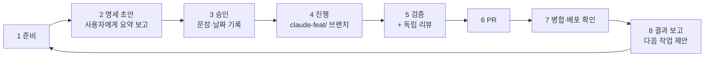

# AV System Builder 작업 흐름

이 폴더는 [AV System Builder 통합 재구축 기획](../기획/시스템빌더통합기획-2026-10-06.md)의 작업을 관리한다. 2026-10-06 사용자 지시("나는 코덱스가 없어서 우리 작업은 코덱스 부분은 걷어내고 작업할 수 있도록 하자. 우리 작업의 흐름은 따로 정의해서 그 흐름을 따라 진행하는 걸로 할거야")에 따라, Builder 작업은 Portal의 Work/Codex 절차 대신 **이 문서의 흐름**을 따른다.

## 적용 범위

이 흐름을 따르는 작업:

- Builder 앱(`builder/`)
- 결선용 라이브러리 생성기·어휘(`beta/build-builder-library.mjs`, `beta/port-vocabulary.mjs` 등)
- 구성도 JSON 스키마·검증기
- **Builder를 위한 Portal 데이터 보강**

그 밖의 Portal 작업은 기존 [Work 안내](../README.md)와 [AGENTS.md](../../AGENTS.md)의 Work/Codex 절차를 그대로 따른다.

절차만 다르고 **규칙은 같다.** 다음 규칙은 이 흐름에서도 그대로 지킨다.

- AGENTS.md의 제품 데이터 정확성 규칙(추측 금지, 모델 일치, 단종 미등록, 출처 우선순위)
- 공개 저장소·비공개 자료 규칙
- 검색 인덱스·RTCOM 동기화 절차
- PR 병합 규칙(보호 규칙 우회·강제 push 금지)

## 역할

| 역할 | 하는 일 |
|---|---|
| **사용자** | 작업 승인, 제품 결정, 결과 확인 |
| **Claude Code** | 명세 작성부터 구현·검증·기록·PR·병합·결과 보고까지 **한 작업을 끝까지** 맡는다. 필요하면 하위 에이전트에게 조사, 구현 일부, 독립 리뷰를 맡긴다 |

같은 담당이 기획과 구현을 함께 하므로 Codex 인계서·Work 인계서·`Work/지시서.md`는 쓰지 않는다. 그 대신 작업 파일 하나에 명세·진행 기록·결과를 모두 적는다.

## 파일

| 파일 | 내용 |
|---|---|
| [통합 기획](../기획/시스템빌더통합기획-2026-10-06.md) | 방향, 결정 기록(§0), 로드맵. 결정이 바뀌면 §0에 날짜와 원문을 추가한다 |
| 이 문서 | 흐름과 작업 목록 |
| `작업/B-YYYYMMDD-NN.md` | 작업 하나의 명세 + 진행 기록 + 결과. [작업 템플릿](작업템플릿.md)으로 만든다 |
| `builder/README.md`, `builder/CHANGELOG.md` | 앱이 생긴 뒤(P4~) 실행법과 버전별 변경 기록 |

- 작업 ID는 `B-YYYYMMDD-NN`이다. Portal의 `W-` ID와 섞이지 않는다.
- 같은 날 여러 작업이면 `NN`을 01부터 올린다.

## 상태

| 상태 | 뜻 |
|---|---|
| 초안 | 명세를 썼고 승인을 기다린다 |
| 승인 | 사용자가 승인했다. 승인 문장과 날짜가 작업 파일에 있다 |
| 진행 | 구현 브랜치에서 작업 중이다 |
| 검토 | 검증을 마치고 PR을 열었다 |
| 완료 | PR이 병합되고 배포까지 확인했다 |
| 보류 | 결정이나 선행 작업을 기다린다. 이유를 적는다 |
| 중단 | 하지 않기로 했다. 이유를 적는다 |

## 흐름

### 1. 준비

- `git fetch origin` 후 최신 `origin/main`을 기준으로 한다. 이 목록, 열린 PR, 공유 작업노트(`git rev-parse --git-common-dir`/`agent-notes.md`)의 마지막 부분을 읽는다.
- 앞 작업이 병합됐다면 그 작업 파일에 PR 번호, 병합 SHA, 배포 결과를 적고 상태를 **완료**로 바꾼다.
  - 이 기록은 다음 작업의 PR에 함께 넣는다.
  - 병합 전 커밋에 미래의 병합을 미리 적지 않는다.
- **Portal 데이터 파일**(`beta/site/catalog.json`, `beta/site/detail/data/*.json` 등)을 건드리는 작업이면 두 가지를 확인한다.
  - `Work/지시서.md`의 현재 상태
  - 열린 PR
  - 같은 파일을 다루는 진행 중 작업이 있으면 시작하지 않고 사용자에게 알린다.

### 2. 명세 초안

- [작업 템플릿](작업템플릿.md)을 `작업/B-YYYYMMDD-NN.md`로 복사해 다음 항목을 채운다.
  - 목표
  - 범위(할 것·하지 않을 것)
  - 완료 조건
  - 검증 방법
  - 결정이 필요한 사항
  - 작업 방식(하위 에이전트·모델)
- 작업 하나는 PR 하나로 끝낼 수 있는 크기로 쪼갠다.
- 사용자에게 **요약**(무엇을, 어디까지, 어떻게 확인하는지, 무엇을 정해야 하는지)을 보고한다. 명세 파일 경로도 함께 알린다.

### 3. 승인

- 사용자가 승인하면 그 문장과 날짜를 작업 파일의 "승인" 칸에 그대로 적고 상태를 **승인**으로 바꾼다.
- 여러 작업을 한 번에 승인할 수 있다. 예: "B-01부터 B-03까지 진행해".
- 진행 중 승인 범위를 넘는 변경이 필요해지면 멈추고 묻는다.
  - 범위를 넘는 변경의 예: 새 제품 결정, 기존 결정 변경, Portal 데이터의 승인 밖 수정
- 통상적인 구현 판단(내부 구조, 함수 분리, 테스트 방식)은 매번 묻지 않는다.

### 4. 진행

- 최신 `origin/main`에서 `claude-feat/<작업ID>-<설명>` 브랜치를 만들고 상태를 **진행**으로 바꾼다.
- 다른 에이전트와 같은 체크아웃 폴더를 쓰지 않는다. Paseo 워크스페이스에서 작업할 때는 현재 워크스페이스를 그대로 쓴다.
- 작업 파일의 "진행 기록"에 체크리스트를 두고, **실제로 한 항목만** `[x]`로 바꾼다.
- 엔진·규칙·생성기는 테스트를 먼저 쓴다.
- 막히면 상태를 **보류**로 바꾸고 이유를 적는다. 막히지 않은 부분은 계속한다.

### 5. 검증

- 작업 파일의 검증 방법과 아래 공통 검증을 실행한다. **결과를 숫자로** 적고, 실행하지 못한 검증은 이유를 적는다.
- 코드 변경이 있으면 하위 에이전트나 `/code-review`로 **독립 리뷰**를 한 번 받는다. 지적 사항과 처리 결과를 적는다.

| 대상 | 명령 |
|---|---|
| 모든 PR | `git diff --check origin/main...HEAD` |
| Portal 저장소 전체 | **LF 체크아웃 복제본**에서 `node --test --test-concurrency=1 tests/*.test.mjs`, `node beta/verify-pages.mjs`, `node beta/build-search-index.mjs --check` |
| Portal 상세·목록 JSON을 바꾼 경우 | 위에 더해 AGENTS.md의 snapshot·검색 인덱스·읽기용 목록 재생성 절차 |
| 라이브러리 생성기 (P2 이후) | `node beta/build-builder-library.mjs --check` |
| Builder 앱 (P4 이후) | `builder/`에서 `npm ci`, 타입 검사, 린트, 테스트, 빌드, 브라우저 시험 |
| 구성도 JSON (P3 이후) | `node builder/cli/validate.mjs builder/examples/small-room.diagram.json builder/examples/auditorium-audio.diagram.json builder/examples/rtcom-extender.diagram.json` (PowerShell은 `*`를 펼치지 않으므로 파일을 나열한다) |

- LF 복제본에서 검사하는 이유: 이 PC는 `core.autocrlf=true`다. 작업 폴더의 JSON이 CRLF로 바뀌어 바이트 SHA 테스트가 실패한다.
- 복제 방법: `git clone --config core.autocrlf=false -b <브랜치> . <임시폴더>`. 검사 후 임시 폴더는 지운다.

### 6. PR

- 상태를 **검토**로 바꾼다.
- 한 PR에 넣는 것: 코드, 작업 파일의 진행 기록·결과, 그리고 (앱 변경이면) `builder/CHANGELOG.md`·`builder/README.md`
- PR 본문에 적는 것: 작업 ID, 작업 파일 링크, 변경 요약, 검증 결과, 후속 사항
- 커밋 메시지는 `feat:`·`fix:`·`docs:`·`refactor:`·`test:`·`chore:` 형식이다.

### 7. 병합

- 최신 `origin/main`을 브랜치에 합친다(`git merge origin/main`). 충돌을 해결하고 검증을 다시 실행한다.
- 승인된 작업 범위 안이고 검증이 모두 통과했으면 병합한다. 2026-09-29 PR 병합 상시 승인을 B 작업에도 적용한다.
- 병합 후 Pages 배포 결과를 확인한다.
- 미승인 범위, 해결 안 된 충돌, 테스트 실패가 있으면 병합하지 않고 보고한다.
- 다음 경우에는 병합 전에 사용자에게 확인한다.
  - 기획 문서·결정 기록만 바꾸는 PR
  - 사용자가 내용을 보고 싶다고 한 PR

### 8. 결과 보고

사용자에게 다음을 보고한다.

- 한 일
- 검증 결과
- PR·병합 SHA·배포 결과
- 남은 일
- **다음 작업 제안**(명세 초안 경로)

공유 작업노트 끝에 같은 내용을 짧게 덧붙인다.

## 작업 방식 (하위 에이전트와 모델)

2026-10-05 사용자 지시("토큰 아껴서 쓸 수 있도록 사용 모델과 추론을 적절하게 판단해서")를 따른다. 기준은 **"틀렸을 때 누가 잡아 주는가"**다.

| 일의 성격 | 맡기는 방식 |
|---|---|
| 자료 집계·파일 탐색·요약 | 하위 에이전트, 가벼운 모델 |
| 생성기·엔진·스키마 구현 (테스트가 잡아 줌) | 하위 에이전트 또는 직접, 기본 모델 |
| 표기 대응 판정, TX/RX 분리, 상호작용 설계, 독립 리뷰 (사람이 봐야 함) | 직접 또는 상위 모델 |

- 작업 파일의 "작업 방식"에 무엇을 누구에게 맡길지 근거와 함께 한 줄로 적는다.
- 처음부터 올리지 않는다. 같은 자리에서 두 번 막히면 올린다.

## 다른 작업과 함께 진행하기

- `Work/지시서.md`, `Work/작업/W-*`, `Work/기록/W-*`, `Work/템플릿/`은 이 흐름에서 수정하지 않는다.
- Portal 데이터 보강(P6)은 이 흐름으로 하되, 1단계 준비의 충돌 확인을 반드시 거친다.
- 기존 Work/Codex 대기열과 순서를 다투지 않는다. 같은 파일을 동시에 고치지 않는 것만 지킨다.

## 작업 목록

| ID | 내용 | 로드맵 | 상태 |
|---|---|---|---|
| [B-20261006-01](작업/B-20261006-01.md) | 기반 명세: 단자 표기 빈도 분석, 표준 어휘, 단자 ID·이름 규칙, 카테고리·선 종류 대응, TX/RX 분리, 연결 규칙, 1.2 호환 명세, 상호작용 수치 | P1 | 완료 |
| [B-20261006-02](작업/B-20261006-02.md) | 결선용 라이브러리 생성기: 부록 A 규칙 구현, `builder-library.json` 생성·배포, 규칙·회귀 테스트 | P2 | 완료 |
| [B-20261006-03](작업/B-20261006-03.md) | 구성도 JSON 1.2 엔진·스키마·검증 CLI: 노드·엣지 생성, 연결 규칙, 이슈, 결정적 직렬화, 예제 3종 | P3 | 완료 |
| [B-20261006-04](작업/B-20261006-04.md) | Builder 화면 골격: 장비 목록·배치·연결(엔진 규칙)·케이블 입력·JSON 열기/내보내기·자동 저장, 빌드·배포·Builder CI | P4 (1차) | 완료 |
| [B-20261006-05](작업/B-20261006-05.md) | Builder 기본 조작: 근접 연결·장비 몸체에 놓기, 왼쪽 드래그 범위 선택, 가운데 버튼·Space 화면 이동, 이슈 패널, 케이블 수치 엔진 검사, Playwright 시험 | P4 (2차) | 완료 |
| [B-20261006-06](작업/B-20261006-06.md) | 평행선 한꺼번에 긋기: 단자 범위 선택·Shift+클릭, 묶음 끌기 미리보기, 놓은 단자부터 같은 열 아래로 다중 연결(건너뛰기·모자람 알림), 평행 간격 | P5 (1차) | 완료 |
| [B-20261006-07](작업/B-20261006-07.md) | 선 그리기 이식: 구 Builder 평행선 간격(Stage 0~4)·채널 순서·교차 점프·양방향 선 방향, 끌기 중 성능, 케이블 보기 | P5 (2차) | 완료 |
| [B-20261006-08](작업/B-20261006-08.md) | 편집 도구 이식: 오토 레이아웃(Dagre·barycenter), 복사·붙여넣기, 잠금, 격자 맞춤, 미니맵, 선 종류 필터, LOD | P5 (3차) | 완료 |
| [B-20261006-09](작업/B-20261006-09.md) | 메모·영역 서식 편집(서식 패널·크기 바꾸기·고정)과 다크/라이트 테마 | P5 (4차) | 완료 |
| [B-20261006-10](작업/B-20261006-10.md) | 도면 내보내기: 구성도 데이터로 그린 벡터 SVG, SVG에서 만든 PDF | P5 (5차) | 검토 |
